# Active Directory Lab

> Deploying and hardening a fully functional Active Directory environment on Windows Server 2019 - built from scratch in Oracle VirtualBox as part of my cybersecurity portfolio.

---

## Overview

This lab simulates a real-world corporate Active Directory environment from the ground up. Starting from a bare Windows Server 2019 VM, I provisioned a domain controller, built a department-based Organizational Unit (OU) hierarchy, managed user accounts and security groups using Role-Based Access Control, and hardened the environment with Group Policy - then validated everything end-to-end with a domain-joined Windows 10 client machine.

---

## Lab Objectives

- Deploy Active Directory Domain Services (AD DS) on Windows Server 2019
- Promote the server to a domain controller for the `ADLAB.local` forest
- Design and implement a department-based OU hierarchy
- Create and manage domain user accounts with enforced password policies
- Configure Global Security groups for Role-Based Access Control (RBAC)
- Apply Group Policy Objects (GPOs) for password policy, account lockout, and logon banners
- Join a Windows 10 client to the domain and verify GPO enforcement end-to-end

---

## Lab Environment

| Component | Details |
|-----------|---------|
| Hypervisor | Oracle VirtualBox |
| Domain Controller OS | Windows Server 2019 Standard Evaluation |
| Client Machine OS | Windows 10 |
| Server Hostname | DC01 |
| Client Hostname | CLIENT01 |
| Domain Name | ADLAB.local |
| DC Static IP | 192.168.10.1 |
| Subnet Mask | 255.255.255.0 |
| DNS Server | 192.168.10.1 (self-referencing) |
| Forest / Domain Functional Level | Windows Server 2016 |

---

## Domain & OU Structure

```
ADLAB.local (Domain)
│
├── DC01  ←  Domain Controller (192.168.10.1)
│
└── CLIENT01  ←  Domain-joined Windows 10 workstation

OU Hierarchy:
ADLAB.local
├── IT_Department
│   ├── Admin
│   └── Helpdesk
├── HR_Department
├── Finance_Department
├── Computer
│   └── workstations
└── Service_Accounts
```

---

## Lab Phases

---

### Phase 1 - Server Setup

Before installing any roles, the server was prepared for domain controller promotion:

- Assigned a **static IP address**: `192.168.10.1`, subnet `255.255.255.0`, DNS pointing to itself
- Renamed the machine from the default Windows name to **DC01**
- Confirmed the hostname change via Settings > About

| Screenshot | Description |
|-----------|-------------|
| 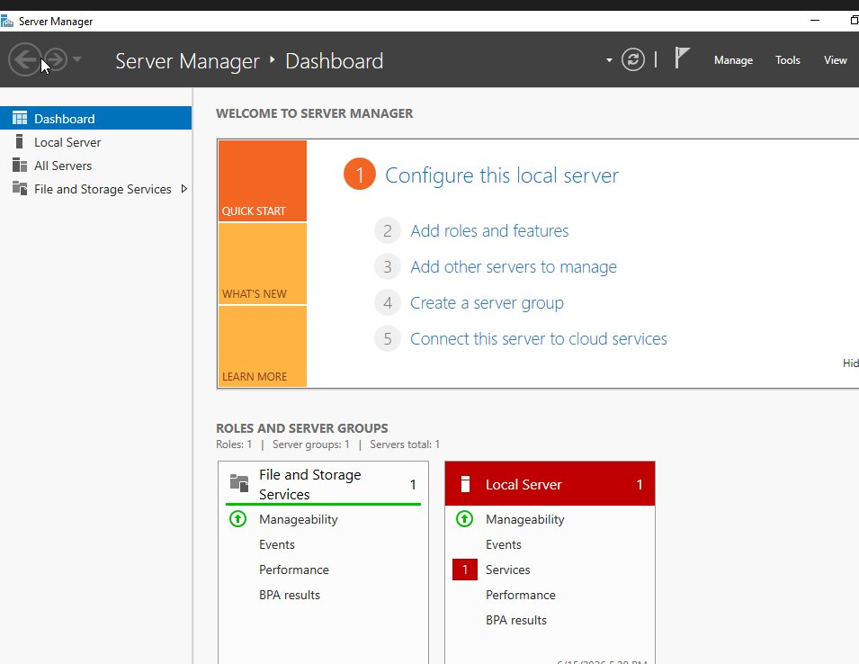 | Initial Server Manager Dashboard |
| 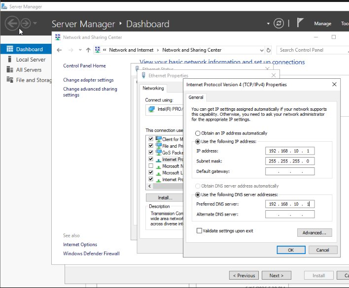 | Static IP assigned (192.168.10.1) |
| 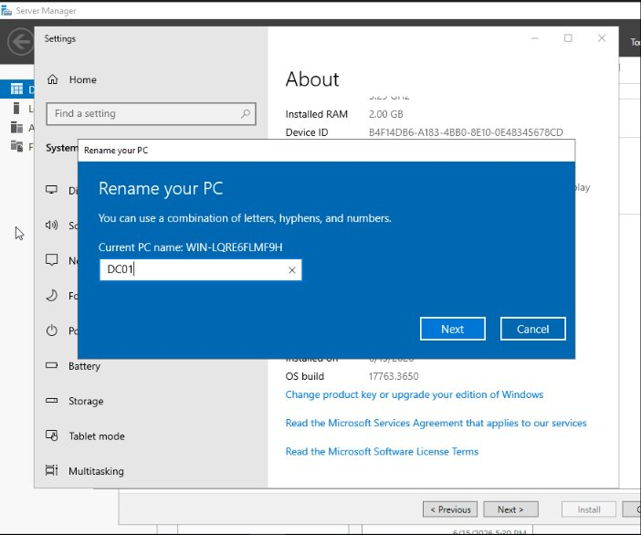 | Rename PC dialog - DC01 entered |
| 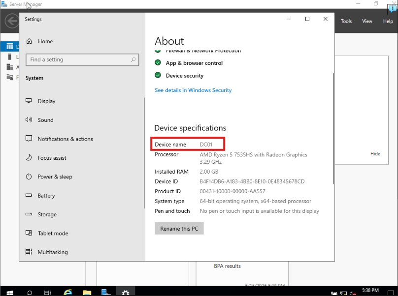 | Device name confirmed as DC01 |

---

### Phase 2 - AD DS Role Installation

The **Active Directory Domain Services** role was installed using the Add Roles and Features Wizard in Server Manager. The following components were installed automatically:

- Active Directory Domain Services
- Group Policy Management
- Remote Server Administration Tools (RSAT)
- AD DS and AD LDS Tools
- Active Directory Administrative Center
- AD DS Snap-ins and Command-Line Tools

| Screenshot | Description |
|-----------|-------------|
| 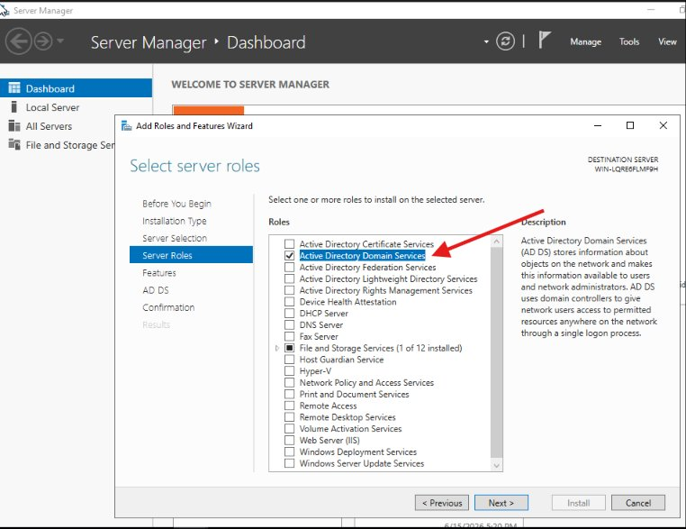 | AD DS role selected in the wizard |
| 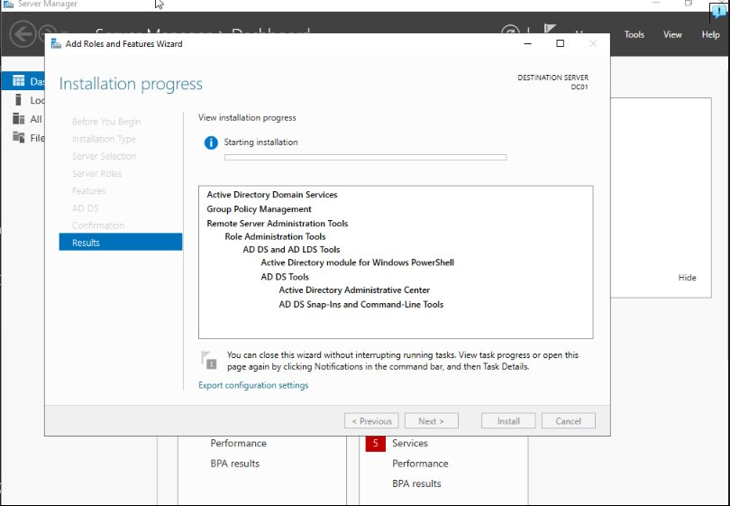 | Installation in progress |
| 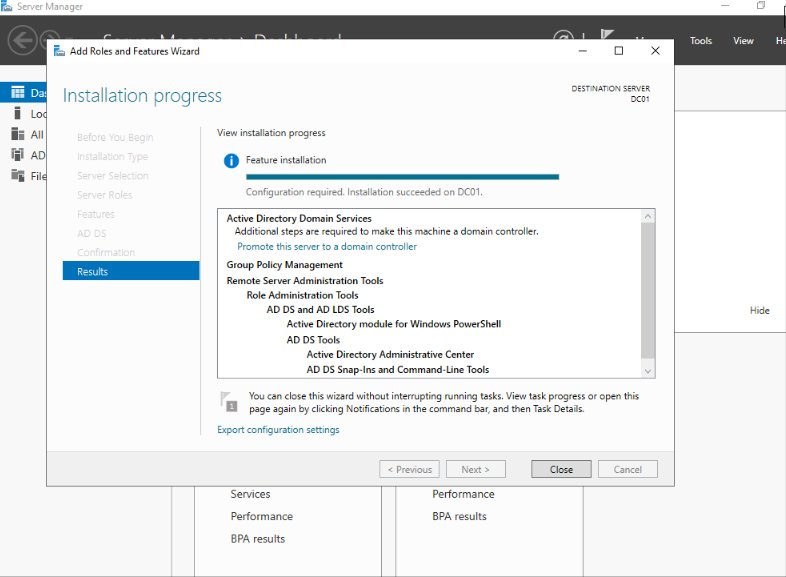 | Installation complete - Promote link shown |

---

### Phase 3 - Domain Controller Promotion

After AD DS installation, the server was promoted to a domain controller using the **AD DS Configuration Wizard**, creating a brand new forest.

**Configuration applied:**

| Setting | Value |
|---------|-------|
| Deployment Operation | Add a new forest |
| Root Domain Name | ADLAB.local |
| Forest Functional Level | Windows Server 2016 |
| Domain Functional Level | Windows Server 2016 |
| DNS Server | Enabled |
| Global Catalog (GC) | Enabled |
| Read-only Domain Controller | Disabled |
| DSRM Password | Configured |

The server rebooted automatically after promotion and came back online as a domain controller.

**DNS Verification:**
```
C:\> nslookup ADLAB.local
Name:    ADLAB.local
Address: 192.168.10.1
```

| Screenshot | Description |
|-----------|-------------|
| 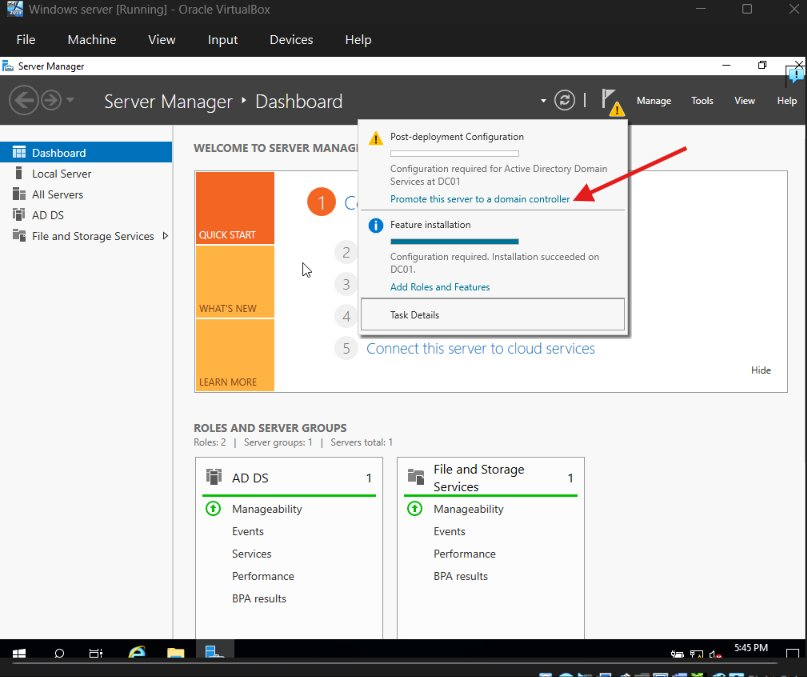 | Post-deployment notification - Promote this server |
| 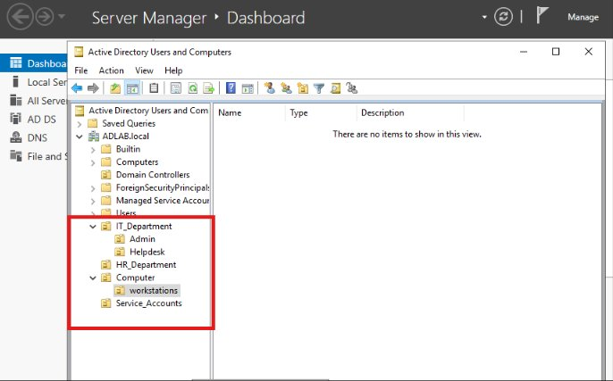 | Deployment Configuration - Add a new forest |
| 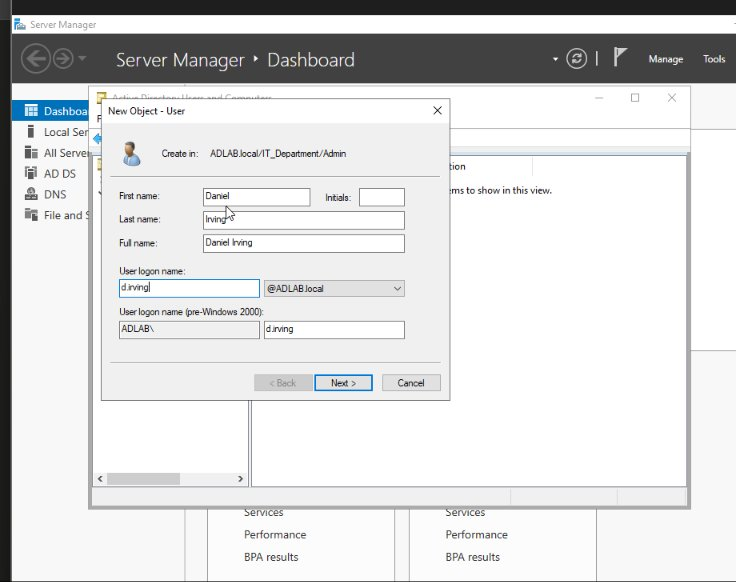 | DC Options - DNS, GC, DSRM password |
| 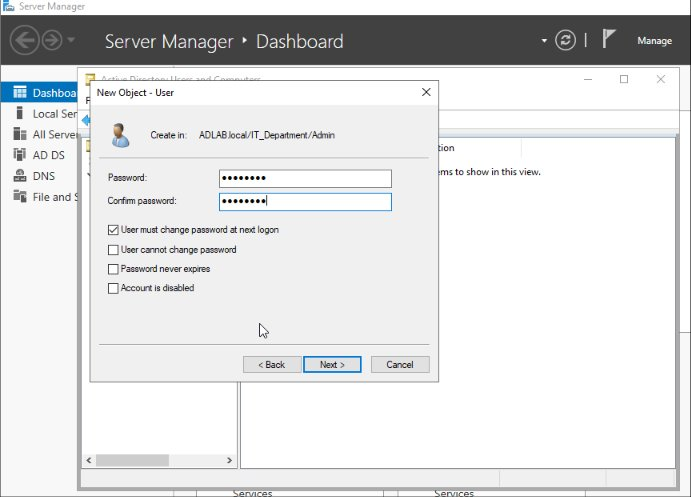 | DNS Options |
| 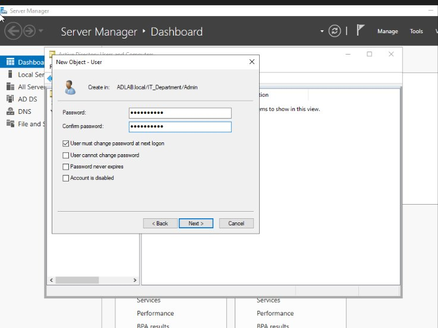 | Additional Options - NetBIOS name |
| 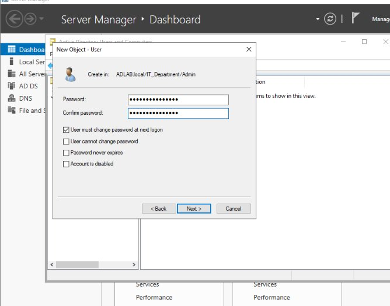 | Paths - NTDS, Logs, SYSVOL |
| 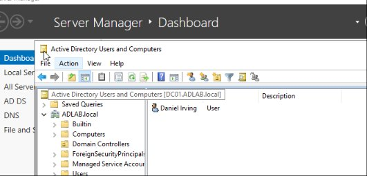 | Review Options |
| 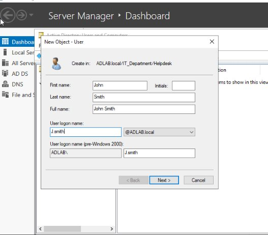 | Prerequisites Check - All passed |
| 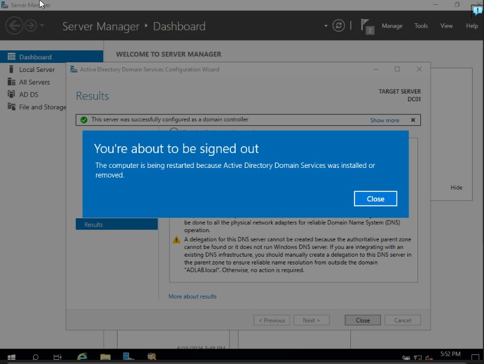 | Promotion complete - Reboot initiated |
| 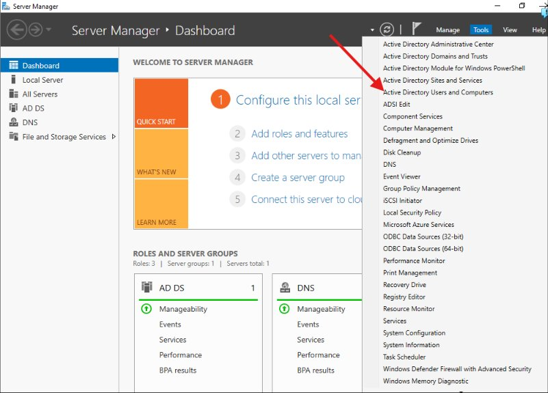 | AD tools now available in Server Manager |
| 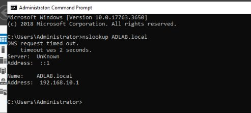 | nslookup confirms ADLAB.local → 192.168.10.1 |

---

### Phase 4 - Organizational Unit (OU) Structure

Using **Active Directory Users and Computers (ADUC)**, a department-based OU hierarchy was designed to reflect a realistic enterprise structure. All OUs were created with **"Protect container from accidental deletion"** enabled.

| OU | Sub-OUs | Purpose |
|----|---------|---------|
| IT_Department | Admin, Helpdesk | IT staff organized by function |
| HR_Department | - | Human Resources personnel |
| Finance_Department | - | Finance team accounts |
| Computer | workstations | Computer objects for domain-joined machines |
| Service_Accounts | - | Service and system accounts |

| Screenshot | Description |
|-----------|-------------|
| 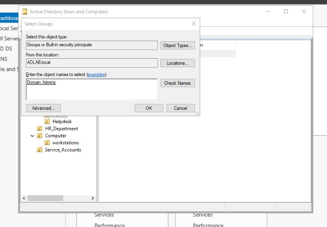 | ADUC opened - Daniel Irving visible as initial user |
| 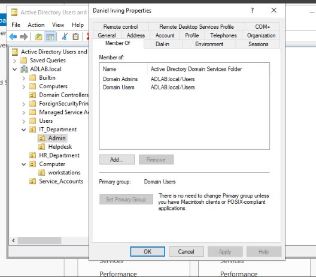 | Complete OU hierarchy |
| 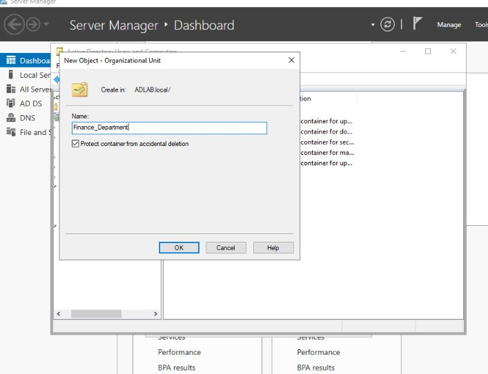 | Finance_Department OU being created |

---

### Phase 5 - User Account Management

Five domain user accounts were created and placed in their respective OUs. All accounts were configured with **"User must change password at next logon"** enforced to ensure secure first-time access.

| Full Name | Username | OU Path | Role |
|-----------|----------|---------|------|
| Daniel Irving | d.irving | IT_Department/Admin | IT Administrator |
| John Smith | J.smith | IT_Department/Helpdesk | Helpdesk Technician |
| Sarah Brown | s.brown | HR_Department | HR Staff |
| Glen Davis | g.davis | Finance_Department | Finance Staff |
| svc backup | svc_backup | Service_Accounts | Backup Service Account |

| Screenshot | Description |
|-----------|-------------|
| 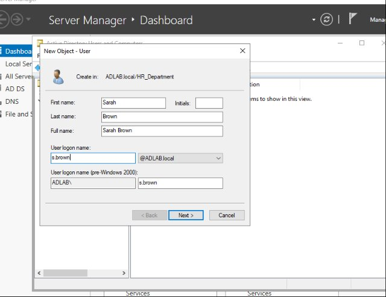 | John Smith created in IT_Department/Helpdesk |
| 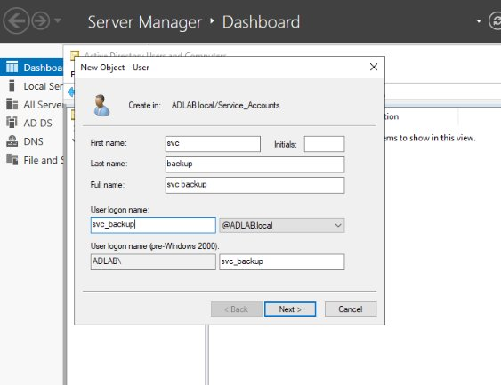 | svc_backup created in Service_Accounts |
| 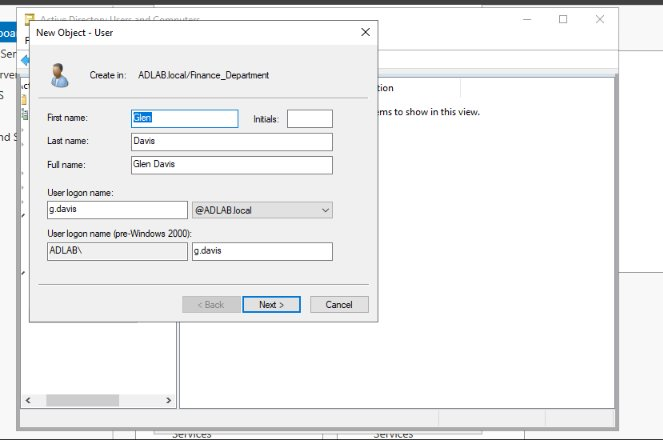 | Glen Davis created in Finance_Department |
| 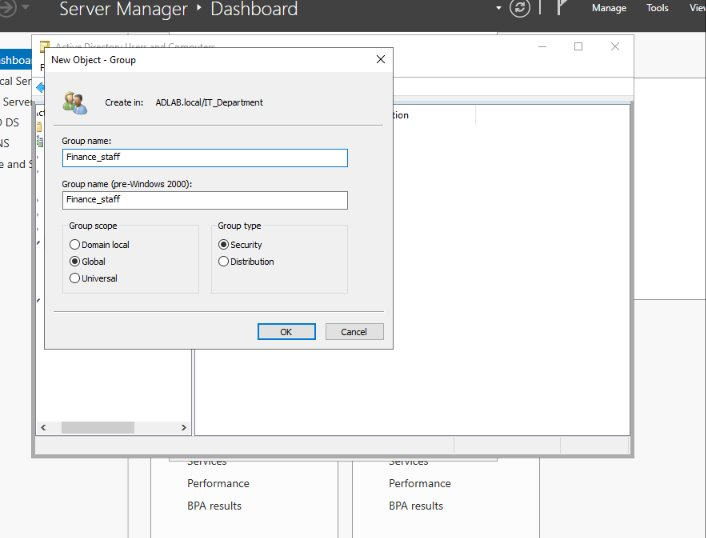 | Daniel Irving created in IT_Department/Admin |

---

### Phase 6 - Security Groups & Role-Based Access Control

Four **Global Security** groups were created to mirror the department structure and enforce role-based access control. Each user was assigned to the appropriate group.

| Group | Scope | Type | Member(s) |
|-------|-------|------|-----------|
| IT_Admins | Global | Security | Daniel Irving |
| IT_Helpdesk | Global | Security | John Smith |
| HR_staff | Global | Security | Sarah Brown |
| Finance_staff | Global | Security | Glen Davis |

**Privileged Access:** Daniel Irving was additionally added to the built-in **Domain Admins** group, granting full domain administrative rights.

**Final Group Memberships:**

| User | Member Of |
|------|-----------|
| Daniel Irving | Domain Admins, IT_Admins |
| John Smith | IT_Helpdesk |
| Sarah Brown | HR_staff |
| Glen Davis | Finance_staff |

| Screenshot | Description |
|-----------|-------------|
| 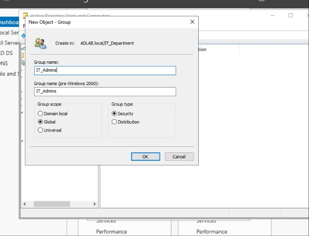 | IT_Admins - Global Security group created |
| 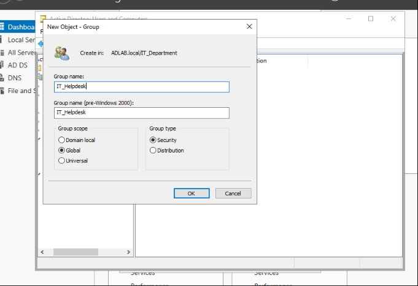 | IT_Helpdesk - Global Security group created |
| 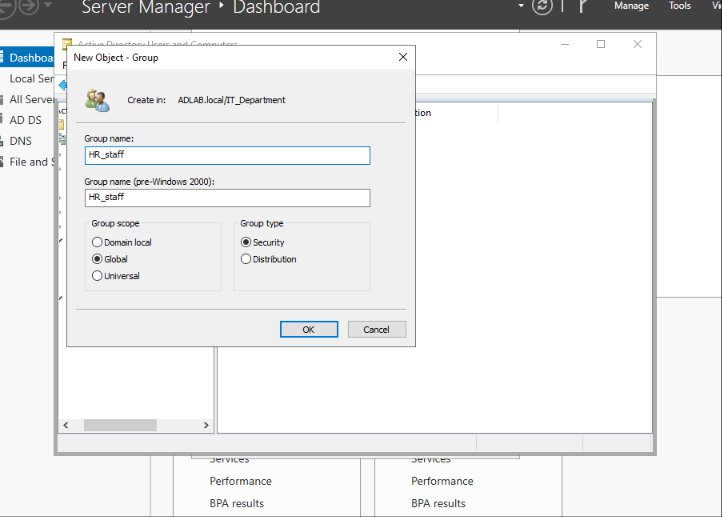 | HR_staff - Global Security group created |
| 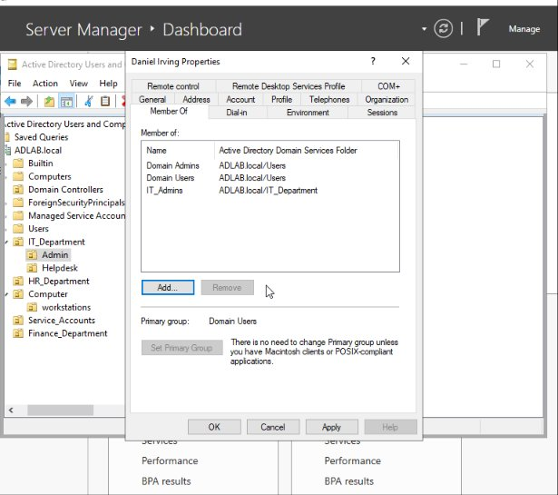 | John Smith → IT_Helpdesk confirmed |
| 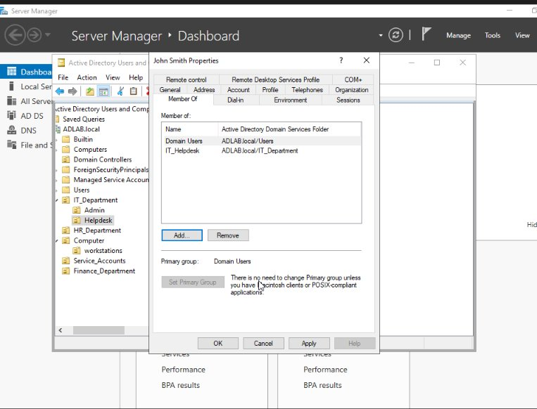 | Daniel Irving → Domain Admins + IT_Admins confirmed |
| 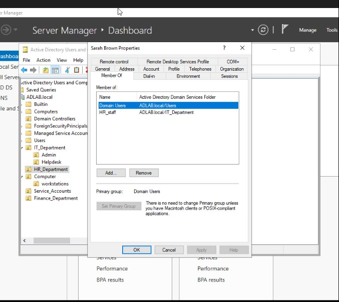 | Sarah Brown → HR_staff confirmed |

---

### Phase 7 - Group Policy Configuration

A new GPO named **"Password Policy"** was created in the **Group Policy Management Console (GPMC)** and linked to the `IT_Department` OU. The policy enforces three categories of security settings.

#### 7.1 Password Policy

| Setting | Configured Value |
|---------|-----------------|
| Enforce password history | 10 passwords remembered |
| Maximum password age | 90 days |
| Minimum password age | 0 days |
| Minimum password length | 10 characters |
| Password complexity requirements | Enabled |
| Store passwords using reversible encryption | Disabled |

#### 7.2 Account Lockout Policy

| Setting | Configured Value |
|---------|-----------------|
| Account lockout threshold | 5 invalid logon attempts |
| Account lockout duration | 30 minutes |
| Reset account lockout counter after | 30 minutes |

#### 7.3 Interactive Logon Banner

A legal notice banner was configured to display before every login:

- **Title:** `Authorized Users Only`
- **Message:** `This system is for authorized users only. All activity is being logged and monitored.`

| Screenshot | Description |
|-----------|-------------|
| 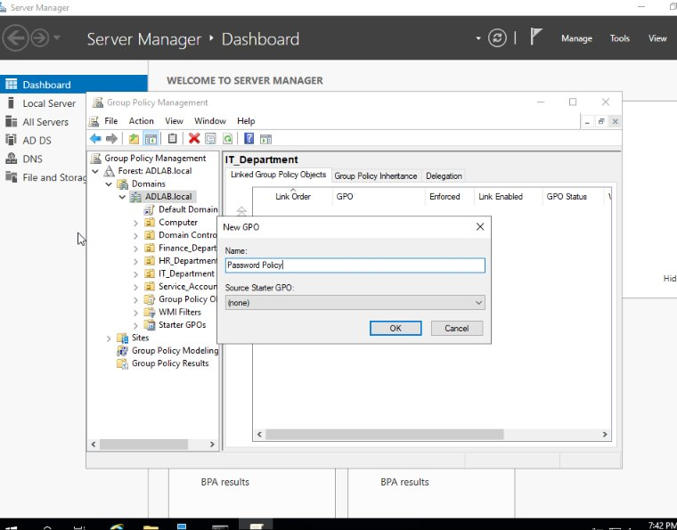 | "Password Policy" GPO created in GPMC |
| 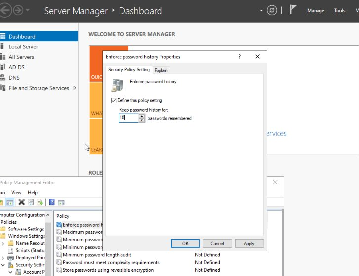 | Password history - 10 passwords remembered |
| 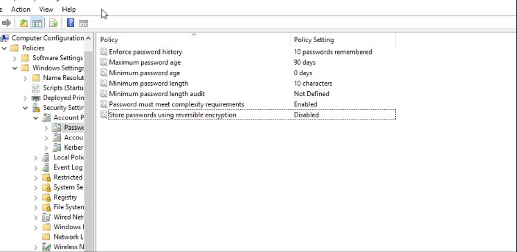 | Full password policy settings |
| 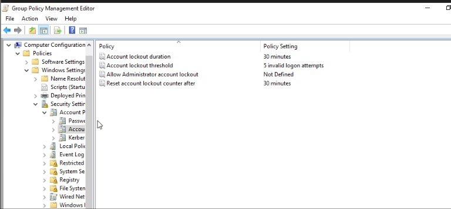 | Account lockout policy - 5 attempts / 30 min |
| 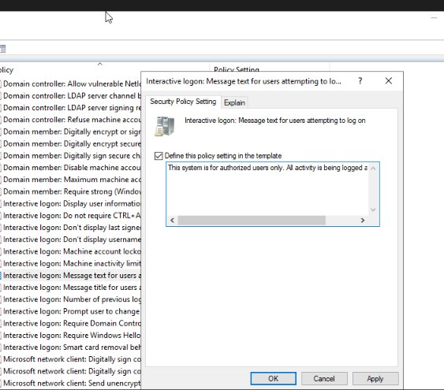 | Logon banner message configured |
| 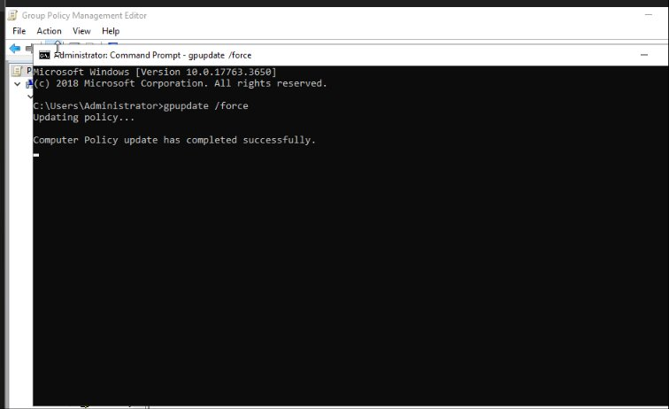 | `gpupdate /force` - Policy update completed |

---

### Phase 8 - Client Machine Integration & Verification

A Windows 10 machine was named **CLIENT01** and joined to the `ADLAB.local` domain. Group Policy was then applied and verified through domain user login.

**Steps performed:**
1. CLIENT01 joined to `ADLAB.local` via System Properties > Computer Name
2. `gpupdate /force` run on DC01 to push latest policies
3. Logged into CLIENT01 as `d.irving` (ADLAB\d.irving)
4. **Logon banner appeared** - confirming GPO enforcement
5. **Forced password change triggered** - "User must change password at next logon"
6. Password successfully changed on first login

**Domain Verification (run on DC01):**

```cmd
C:\> nslookup ADLAB.local
Address: 192.168.10.1  ✅

C:\> netdom query dc /domain:ADLAB.local
DC01  ✅

C:\> netdom query fsmo
Schema master          DC01.ADLAB.local  ✅
Domain naming master   DC01.ADLAB.local  ✅
PDC                    DC01.ADLAB.local  ✅
RID pool manager       DC01.ADLAB.local  ✅
Infrastructure master  DC01.ADLAB.local  ✅

C:\> dsquery user -domain ADLAB.local
"CN=Daniel Irving,OU=Admin,OU=IT_Department,DC=ADLAB,DC=local"   ✅
"CN=John Smith,OU=Helpdesk,OU=IT_Department,DC=ADLAB,DC=local"  ✅
"CN=Sarah Brown,OU=HR_Department,DC=ADLAB,DC=local"             ✅
"CN=svc backup,OU=Service_Accounts,DC=ADLAB,DC=local"           ✅
"CN=Glen Davis,OU=Finance_Department,DC=ADLAB,DC=local"         ✅

C:\> dsquery computer -domain ADLAB.local
"CN=DC01,OU=Domain Controllers,DC=ADLAB,DC=local"               ✅
"CN=CLIENT01,OU=workstations,OU=Computer,DC=ADLAB,DC=local"     ✅
```

> **Note:** `net view /domain:ADLAB.local` returned Error 6118 - expected behavior in modern Windows environments where the Computer Browser service is disabled. This does not indicate a domain issue; all other verification commands confirmed full domain functionality.

| Screenshot | Description |
|-----------|-------------|
| 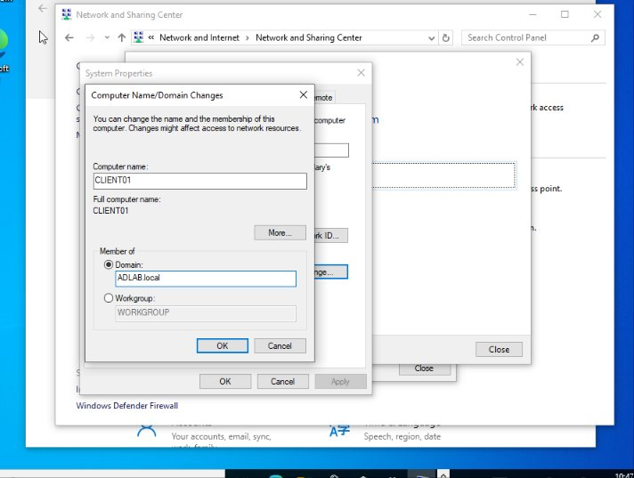 | CLIENT01 joining ADLAB.local |
| 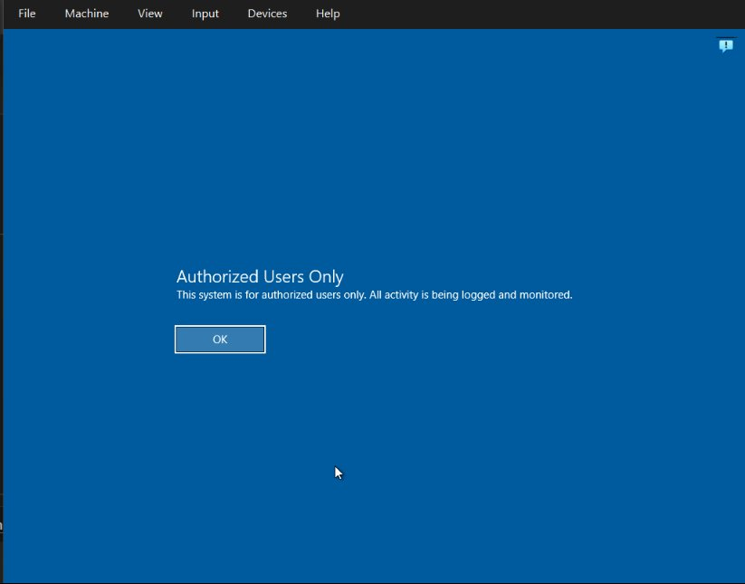 | d.irving logging in on CLIENT01 |
| 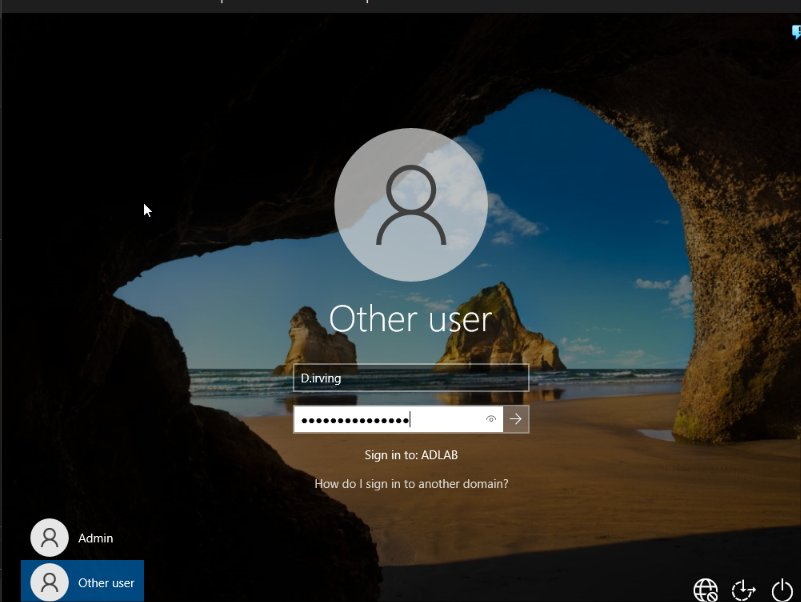 | GPO forces password change on first login |
| 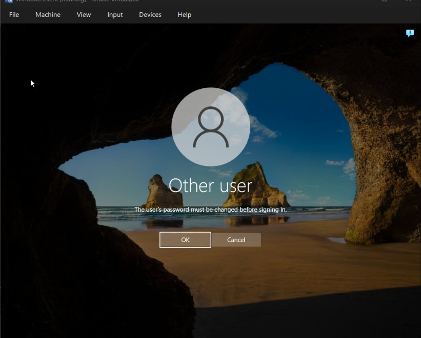 | Password changed successfully |
| 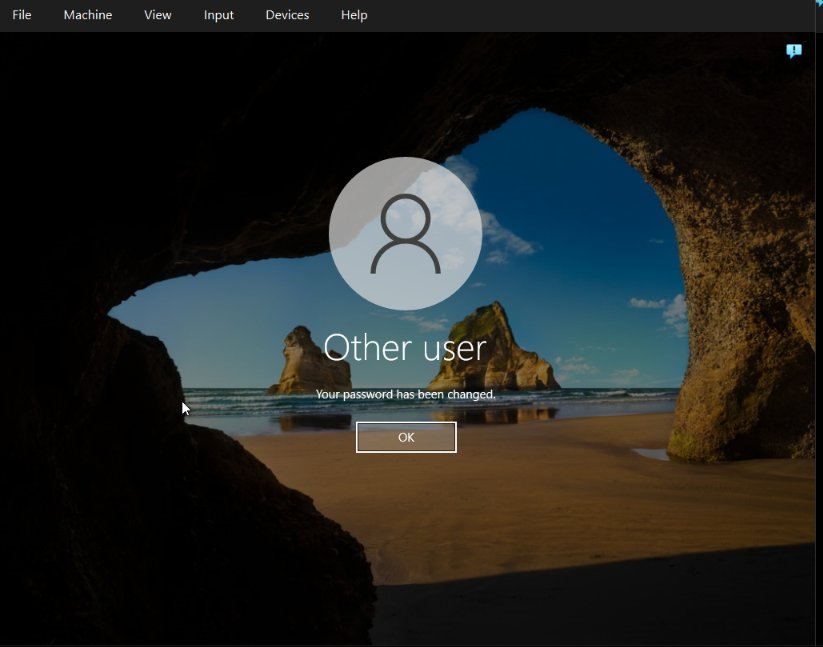 | "Authorized Users Only" GPO banner displayed |
| 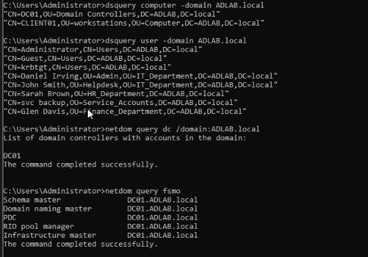 | dsquery + netdom FSMO verification |

---

## Skills Demonstrated

| Skill | Details |
|-------|---------|
| Windows Server Administration | Installed and configured Windows Server 2019 from a clean VM |
| Active Directory Domain Services | Deployed AD DS, created a new forest, promoted a domain controller |
| OU Design | Built a department-based OU hierarchy reflecting real-world enterprise structure |
| User Account Management | Created domain users with UPNs, logon names, and enforced password policies |
| Security Group Management | Created Global Security groups and implemented RBAC across departments |
| Group Policy (GPO) | Configured password policy, account lockout, and interactive logon banners |
| DNS Administration | Configured self-referencing DNS to support AD, verified with nslookup |
| Domain Client Integration | Joined Windows 10 to the domain and verified policy enforcement |
| CLI Verification | Used `dsquery`, `netdom`, `nslookup`, `gpupdate` for end-to-end validation |
| Virtualisation | Designed and deployed a multi-VM virtual lab in Oracle VirtualBox |

---

## Tools & Technologies

| Tool | Purpose |
|------|---------|
| Oracle VirtualBox | Hypervisor / lab environment |
| Windows Server 2019 | Domain Controller OS |
| Windows 10 | Client machine OS |
| Active Directory Users and Computers (ADUC) | OU, user, and group management |
| Group Policy Management Console (GPMC) | GPO creation, linking, and editing |
| Server Manager | AD DS role installation |
| DNS Manager | Domain Name System configuration |
| Command Prompt | Verification via dsquery, netdom, nslookup, gpupdate |

---

## Repository Structure

```
Active-Directory-Home-Lab/
├── README.md
└── screenshots/
    ├── 01-server-setup/
    ├── 02-adds-installation/
    ├── 03-dc-promotion/
    ├── 04-ou-structure/
    ├── 05-user-accounts/
    ├── 06-security-groups/
    ├── 07-group-policy/
    └── 08-client-verification/
```

---

## Author

**Daniel Irving**  
Computer Networking & Security Student - University of Technology, Jamaica  
GitHub: [github.com/Danielirving0392/Cybersecurity-Projects](https://github.com/Danielirving0392/Cybersecurity-Projects.git)

---

*Lab completed: June 15, 2026*
