# Digital Forensic Investigation — *Wes Mantooth et al.*

> A practical digital forensics case study performed in **Autopsy**, covering evidence ingestion, integrity verification, file system and metadata analysis, deleted-file recovery, email and PST examination, EXIF analysis, keyword searches, timeline reconstruction, data carving, and chat-log recovery.


-orange)


---

> [!IMPORTANT]
> **Academic disclaimer.** This case is a **fictitious teaching scenario** used for instruction in digital forensics. All persons, businesses, email addresses, phone numbers, and locations referenced in the evidence are fabricated. No real-world investigation, suspect, or victim is described or implied.

---

## Table of Contents

1. [Overview](#overview)
2. [Skills Demonstrated](#skills-demonstrated)
3. [Tools Used](#tools-used)
4. [Case Details](#case-details)
5. [Evidence Sources](#evidence-sources)
6. [Methodology](#methodology)
7. [Part I — Evidence Verification and Integrity](#part-i--evidence-verification-and-integrity)
8. [Part II — File and Metadata Analysis](#part-ii--file-and-metadata-analysis)
9. [Part III — Email and Communication Analysis](#part-iii--email-and-communication-analysis)
10. [Part IV — Multimedia and Metadata Analysis](#part-iv--multimedia-and-metadata-analysis)
11. [Part V — Advanced Analysis](#part-v--advanced-analysis)
12. [Part VI — Additional Investigation Tasks](#part-vi--additional-investigation-tasks)
13. [Key Takeaways](#key-takeaways)
14. [Repository Structure](#repository-structure)
15. [Acknowledgements](#acknowledgements)

---

## Overview

This repository documents a complete end-to-end forensic examination of three forensic disk images — a suspect's primary computer, an associate's external drive, and a USB thumb drive — using **Autopsy** as the primary platform. The investigation establishes a coordinated criminal network engaged in **check forgery, prescription fraud, methamphetamine manufacture, ATM skimming, and advance-fee fraud**, supported by recovered email threads, Outlook tasks, deleted files, carved chat logs, and EXIF-bearing imagery.

| Outcome | Result |
|---|---|
| Forensic images processed | 3 (E01) |
| Hash verification | MD5 + SHA-1 confirmed on all images |
| Suspicious files bookmarked | 5 (Illegal Activities) + 6 (Suspicious Graphics) + 3 (Encrypted RID 1000) |
| Deleted files identified | 1,638 |
| Carved artefacts of interest | Google search for *"credit card skimming"*, `Recovered Chat.HTML` |
| Contacts of interest enumerated | 8 (with two cross-platform identities resolved) |
| Timeline window analysed | January 2004 – July 2008 |

---

## Skills Demonstrated

- **Forensic image acquisition and verification** — `.E01` ingestion, MD5/SHA-1 hash validation, time-zone enforcement
- **NTFS internals** — locating the Volume Serial Number at byte offset `0x48` of the Volume Boot Record, decoding in little-endian
- **File system metadata analysis** — MFT entries, allocation states, MAC timestamps
- **Deleted-file recovery** from unallocated space
- **Email forensics** — thread reconstruction, header analysis, alias and identity correlation across SMTP, AIM, and PST contacts
- **PST (Outlook) examination** with Autopsy and an independent third-party viewer for corroboration
- **EXIF metadata extraction** and reconciliation against file-system timestamps
- **Keyword indexing and data carving** from unallocated space, including manual HTML chat-log recovery
- **Timeline analysis** for behavioural pattern reconstruction
- **Evidence integrity and chain-of-custody discipline** throughout

---

## Tools Used

| Tool | Purpose |
|---|---|
| **Autopsy** | Primary forensic platform — ingestion, hashing, metadata, timeline, keyword search, carving, tagging |
| **Autopsy Hex Editor** | Manual NTFS VBR inspection at offset `0x48` |
| **Kernel Outlook PST Viewer** | Independent corroboration of contact and PST data |
| **EXIF analysis (Autopsy module)** | Camera make/model and capture-date extraction |

---

## Case Details

| Field | Value |
|---|---|
| Case title | Forensic Investigation of *Wes Mantooth et al.* |
| Case reference | `FC1-WM-20240922-A4.11` |
| Nature of occurrence | Check forgery, financial fraud, illegal substances, ATM fraud |
| Date of request | 23 September 2024 |
| Due date | 6 October 2024 |
| Classification | Confidential — academic use |
| Time zone applied | `(GMT-7:00) America/Denver` — Mountain Daylight Time (MDT, UTC-7) |

---

## Evidence Sources

Three forensic images were added as separate data sources in Autopsy, each configured with **Auto Detect** sector size and the time zone above.

| # | Image | Description |
|---|---|---|
| 1 | `Mantooth32.E01` | Primary suspect's computer hard drive |
| 2 | `Washer 17.E01` | External drive belonging to associate John Washer |
| 3 | `Thumbdrive 05.E01` | USB thumb drive seized during the investigation |

**Figure 1.1** — Adding `Mantooth32.E01` as a data source in Autopsy
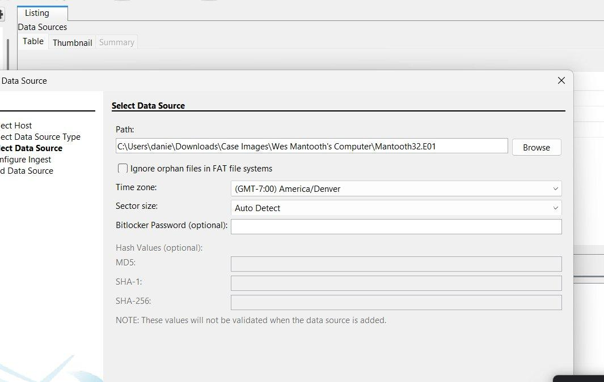
> The screenshot shows the *Select Data Source* step of the *Add Data Source* wizard in Autopsy. The time zone is set to `(GMT-7:00) America/Denver` and sector size is *Auto Detect*. This image represents the main computer hard drive belonging to the primary suspect.

**Figure 1.2** — Adding `Washer 17.E01` as a data source in Autopsy
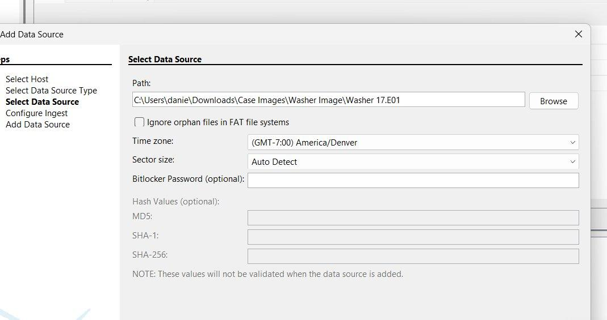
> Configured for `Washer 17.E01`, representing the external drive associated with John Washer. The same time zone was applied to ensure timestamp consistency.

**Figure 1.3** — Adding `Thumbdrive 05.E01` as a data source in Autopsy
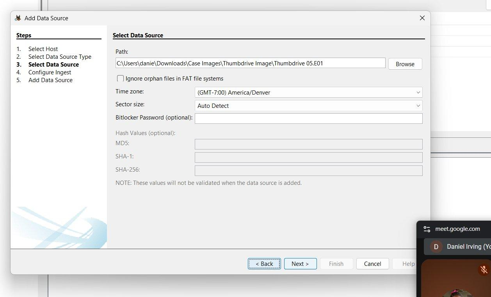
> Configured for `Thumbdrive 05.E01`, representing a USB thumb drive seized during the investigation. The same time zone and sector size settings were applied.

---

## Methodology

1. Create a new case in Autopsy and add all three forensic images as separate data sources.
2. Apply a consistent time zone (`America/Denver`) to all data sources to ensure timestamp comparability.
3. Allow Autopsy to compute MD5 and SHA-1 hashes during ingestion and verify against reference values.
4. Extract NTFS volume serial numbers directly from the Volume Boot Record using the hex editor and cross-check against Autopsy's System Information.
5. Run the standard ingest modules (Hash Lookup, File Type, Keyword Search, EXIF Parser, Email Parser, Encryption Detection, Interesting Files).
6. Tag findings under structured bookmarks: `Illegal Activities`, `Foreign Documents`, `Suspicious Appointments`, `June 2007 appointments`, `Suspicious Graphics`, `Encrypted 1000`, `Re: oooh I have AOL!`, `Recovered Chat`.
7. Perform targeted keyword searches (`skimmer`, `ATM fraud`, `Rosco`, `Mantooth`, `rbadguy`) and carve any unallocated hits of interest.
8. Reconstruct a logarithmic timeline of file-system activity across all images.

---

## Part I — Evidence Verification and Integrity

### Hash Verification

MD5 and SHA-1 values were computed by Autopsy at ingest time for each forensic image and compared against the supplied reference hashes. **All three images verified successfully**, confirming the evidence has not been altered since acquisition and is admissible for analysis.

### Volume Serial Numbers (NTFS)

NTFS stores a 64-bit Volume Serial Number at **byte offset `0x48` (decimal 72) of the Volume Boot Record**, in little-endian format. Windows displays the **lower 32 bits** as `XXXX-XXXX`.

**Procedure:**
1. Select the NTFS partition in Autopsy's Source Tree.
2. Open the hex view of the partition's Volume Boot Record.
3. **Go To Offset** → value `48` (hex), origin: *Beginning of File*.
4. Read the 8 bytes at offset `0x48`; the lower 4 bytes (little-endian) give the serial.
5. Cross-verify against Autopsy's **System Information** panel.

**Figure 2.1** — Go To Offset dialog: hex offset `0x48`
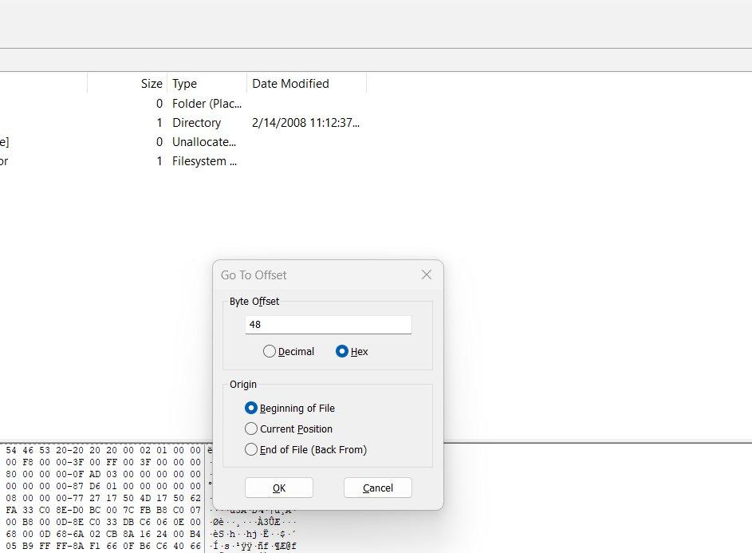
> Value `48` in hexadecimal, origin set to *Beginning of File*. This navigates the hex view to byte 72 (0x48), the exact NTFS VBR location for the Volume Serial Number field.

**Figure 2.2** — Hex editor: 8-byte selection at offset `0x48`
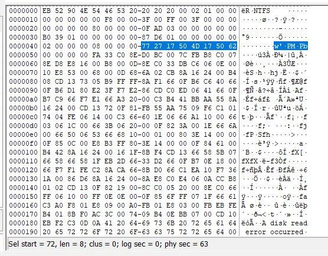
> Status bar confirms `Sel start = 72` (decimal), `len = 8`. Reading the lower four bytes in little-endian format yields `5017-2777`.

**Figure 2.3** — Autopsy System Information confirms `WASHER` partition serial number `5017-2777`
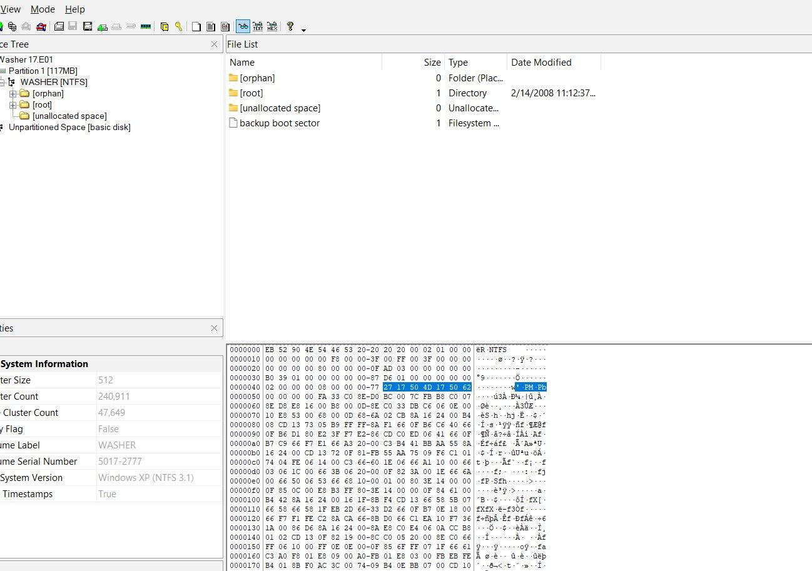
> The `WASHER` partition is selected. System Information confirms Volume Serial Number `5017-2777`, Volume Label `WASHER`, and File System Version `Windows XP (NTFS 3.1)`. The highlighted hex bytes at offset `0x48` independently corroborate the extraction.

### Time Zone Verification

All three forensic images were configured with `(GMT-7:00) America/Denver` — Mountain Daylight Time (MDT, UTC-7), consistent with the geographic context of the suspect's activities. A single, consistent zone is essential for reliable timeline reconstruction across data sources (see Figures 1.1–1.3).

---

## Part II — File and Metadata Analysis

### Identification of Suspicious Files

Five files on `Mantooth32.E01` evidencing illegal activity were located and tagged under **`Illegal Activities`**:

| File | Description |
|---|---|
| `chapter3[1].htm` | HTML guide titled *"How to make Meth"* — lists pseudoephedrine, red phosphorus, iodine, distilled water |
| `ATM_THEFTS1.ppt` | ATM theft strategy presentation |
| `How to Steal Cars.txt` | Vehicle theft instructions |
| `csid_meth1_small[1].jpg` | Drug manufacturing equipment photograph |
| `Those who owes.xls` | Financial ledger of debtors to Mantooth |

**Figure 3.1** — `Illegal Activities` bookmark: 5 tagged files with analyst comments
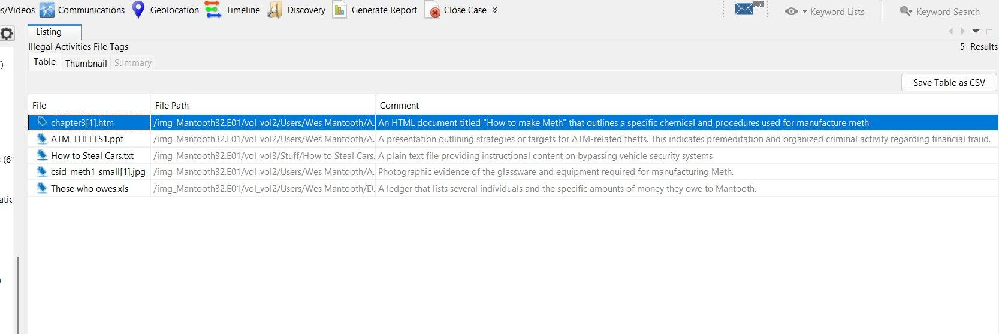
> All five bookmarked files are shown alongside analyst comments. `chapter3[1].htm` is described as an HTML document outlining chemicals and procedures for manufacturing methamphetamine. `ATM_THEFTS1.ppt` outlines ATM theft strategies. `How to Steal Cars.txt` provides vehicle theft instructions. `csid_meth1_small[1].jpg` shows drug manufacturing equipment. `Those who owes.xls` is a debt ledger listing individuals and amounts owed to Mantooth.

**Figure 3.2** — `chapter3[1].htm` rendered in Autopsy
> *Note: This screenshot was not embedded in the original document.* The document is titled "How to make Meth" and lists materials including a lava lamp, pseudoephedrine, red phosphorus, iodine, and distilled water — direct evidence of involvement in or planning for the illegal manufacture of methamphetamine.

### Deleted File Recovery — `ValidateCreditCard.zip`

`ValidateCreditCard.zip` was located on `Mantooth32.E01`:

```text
Path:        /img_Mantooth32.E01/vol_vol2/Users/Wes Mantooth/Documents/ValidateCreditCard.zip
MIME type:   application/zip
Size:        409,724 bytes
MFT entry:   1613 (Internal ID 4366)
Allocation:  File Name = Unallocated, Metadata = Unallocated (DELETED)
Created:     2007-07-14
MFT changed: 2007-08-04 09:04:30 MDT  ← deletion event
```

Both the file-name and metadata allocations are *Unallocated*, confirming deletion. The MFT entry's last-changed timestamp pins the deletion date to **on or around 4 August 2007**. The content remained recoverable as no overwrite had occurred.

**Figure 4.1** — `Deleted Files > All`: **1,638 files** identified
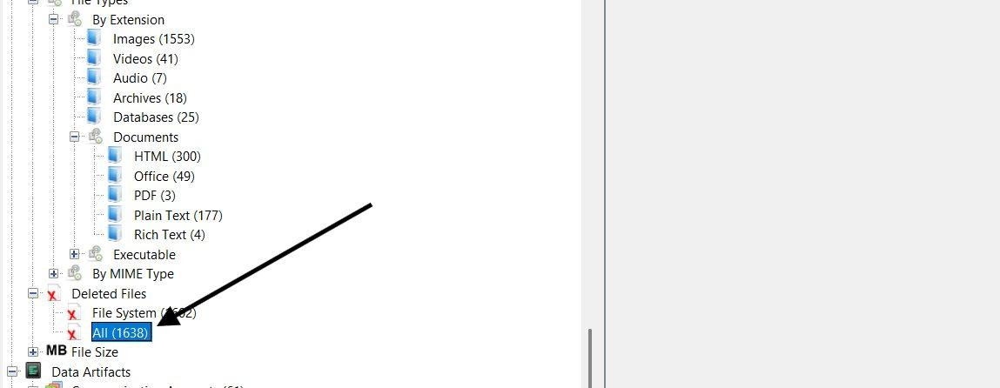
> Autopsy's *Views* panel with *Deleted Files > All* selected, displaying 1,638 total deleted files across the case.

**Figure 4.2** — Search filter `Validate` locates `ValidateCreditCard.zip`
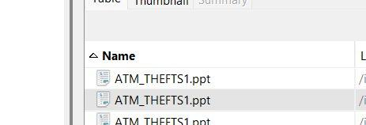
> The red X icon confirms its deleted status.

**Figure 4.3** — File metadata: MFT entry 1613, both allocations *Unallocated*
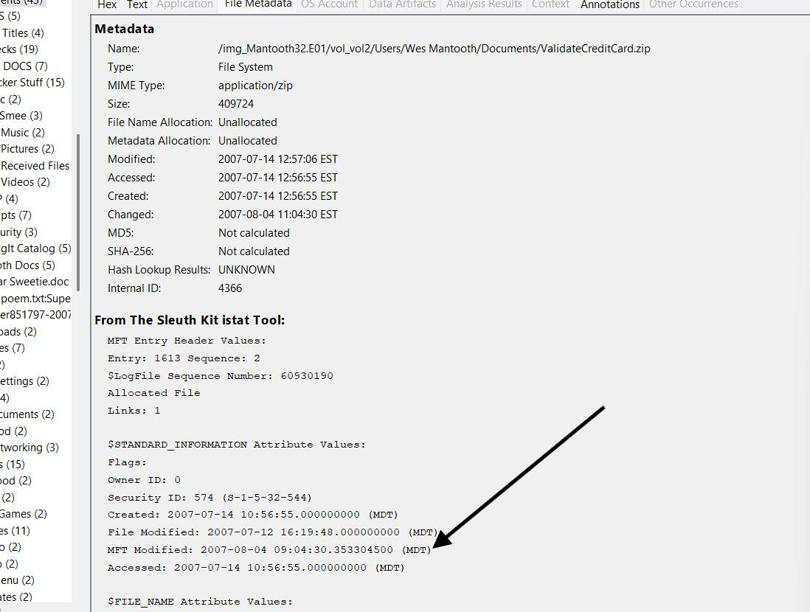
> MIME type `application/zip`, size 409,724 bytes. Created 2007-07-14, MFT entry last changed 2007-08-04 at 09:04:30 MDT, indicating the deletion date.

### Document Examination

Approximately **26 `.doc` files** were identified across all three evidence images. Files of forensic significance include:

`How To Steal Credit Numbers.doc` · `C money plates.doc` · `Confidential Business Letter.doc` · `The Dealz.doc` · `John.doc` · `Wes.doc` · `X marks the spot.doc` · `Dear Sweetie.doc`

**Figure 5.1** — Full `.doc` file listing across all evidence images
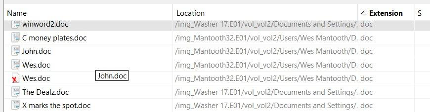

**Figure 5.2** — Additional `.doc` files including `C money plates.doc` and `The Dealz.doc`
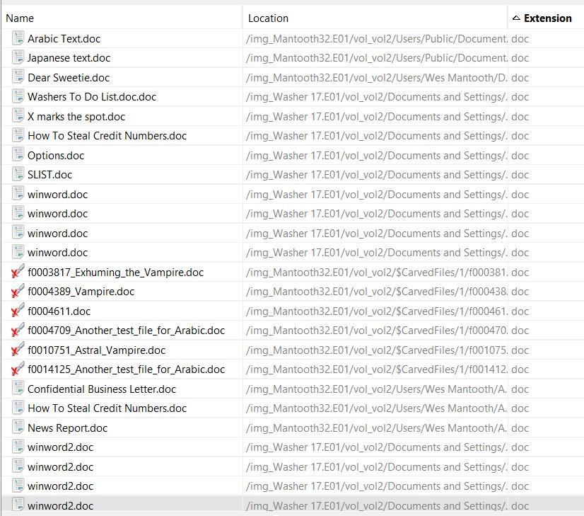
> File names are consistent with financial fraud and check forgery activities.

#### Foreign-Language Document Authorship

Both `Arabic Text.doc` and `Japanese text.doc` were authored by **Mark Stringer** (`dc:creator` and `meta:last-author`), created on the same date (**2006-07-09**), with the company field set to *AccessData Corp* — a known forensic-tool environment artefact, suggesting these are sample documents rather than authored suspect content. Both were bookmarked under **`Foreign Documents`**.

**Figure 5.3** — `Arabic Text.doc` author: Mark Stringer
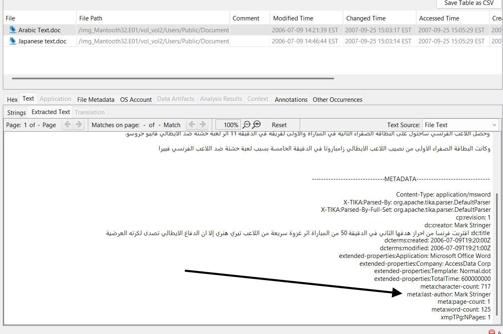

**Figure 5.4** — `Japanese text.doc` author: Mark Stringer
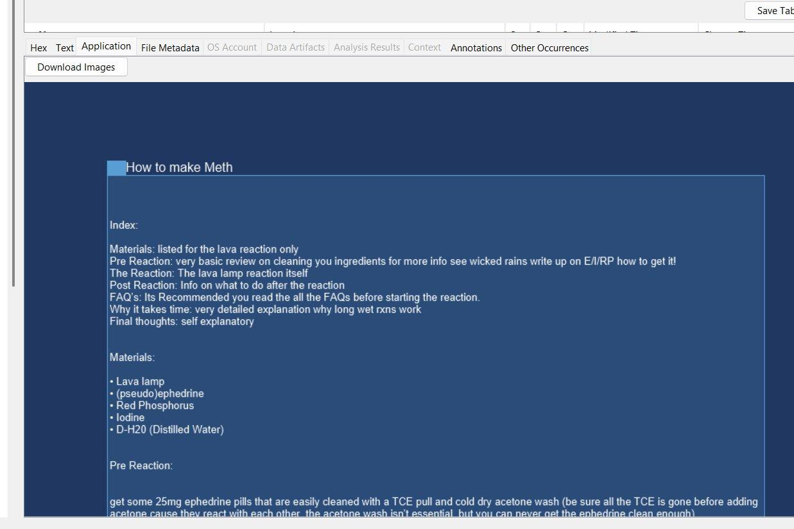

**Figure 5.5** — Tags panel: `Foreign Documents` (2), `Illegal Activities` (5)
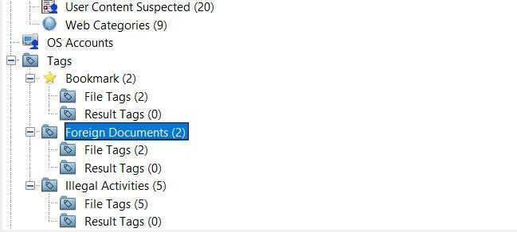

---

## Part III — Email and Communication Analysis

### Email Examination

Wes Mantooth's primary email address is **`dollarhyde86@comcast.net`**. Multiple threads provide direct evidence of check forgery, prescription fraud, drug activity, and organised financial crime.

**Figure 6.1** — Autopsy email listing: key fraudulent and suspicious emails
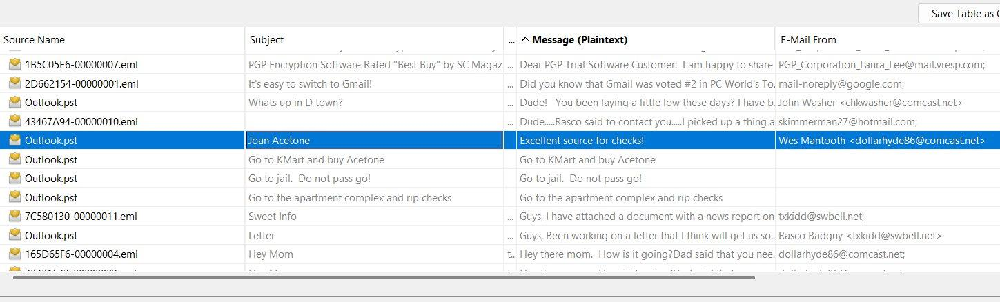
> Notable entries include the "Whats up in D town?" thread from John Washer, a reference from `skimmerman27@hotmail.com`, the "Joan Acetone" entry showing "Excellent source for checks!", tasks including "Go to the apartment complex and rip checks", the "Letter" email from Rasco Badguy, and a "Hey Mom" email.

#### Thread: *"Whats up in D town?"* — Check Forgery and Prescription Fraud

| Time (MDT) | From → To | Substance |
|---|---|---|
| 06/20/2007 12:56 | Washer → Mantooth | Reference to *"Special K"* (ketamine); urges urgent contact |
| 06/20/2007 13:01 | Washer → Mantooth | *"forget percriptions... This is the way to go!"* + drug-manufacturing URL |
| 06/20/2007 13:01 | Washer → Mantooth | *"hot on the trail of some good scripts... do a little editing on the type and quantity"* |
| 06/20/2007 13:09 | Washer → Mantooth | Explicit check-washing question + link to `celtickane.com/projects/washing/` |
| Embedded reply | Mantooth → Washer | *"sticking with my method... I horked another today from the pharm counter"* |

**Figure 6.2** — John Washer to Mantooth, 06/20/2007 12:56 PM: "Special K" reference
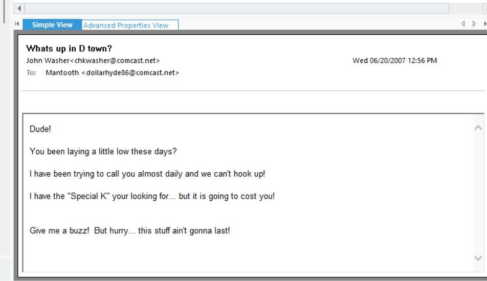
> The opening email from John Washer (`chkwasher@comcast.net`) references "Special K" — a street name for Ketamine — and urges urgent contact, indicating an active drug dealing relationship alongside the check forgery scheme.

**Figure 6.3** — Washer 13:01 PM: drug URL and "Forget Prescriptions"
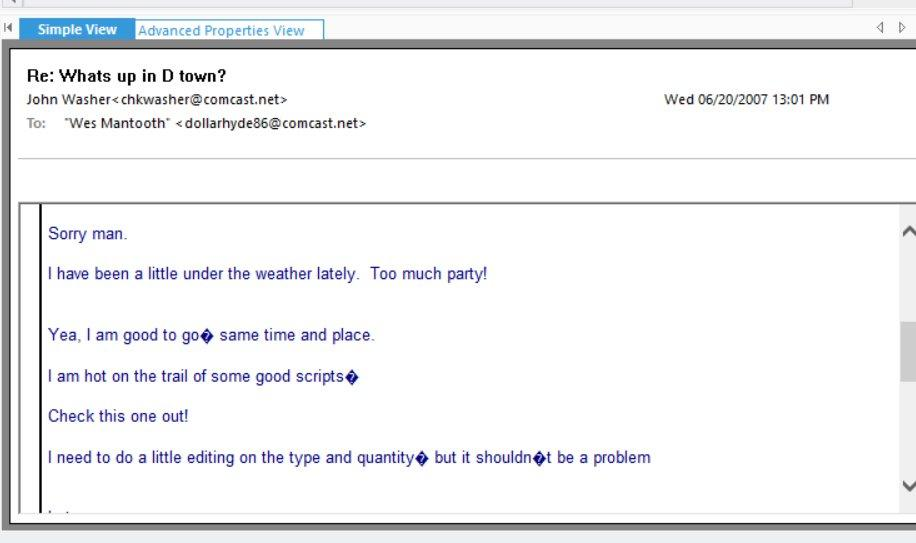
> Includes a link to a drug manufacturing page, encouraging Mantooth to obtain drugs through illegal means rather than legitimate prescriptions.

**Figure 6.4** — Washer 13:01 PM: "Hot on the trail of good scripts"
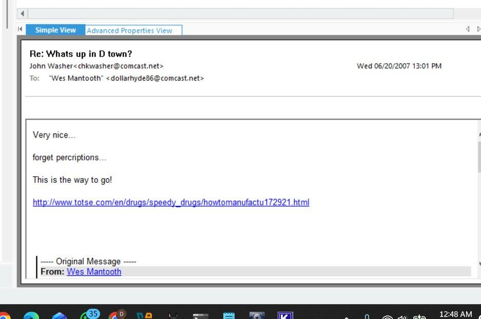
> References the acquisition and alteration of stolen prescription pads.

**Figure 6.5** — Washer 13:09 PM: explicit check-washing question
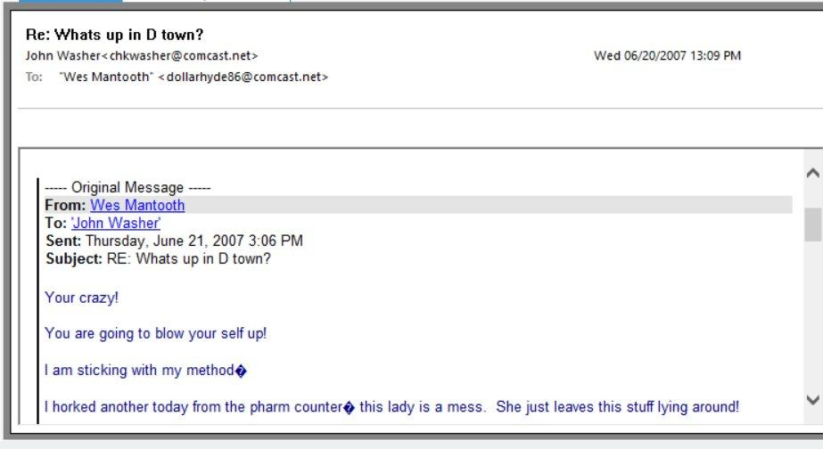
> The most forensically critical message: *"how are you going to get the writing off these? The usuall method? Does it work the same with scripts as checks?"* with a link to a check-washing guide. This constitutes **direct evidence of a conspiracy to commit check fraud through chemical washing**.

**Figure 6.6** — Wes Mantooth reply: "Horked another from the pharm counter"
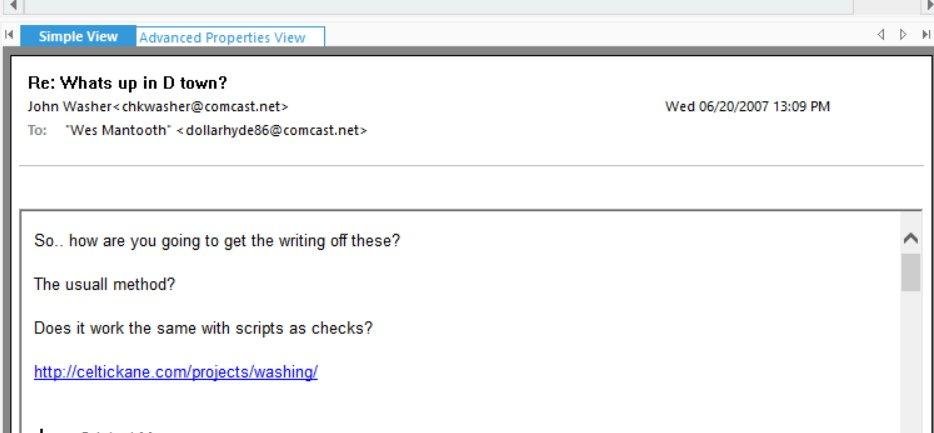
> Mantooth confirms systematic theft of pharmaceutical items and an established check-washing method.

#### Email: *"A Trade"* — Blank Cheque Trafficking

**Figure 6.7** — `smee.rox@gmail.com` proposes trading blank cheques
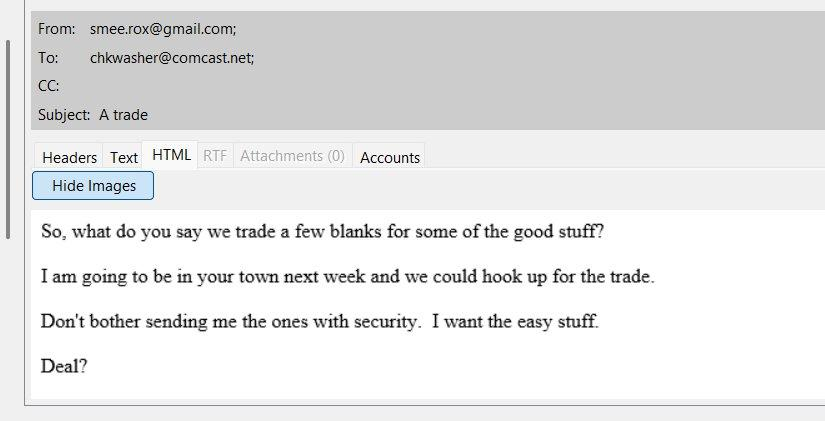
> Proposes trading *"a few blanks"* (blank cheques) for *"some of the good stuff"*, adding *"Don't bother sending me the ones with security. I want the easy stuff."* — evidence that John Washer is **trafficking blank cheques** within the network.

#### Email: *"Letter"* — Advance Fee Fraud

**Figure 6.8** — Rasco Badguy: advance-fee fraud letter to the criminal network
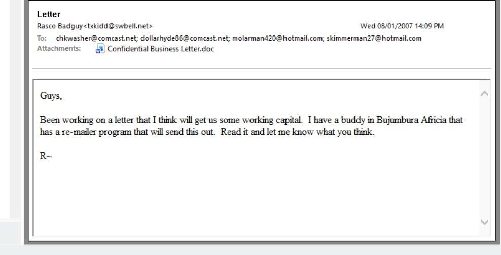
> Email from Rasco Badguy (`txkidd@swbell.net`) sent 08/01/2007 to Washer, Mantooth, `molarman420@hotmail.com`, and `skimmerman27@hotmail.com`. Describes a letter to obtain "working capital" via a re-mailer program with an Africa-based contact. Attachment: `Confidential Business Letter.doc`. Consistent with **advance fee fraud (419 scam)**.

#### Email: Skimmerman27 — ATM Machines

**Figure 6.9** — `skimmerman27@hotmail.com` to Mantooth: ATM machine expertise referral

> Sent 2007-07-23 at 16:59:26 MDT: *"Dude.....Rasco said to contact you.....I picked up a thing and need to get it open and he said you had experience with ATM machines. Got one in my living room."* Confirms Rasco is **directing criminal contacts to Mantooth** for ATM tampering assistance.

#### Email: *"Re: New Venture"* — Chain Letter Fraud

**Figure 6.10** — John Washer: "He got this from a SPAM chainletter!"
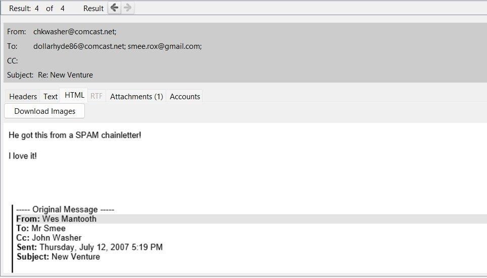
> Demonstrates the group's use of spam and chain-letter schemes as part of their fraud portfolio.

### Appointment and Calendar Analysis — June 2007

Mantooth's Outlook task list contains **13 tasks, all created on 2007-06-21** between 17:13 and 18:25 MDT, many explicitly criminal:

*Steal checks · wash checks · pass checks · Make Meth · make $$$ · Go to KMart and buy Acetone · Go to the apartment complex and rip checks · Go to jail. Do not pass go!*

The sequential due dates — **steal cheques on 06/20**, **wash cheques on 06/21** — align precisely with the email thread from the same dates, demonstrating **coordinated, premeditated criminal action**.

**Figure 7.1** — Full task list: 13 tasks created 06/21/2007
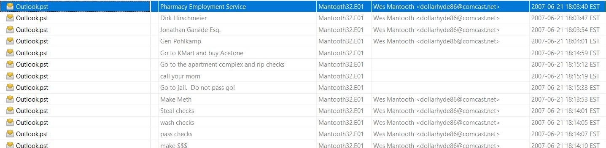

**Figure 7.2** — Calendar entries: "Go Check Stealing" and "Meet with Seth", 06/21/2007 18:05
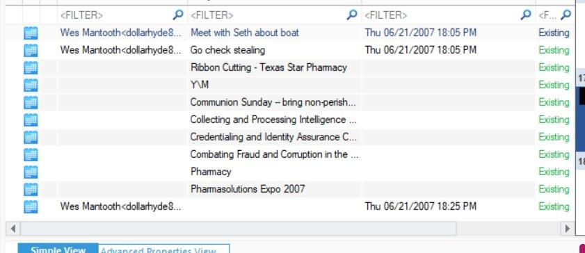

**Figure 7.3** — Task `wash checks`, due 06/21/2007 19:00 PM
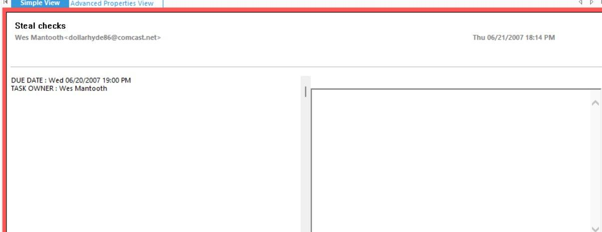
> Owned by Wes Mantooth (`dollarhyde86@comcast.net`). Direct evidence Mantooth planned to chemically wash stolen cheques that evening.

**Figure 7.4** — Task `Steal checks`, due 06/20/2007 19:00 PM
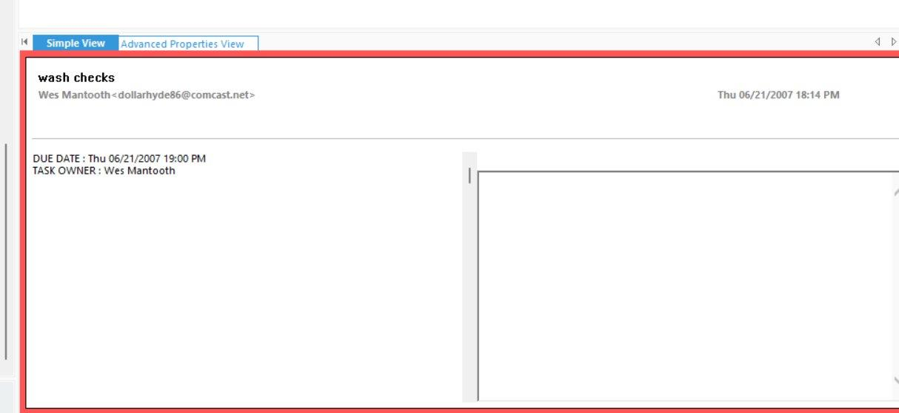
> Sequential due dates — stealing cheques on 06/20 then washing them on 06/21 — demonstrate coordinated and premeditated criminal action.

**Figure 7.5** — `June 2007 appointments` tag creation in Autopsy
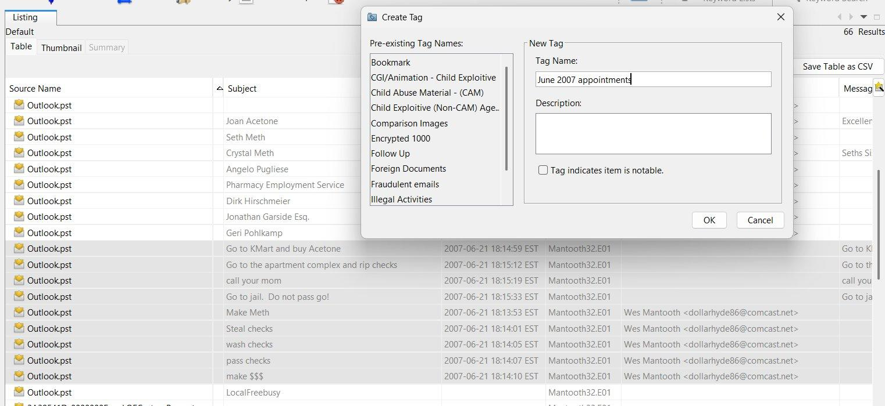

**Figure 7.6** — June 2007 appointments task list detail
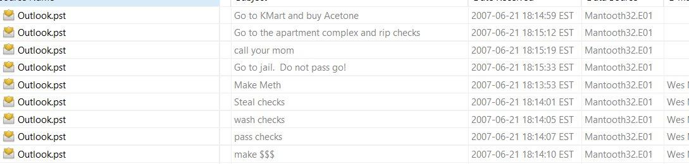
> Includes *Go to KMart and buy Acetone*, *Go to the apartment complex and rip checks*, *call your mom*, and *Go to jail. Do not pass go!*

**Figure 7.7** — June 2007 appointments: 9 e-mail messages tagged (17:13:53–17:15:33 MDT)
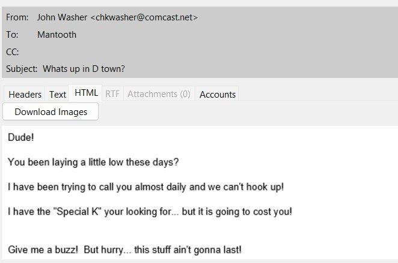

### Contact and Associate Identification

Eight contacts were enumerated from Mantooth's Outlook PST and independently corroborated using **Kernel Outlook PST Viewer**:

| Contact | Email | Affiliation / Note |
|---|---|---|
| Joan Acetone | `acetonejoan@gmail.com` | Night Cook, **Arby's Inc.**, Lindon UT — note: *"Excellent source for checks!"* |
| Seth Meth | `crackme@aol.com` | Alias *crackme* + surname *Meth* — drug-related |
| Crystal Meth | `sethsister@aol.com` | Note: *"Seths Sister"* |
| Geri Pohlkamp | `gpohlkamp@ifound.org` | Initiative Foundation, Little Falls, MN |
| Jonathan Garside Esq. | `jgarside@foxgalvin.com` | Attorney, Fox Galvin, St. Louis, MO |
| Dirk Hirschmeier | `hirschmeier@antraco.net` | **ANTRACO Chemie**, Duisburg, Germany — chemical trading |
| Pharmacy Employment Service | `info@pharmacyemployment.com` | Bloomfield Township, MI |
| Angelo Pugliese | — | Centre for Biomolecular Sciences, University of Nottingham, UK |

**Figure 8.1** — Autopsy contacts table: all 8 contacts
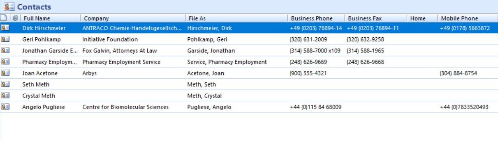

**Figure 8.2** — Kernel Outlook PST Viewer: full contact cards
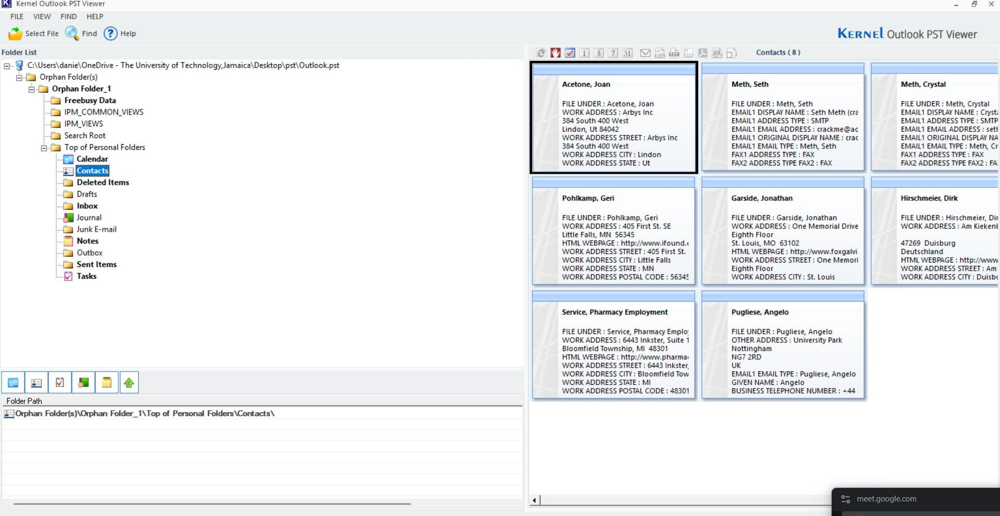
> Confirms Joan Acetone's address as Arbys Inc, 384 South 400 West, Lindon, UT 84042. Seth Meth's email is `crackme@aol.com`. Crystal Meth's email is `sethsister@aol.com`.

**Figure 8.3** — Joan Acetone: *"Excellent source for checks!"*, company: Arbys
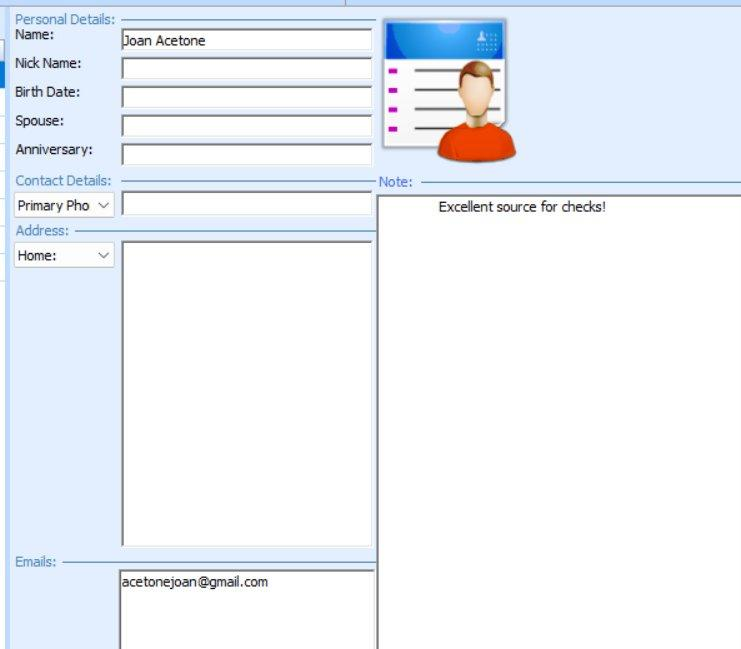

**Figure 8.4** — Joan Acetone full PST details: Night Cook, Arbys Inc


**Figure 8.5** — Seth Meth: `crackme@aol.com`
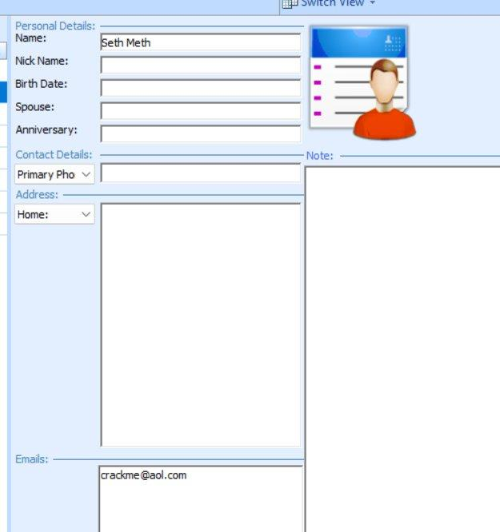

**Figure 8.6** — Crystal Meth: "Seths Sister", `sethsister@aol.com`
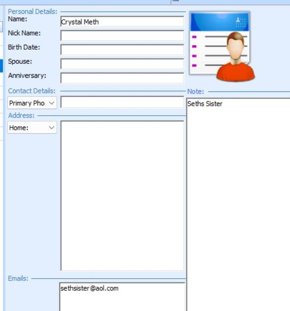

**Figure 8.7** — Geri Pohlkamp: `gpohlkamp@ifound.org`, Initiative Foundation
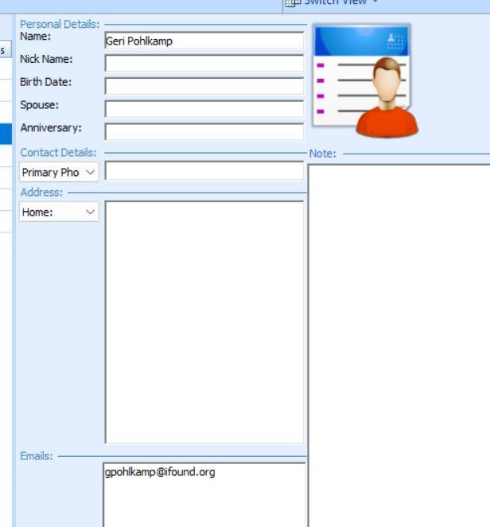

**Figure 8.8** — Jonathan Garside Esq.: `jgarside@foxgalvin.com`, Fox Galvin
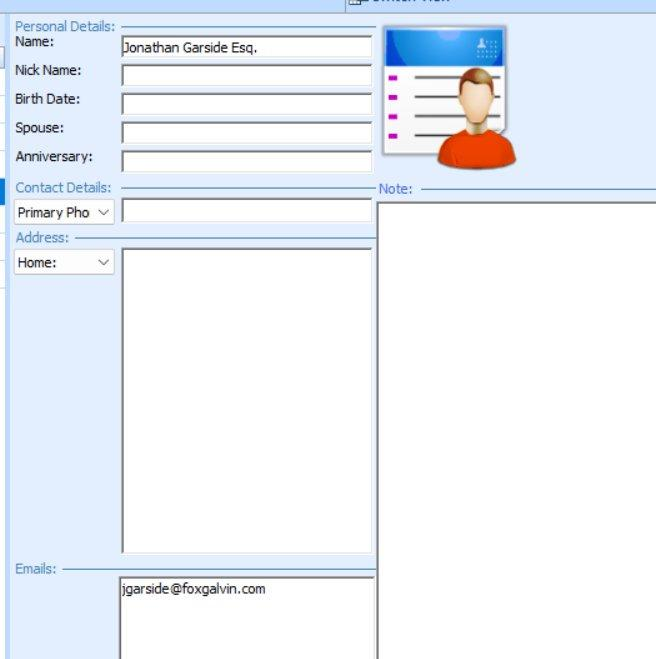

**Figure 8.9** — Dirk Hirschmeier: `hirschmeier@antraco.net`, ANTRACO Chemie
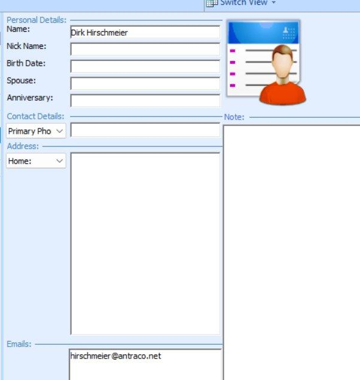
> Connection to a chemical trading company is forensically significant given the drug manufacturing evidence.

**Figure 8.10** — Pharmacy Employment Service: `info@pharmacyemployment.com`
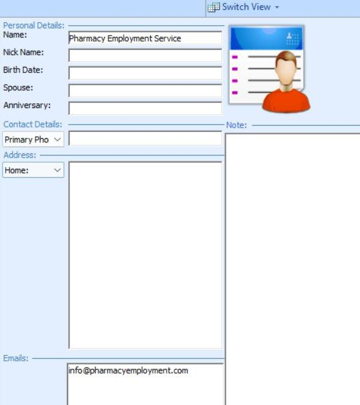

**Figure 8.11** — Angelo Pugliese: Centre for Biomolecular Sciences, Nottingham UK
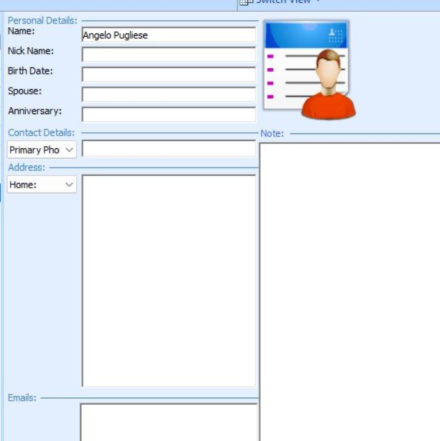

---

## Part IV — Multimedia and Metadata Analysis

### Graphics Analysis

A total of **1,553 image files** were identified across all three evidence images via *Views > File Types > Images*. `ATM_THEFTS1.ppt` was found on **both** `Mantooth32.E01` and `Thumbdrive 05.E01` (in `/Business Ideas/`), confirming **deliberate cross-device propagation** of ATM-theft planning material.

```text
ATM_THEFTS1.ppt (Thumbdrive 05.E01)
  Path:       /img_Thumbdrive 05.E01/Business Ideas/ATM_THEFTS1.ppt
  Size:       570,880 bytes
  MIME type:  application/vnd.ms-powerpoint
  Modified:   2007-07-12
  Accessed:   2007-07-24
  MD5:        d9d1f48d3df7c4453bd53864eda87eda
```

**Figure 9.1** — `ATM_THEFTS1.ppt` file metadata on `Thumbdrive 05.E01`
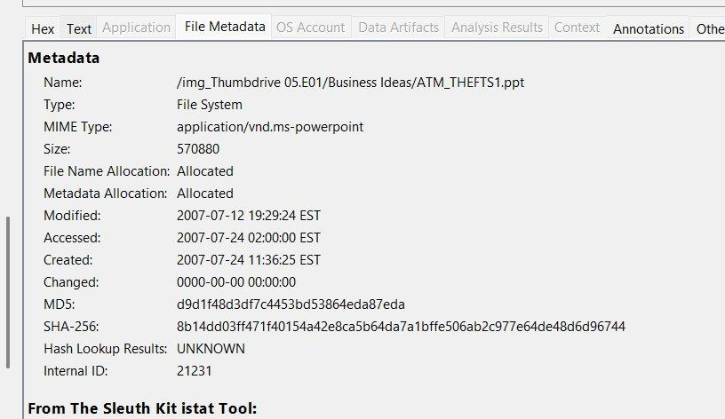

### Suspicious Graphics

Six images were tagged under **`Suspicious Graphics`**:

| File | Subject |
|---|---|
| `Cover Plate.bmp` | ATM skimmer cover plate |
| `csid_meth1_small[1].jpg` | Drug-lab glassware |
| `images[1].jpg` | Bed with bundled currency (cash concealment) |
| `VWCA8QNCACJQ28J…` | Crystalline substance next to a coin (consistent with methamphetamine) |
| `images[6].jpg` | Bags of white powder on scales (distribution prep) |
| `image_7.jpg` | CCTV footage of individual at ATM, timestamp `6:40:34 960H, 11-9-2001 FRI` |

**Figure 9.2** — Suspicious Graphics bookmark: thumbnail view of all 6 tagged images


**Figure 9.3** — `camera03[1].jpg`: Bradesco "Multi Expresso" ATM
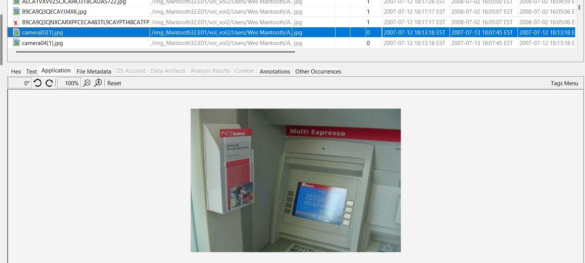
> Possession of detailed ATM photographs is consistent with surveillance prior to ATM tampering or skimmer installation.

**Figure 9.4** — ATM skimmer installation photograph
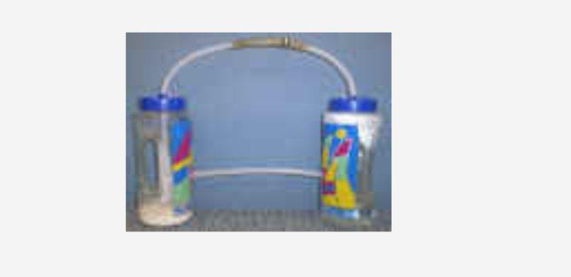
> A hand installing or manipulating a device on an ATM card reader slot — consistent with card skimmer installation.

**Figure 9.5** — CCTV footage: individual at ATM, 11-9-2001
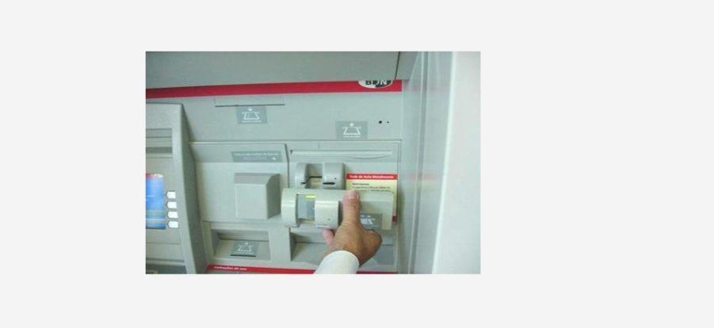

**Figure 9.6** — Drug powder bags on scales
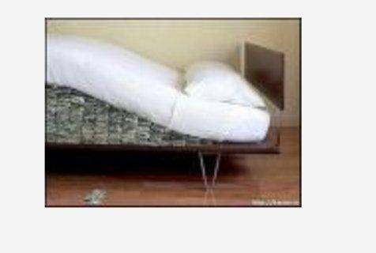
> Consistent with drug weighing and preparation for distribution.

**Figure 9.7** — Crystalline drug substance with coin for scale
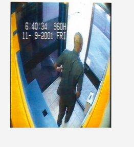
> Directly corroborates the drug manufacturing and distribution activity evidenced by `chapter3[1].htm` and the email correspondence.

**Figure 9.8** — Drug laboratory glassware setup
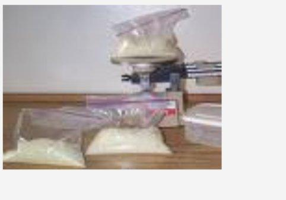
> Specialised glassware apparatus connected by tubing consistent with a chemical reaction setup for drug synthesis.

### EXIF Data Extraction — `Dc6.JPG`

Located on `Washer 17.E01` at: `/img_Washer 17.E01/vol_vol2/Documents and Settings/Administrator/Desktop/Zips/Pix3.ZIP/Dc6.JPG`

```text
MIME type:   image/jpeg
Size:        386,922 bytes
MD5:         a005ecd81f9ee3106907cb9cf006b071
SHA-256:     0a52fed7ce6af4dfa4531755c224ec3d197449c02fff873cc328b44ad01a6253

FS Modified: 2003-10-06
FS Accessed: 2008-02-12
FS Created:  2007-08-03

EXIF Date Created: 2002-10-05 00:13:50 MDT
EXIF Device Make:  EASTMAN KODAK COMPANY
EXIF Device Model: KODAK DX3600 DIGITAL CAMERA
```

The **five-year gap** between the EXIF capture date (2002) and the file-system created date (2007) indicates the photo was taken years before being copied to the Washer drive — useful for provenance reasoning.

**Figure 9.9** — `Dc6.JPG` file metadata: path, hashes, timestamps
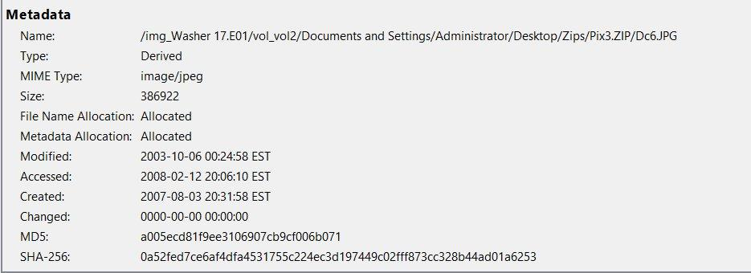

**Figure 9.10** — `Dc6.JPG` EXIF analysis: camera make, model, and date taken
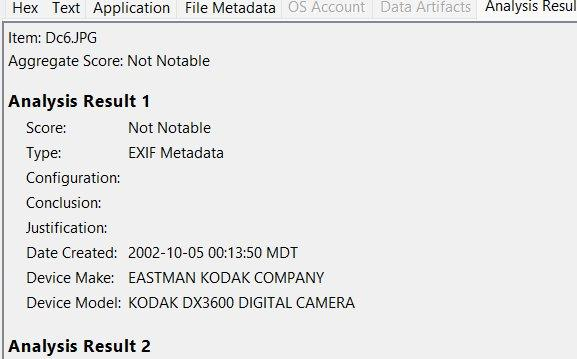

---

## Part V — Advanced Analysis

### Keyword Searches and Pattern Recognition

| Term | Findings |
|---|---|
| `skimmer` | Resolves to alias `skimmerman27@hotmail.com`, a recipient of Rasco's group fraud email; `ATM_THEFTS1.ppt` corroborates |
| `ATM fraud` | Multiple hits across emails, presentations, and graphics |
| `Rosco` / `Rasco` | Found in the *Letter* email and `skimmerman27` email (*"Rasco said to contact you"*) — confirms **Rasco directs criminal contacts to Mantooth** |
| `Mantooth` | Hits across files and communications on `Mantooth32.E01` — central node |

A **data-carving** pass on `Washer 17.E01` recovered a cached Google search page (`f0024333.dat` from `/$CarvedFiles/1/`) showing the query **"credit card skimming"** — direct evidence of research into card-fraud techniques.

**Figure 10.1** — Carved Google search results page: "credit card skimming"
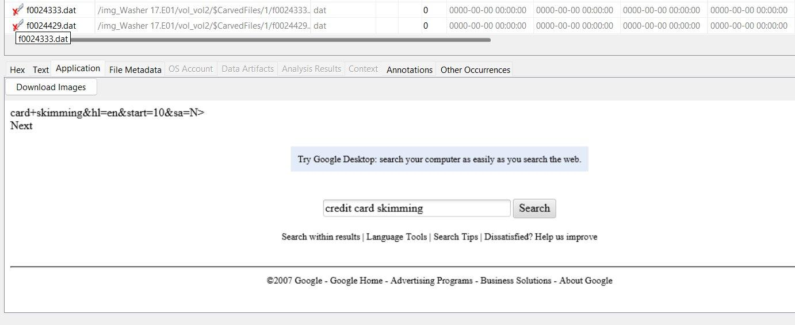
> The cached page footer shows "©2007 Google", confirming contemporaneous research into credit card skimming techniques on the Washer drive.

### Timeline Analysis

Autopsy's Timeline feature was used to visualise file-system activity across all evidence images between **January 2004 and July 2008** in logarithmic scale.

**Figure 10.2** — Autopsy Timeline (logarithmic): file-system activity 2001–2008
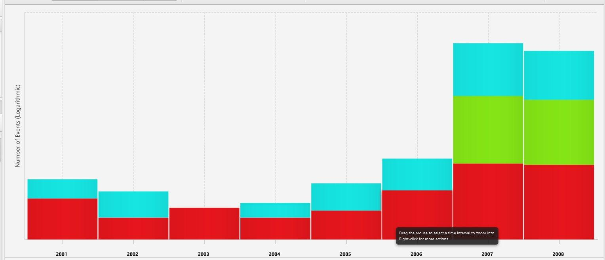
> Low baseline activity from 2001–2005. Moderate increase in 2006 (foreign-language document creation, July 2006). **Largest spike in 2007** — aligned with the June–August 2007 criminal planning activities including check-forgery emails, task creation, the advance-fee fraud letter, and `ValidateCreditCard.zip` deletion. Second large spike in 2008 near the time of device seizure. Because the scale is logarithmic, the 2007 bar represents **exponentially more events** than earlier years.

---

## Part VI — Additional Investigation Tasks

### Data Carving and Recovery

Data carving was performed on unallocated space using Autopsy's built-in carving module. Carved files were recovered from `$CarvedFiles` on both `Mantooth32.E01` and `Washer 17.E01`. The two most significant carved artefacts were the cached Google search page for "credit card skimming" (Figure 10.1) and the `Recovered Chat.HTML` chat log (Figure 20.1 below).

### Encrypted Files Identified for RID 1000

Mantooth's local account:

```text
Login:          wes mantooth
SID:            S-1-5-21-3166329-3263506726-1320359247-1000  (RID 1000)
Created:        2007-02-27
Last login:     2008-02-12
Login count:    96
Administrator:  True
Password hint:  "in your face"
```

**Figure 11.1** — OS Account panel: `wes mantooth`, RID 1000
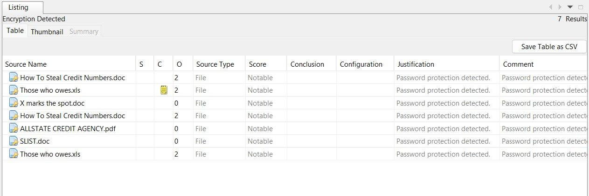
> SID `S-1-5-21-3166329-3263506726-1320359247-1000`, login count 96, administrator account.

**Seven password-protected files** were flagged by Autopsy's *Encryption Detected* analysis. After filtering for RID 1000, three encrypted files belonging to Mantooth were tagged under **`Encrypted 1000`**:

| File | Location |
|---|---|
| `Those who owes.xls` | `Mantooth32.E01` — `/Users/Wes Mantooth/…` |
| `How To Steal Credit Numbers.doc` | `Mantooth32.E01` — `/Users/Wes Mantooth/…` |
| `Those who owes.xls` | `Thumbdrive 05.E01` — `/Bidness Docs/…` |

**Figure 11.2** — Encryption Detected: 7 password-protected files
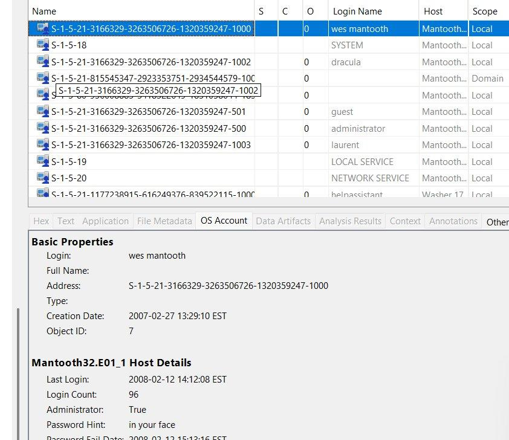
> Files include `How To Steal Credit Numbers.doc` (Score 2), `Those who owes.xls` (Score 2), `X marks the spot.doc` (Score 0), `ALLSTATE CREDIT AGENCY.pdf` (Score 0), and `SLIST.doc` (Score 0).

**Figure 11.3** — Applying `Encrypted 1000` file tag
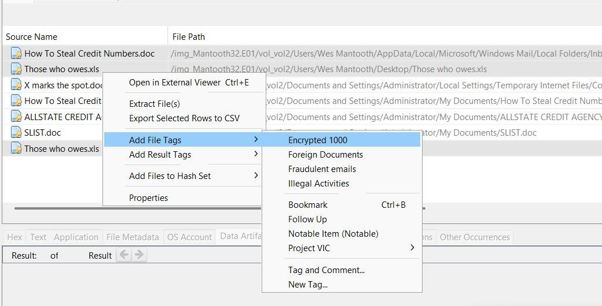

**Figure 11.4** — `Encrypted 1000` file tag listing
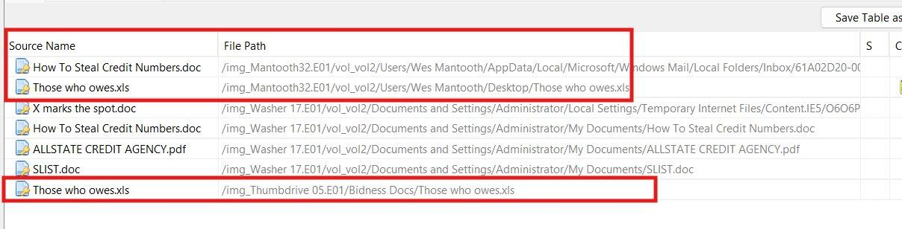

**Figure 11.5** — `Encrypted 1000` bookmark: final list
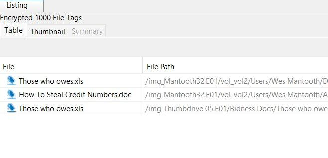

### Email Analysis: *"Re: oooh I have AOL!"*

Located in Mantooth's AOL data files on `Mantooth32.E01`:

```text
From:    "John Washer" <washermeister@gmail.com>
To:      "Mantooth2007" <Mantooth2007@aol.com>
Subject: Re: oooh I have AOL!
Date:    Wed, 20 Jun 2007 12:24:22 -0600
```

Authenticated with DKIM signatures from `gmail.com`. This establishes **`washermeister`** as John Washer's email username — a second identity alongside `chkwasher@comcast.net`.

**Figure 12.1** — AOL data file: `washermeister@gm oooh I have AOL!` entry
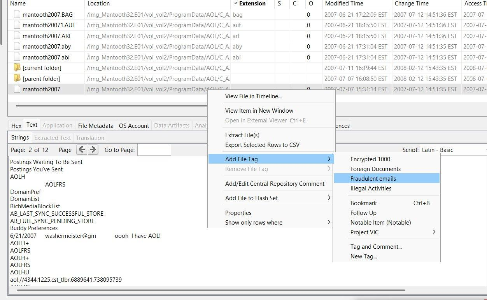

**Figure 12.2** — Full email headers: `washermeister@gmail.com` to `Mantooth2007@aol.com`
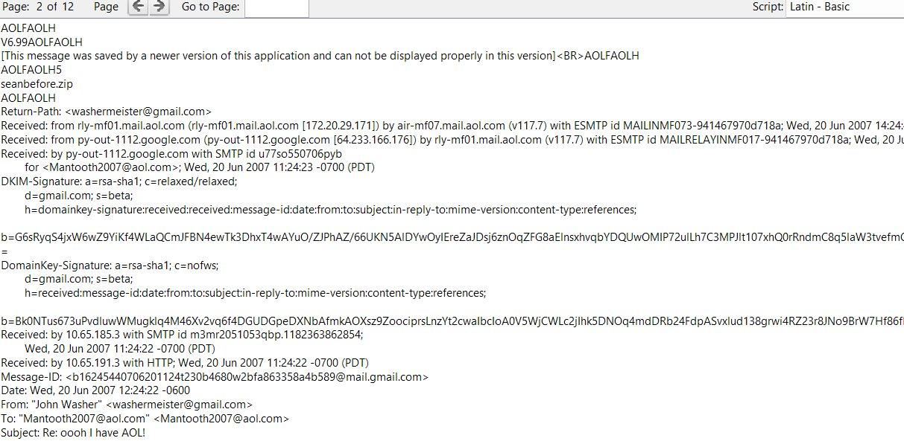

### Appointment Bookmark for June 2007

All appointments and tasks scheduled in June 2007 were tagged under **`June 2007 appointments`**. All activity was concentrated on **June 21, 2007**: 13 tasks and multiple calendar entries created in a single session between 17:13 MDT and 18:25 MDT (see Figures 7.1–7.7 above).

### Email to Mom — Address Identification

Located in Mantooth's *Sent Items* folder on `Mantooth32.E01`:

```text
From:        dollarhyde86@comcast.net
To:          toothfairy@mentaldental.com
Subject:     Hey Mom
Source file: 20401532-00000003.eml (112,959 bytes)
MD5:         87cd613179d3e7201d8103b17e5e29e0
```

**Figure 13.1** — "Hey Mom" email: recipient `toothfairy@mentaldental.com`
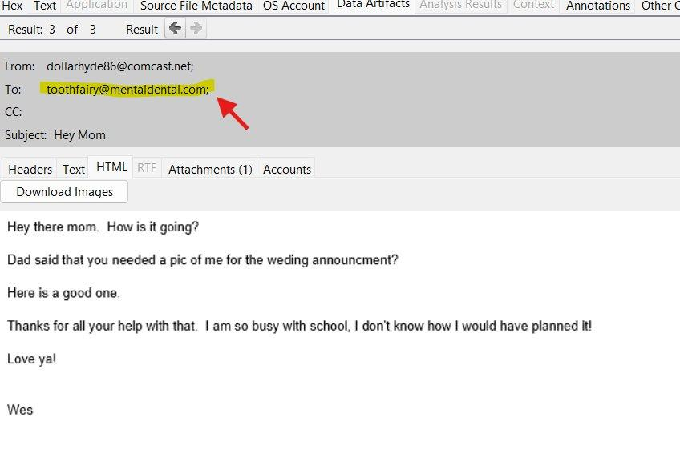

**Figure 13.2** — Source file metadata confirming sent from `Mantooth32.E01`
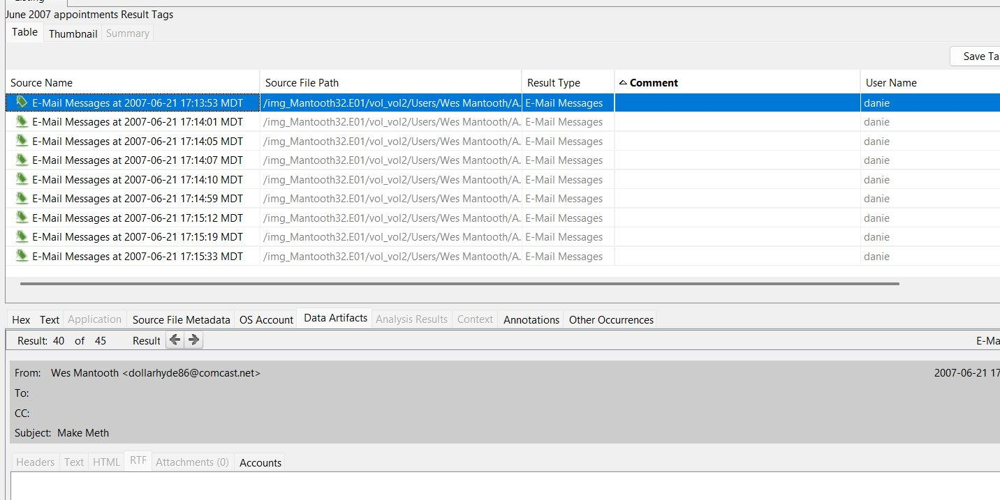

### Email to Mom — Event Discussion

The body discusses a **wedding announcement** — Mantooth is sending his mother a photograph for inclusion in it. One attachment was included.

**Figure 13.3** — "Hey Mom" email content: wedding announcement
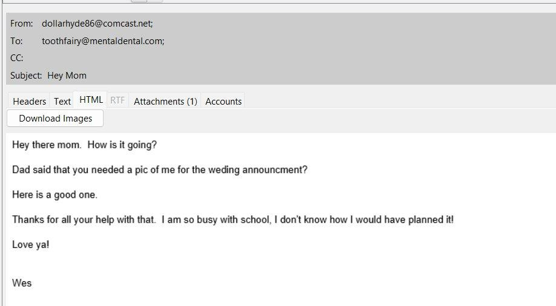
> *"Hey there mom. How is it going? Dad said that you needed a pic of me for the wedding announcement? Here is a good one. Thanks for all your help with that. I am so busy with school, I don't know how I would have planned it! Love ya! Wes."*

### Associate Identification — Joan Acetone

Joan Acetone is **Night Cook at Arby's Inc., 384 South 400 West, Lindon, UT 84042**. Mantooth's contact note — *"Excellent source for checks!"* — together with the "A Trade" email, strongly suggests Joan is supplying **stolen blank cheques** from Arby's into the washing-and-forgery scheme.

**Figure 14.1** — Joan Acetone contact note: "Excellent source for checks!"


**Figure 14.2** — Joan Acetone full PST contact: Night Cook, Arby's Inc, Lindon UT
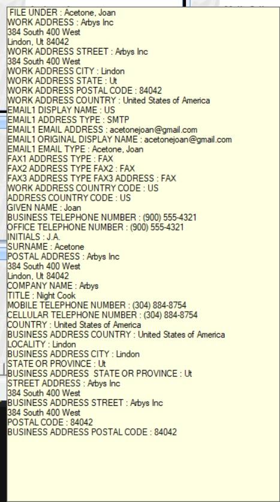

### Family Communication — Wes Mantooth's Dad

`Dear Sweetie.doc` on `Mantooth32.E01` reveals that Wes's father had recently been **released** (consistent with release from a custodial setting) and that the two were attempting to reconcile.

**Figure 15.1** — `Dear Sweetie.doc`: Wes references his dad being released
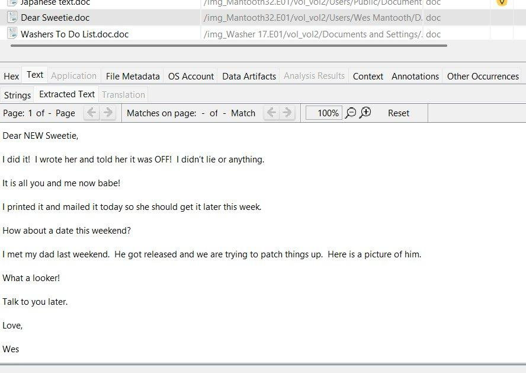
> *"I met my dad last weekend. He got released and we are trying to patch things up."*

### Accomplice Identification — Rosco and ATM Reader Rigging

The investigation confirms Mantooth was involved in discussions about rigging ATM card readers, facilitated by **Rosco (Rasco Badguy, `txkidd@swbell.net`)**. The `skimmerman27` email (Figure 6.9) confirms Rasco directed criminal contacts to Mantooth specifically for ATM expertise.

| Identity | Platform | Name / Alias |
|---|---|---|
| `txkidd@swbell.net` | SMTP | Rasco Badguy |
| `rbadguy2424` | AIM | Rasco Badguy |

**Figure 16.1** — Skimmerman27 email to Mantooth: ATM machine expertise confirmed
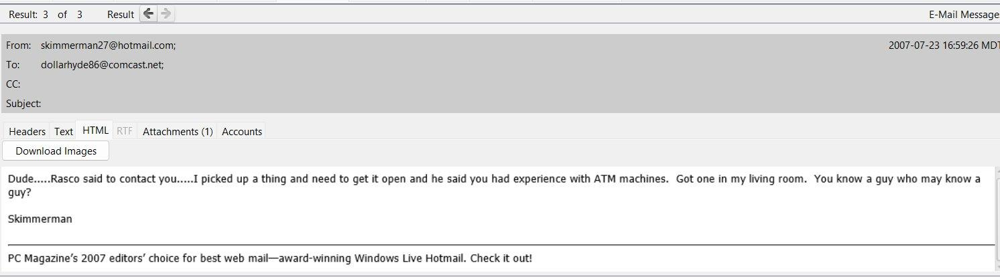

**Figure 16.2** — `Recovered Chat.HTML`: `rbadguy2424` and `Washergonebad`
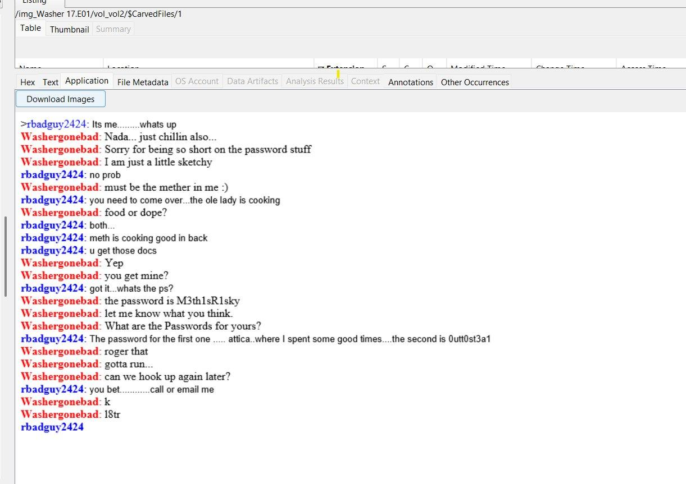
> Key exchanges: *"meth is cooking good in the back"*, exchange of encrypted documents, and disclosure of passwords in plaintext — `M3th1sR1sky` (Washergonebad), `attica` and `0utt0st3a1` (rbadguy2424).

### John Washer's AIM Username

`washergonebad` was identified from AIM URL-cache files on `Mantooth32.E01`:

```text
C:\...\Application Data\Aim\ukilldmw\washergonebad\urlcache\aim73.tmpe
```

Independently corroborated by `Recovered Chat.HTML`. Across platforms, John Washer appears as:

| Platform | Identifier |
|---|---|
| SMTP (primary) | `chkwasher@comcast.net` |
| SMTP (secondary) | `washermeister@gmail.com` |
| AIM | `Washergonebad` |

**Figure 17.1** — AIM URL cache: `washergonebad` username confirmed
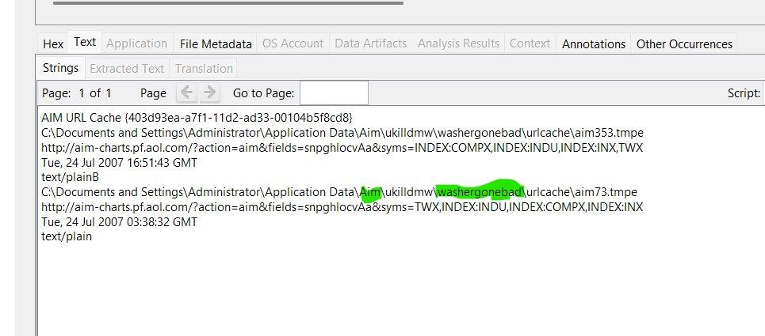

### Suspicious Graphics Analysis

Five additional graphics across the case were identified as suspicious and bookmarked under **`Suspicious Graphics`**. These images collectively provide photographic evidence supporting multiple criminal charges (ATM fraud, drug manufacturing, drug distribution, financial crime).

**Figure 18.1** — Suspicious Graphics bookmark: all 6 tagged images
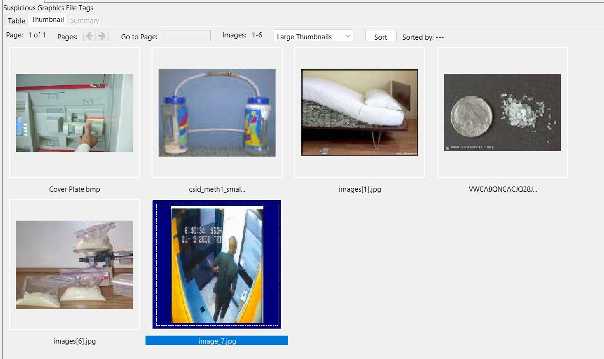

### File Export — `Dear Sweetie.doc` and `Hacker Stuff` Directory

Both items were exported from the forensic image to the `DATA` folder. The `Hacker Stuff` directory contained:

```text
CLOCK.BMP        ERROR.BMP        FTP.OID          getopt.c
HEX32.DLL        HTTP.OID         INETSRV.OID      readme.txt
Revelation.exe   RevelationHelper.dll               Thumbs.db
trout.exe        trout.ini
+ corresponding *-slack files
```

The presence of **`Revelation.exe`** (a password-recovery tool) alongside **`trout.exe`** and network-protocol files (`FTP.OID`, `HTTP.OID`, `INETSRV.OID`) indicates a directory of **hacking and network-intrusion tools**.

**Figure 19.1** — DATA folder: `Dear Sweetie.doc` and `Hacker Stuff` exported
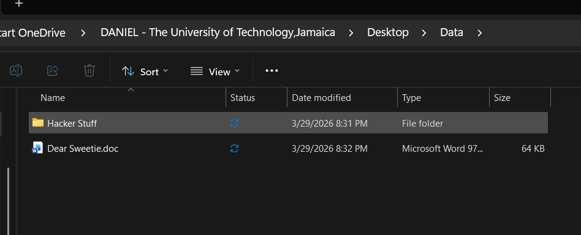

**Figure 19.2** — `Hacker Stuff` folder contents
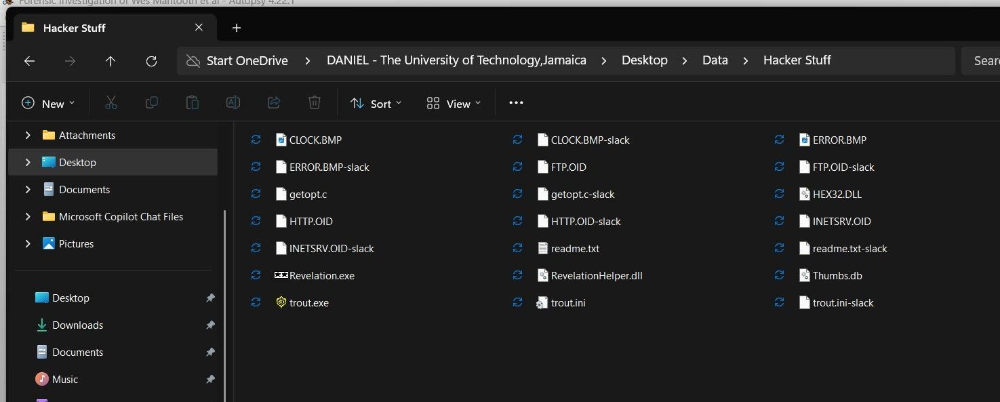

### Data Carving — `Recovered Chat.HTML`

An index search for `rbadguy` returned hits in **unallocated space on `Washer 17.E01`**. The first hit — an HTML-format chat log — was manually carved from `/$CarvedFiles/1/` and saved as `Recovered Chat.HTML` (tagged under `Recovered Chat`).

The recovered chat between **`rbadguy2424`** (Rasco Badguy) and **`Washergonebad`** (John Washer) establishes:

- **Active drug manufacture** — *"meth is cooking good in back"*
- **Exchange of password-protected criminal documents** — *"u get those docs"* / *"Yep"*
- **Plain-text disclosure of passwords**:
  - `Washergonebad` → `M3th1sR1sky`
  - `rbadguy2424` → `attica` (first document), `0utt0st3a1` (second document)
- **Plans to meet again** — *"can we hook up again later"* / *"you bet"*

This is **direct evidence of an ongoing criminal relationship** between Rasco Badguy and John Washer.

**Figure 20.1** — `Recovered Chat.HTML`: full chat between `rbadguy2424` and `Washergonebad`


### Additional Finding — *"Washers To Do List"*

`Washers To Do List.doc.doc` on `Washer 17.E01` contains list items of forensic interest:

> *Buy peanut butter · Call mom · Kill Familiars · Burry Wes's enemies · Confess to the police · Click here for something funny!*

*"Kill Familiars"* and *"Burry Wes's enemies"* reference violence or concealment; *"Confess to the police"* may be ironic or an oblique acknowledgement of criminal awareness.

**Figure 21.1** — `Washers To Do List.doc.doc` contents
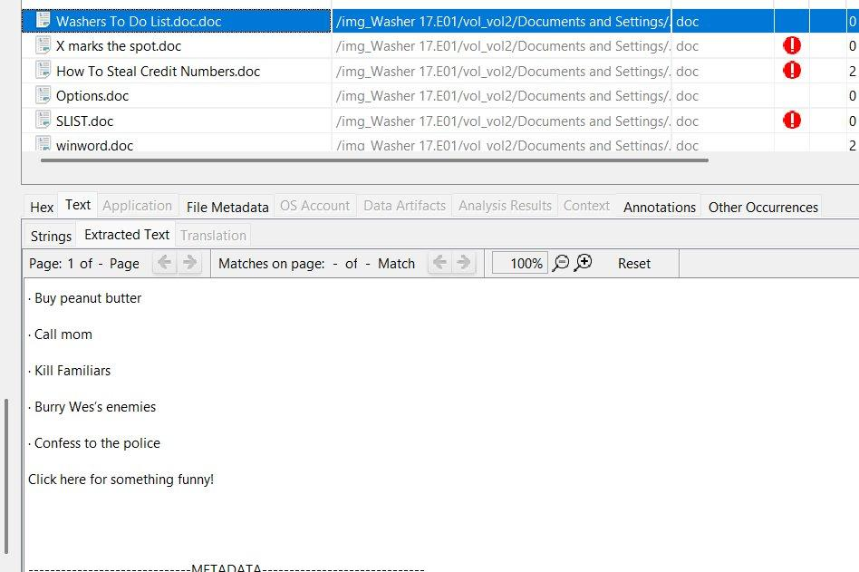

---

## Key Takeaways

1. **Coordinated network.** Email threads, Outlook tasks, contact metadata, and the recovered AIM chat together establish a coordinated criminal network of at least Mantooth, Washer, Rasco Badguy, Skimmerman, Joan Acetone, Seth Meth, and Crystal Meth — operating across check forgery, prescription fraud, methamphetamine manufacture, and ATM skimming.

2. **Identity correlation.** Multiple participants were resolved across SMTP, AIM, and Outlook PST identifiers — notably Washer (`chkwasher` / `washermeister` / `Washergonebad`) and Rasco (`txkidd` / `Rasco Badguy` / `rbadguy2424`).

3. **Timeline coherence.** The 06/20 → 06/21 sequence of *steal cheques* → *wash cheques* in Outlook tasks aligns exactly with the contemporaneous email thread, demonstrating premeditation.

4. **Recoverability of unallocated content.** The most probative single artefact — the chat log proving direct conspiracy between Washer and Rasco — was recovered from unallocated space via keyword-driven carving, reinforcing the value of carving even when 1,638 files are listed as deleted.

5. **Cross-device propagation.** `ATM_THEFTS1.ppt` appearing on both the primary computer and the thumb drive demonstrates deliberate operational distribution of criminal planning material.

---

## Repository Structure

```text
.
├── README.md           ← This file
└── images/             ← All 76 figures extracted from the original report
    ├── fig-01-1.jpg       Figure 1.1   Adding Mantooth32.E01 as Data Source
    ├── fig-01-2.jpg       Figure 1.2   Adding Washer 17.E01 as Data Source
    ├── fig-01-3.jpg       Figure 1.3   Adding Thumbdrive 05.E01 as Data Source
    ├── fig-02-1.jpg       Figure 2.1   Go To Offset Dialog
    ├── ...
    ├── fig-20-1.jpg       Figure 20.1  Recovered Chat.HTML Full Chat
    └── fig-21-1.jpg       Figure 21.1  Washers To Do List
```

---

## Acknowledgements

This case study was produced as coursework for **Forensic Computing**, **University of Technology, Jamaica (UTECH)**, under the instruction of **Dr. Patrick A. Linton**. The scenario, names, and evidence files are part of a teaching dataset; none of the persons, businesses, or addresses described are real.
