# Operation Cyb3rOps -- Full Penetration Test

> CNS3005: Ethical Hacking | University of Technology, Jamaica
> Group Members: Danielle Hemmings, Daniel Irving, Chadwick Hewitt, Christopher Chin
> Date: November 19, 2025

---

## Project Overview

This project documents a full penetration test carried out against the Cyb3rOps workstation VM in a controlled lab environment. The engagement covered the complete attack lifecycle: reconnaissance, enumeration, exploitation, privilege escalation, post-exploitation, and remediation planning.

The target was an intentionally vulnerable Ubuntu 22.04 machine configured to emulate an unpatched enterprise analyst workstation. The objective was to capture four hidden flags embedded across the system through a series of escalating techniques.

**Flags captured:**

| Flag | Location | Method |
|------|----------|--------|
| Flag 1 | SMB public share | Anonymous SMB access via smbclient |
| Flag 2 | User home directory | SSH brute-force (Hydra) + post-auth enumeration |
| Flag 3 | /home/root_flag.txt | Post-auth local file access |
| Flag 4 | /home/agentx/.mission_Cyb3r0ps/ | CVE-2021-3493 local privilege escalation |

---

## Lab Environment

**Network type:** Host-only virtual network (isolated from production and internet)

```
Subnet: 192.168.156.0/24

  Kali Linux (Attacker)          Cyb3rOps VM (Target)
  192.168.156.3            <-->  192.168.156.21
```

**Justification for host-only networking:** A host-only network was selected to ensure full connectivity between attacker and target while preventing any accidental interaction with the wider network. Bridged mode was rejected as it would expose the VM to the LAN; NAT was rejected due to non-deterministic addressing that harms reproducibility across sessions.

---

## Tools Used

| Category | Tools |
|----------|-------|
| Reconnaissance / Enumeration | nmap, enum4linux, Nessus |
| Credential / Auth Testing | Hydra, smbclient, ssh |
| Local Enumeration / PrivEsc Recon | find, sudo -l, la |
| Exploitation / Pivoting | gcc (PoC compilation), GitHub |
| Web Interaction and Defacement | nano |
| Documentation / Evidence Capture | script, cat |

These tools are standard in red-team lab engagements, are available on Kali Linux by default, and support repeatable scriptable workflows for capturing screenshots, command logs, and artifact evidence.

---

## Target System Details

| Property | Value |
|----------|-------|
| OS | Ubuntu 22.04.5 LTS |
| Kernel | 5.15.0-156-generic (x86_64) |
| SSH | OpenSSH 8.9p1 (Ubuntu build) |
| Web Server | Apache HTTP Server 2.4.52 (Ubuntu build) |
| Target IP | 192.168.156.21 |

The combination of an Ubuntu environment with slightly older kernel components was intentionally selected to emulate a realistic analyst workstation that might remain unpatched in an operational environment.

---

## Table of Contents

1. [Reconnaissance and Username Discovery](#1-reconnaissance-and-username-discovery)
2. [Exploitation and Flag Discovery](#2-exploitation-and-flag-discovery)
   - [Flag 1 - SMB Flag](#flag-1---smb-flag)
   - [Flag 2 - Decoy Flag](#flag-2---decoy-flag)
   - [Flag 3 - Root Flag](#flag-3---root-flag)
   - [Flag 4 - User Flag](#flag-4---user-flag)
3. [Privilege Escalation](#3-privilege-escalation)
4. [Post-Exploitation: Website Defacement](#4-post-exploitation-website-defacement)
5. [Remediation Plan](#5-remediation-plan)
6. [References](#6-references)

---

## 1. Reconnaissance and Username Discovery

### Network Setup Verification

Before scanning, the attacker machine's network configuration was confirmed to ensure it was correctly placed on the host-only subnet.

**Command:** `ip a`

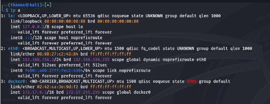
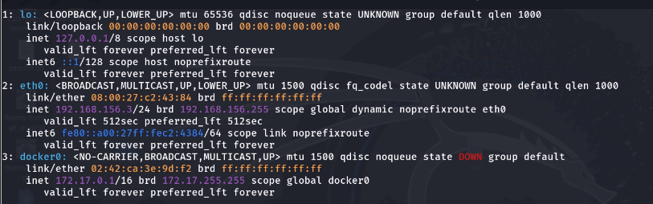

*The `ip a` output shows the Kali attacker at 192.168.156.3/24 on the active ethernet interface.*

**Command:** `ip route`

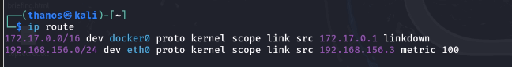

*Routing table confirms the attacker is directly reachable on the 192.168.156.0/24 subnet.*

**Command:** `nmap -Pn 192.168.156.0/24`

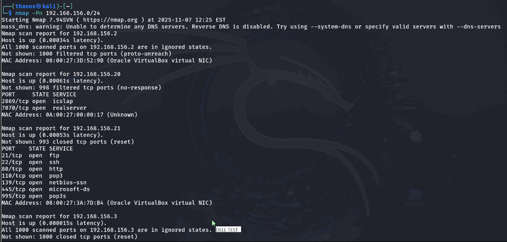
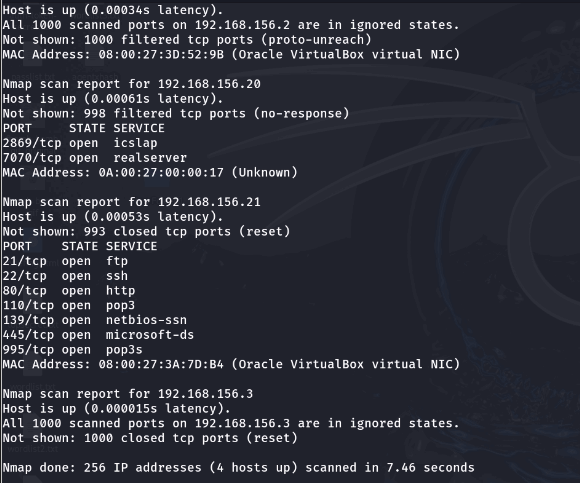

*Host discovery scan confirmed the Cyb3rOps VM at 192.168.156.21 is live on the network.*

---

### Method 1 - Enum4linux and Nessus Scan

**Commands used:**

```bash
# Nessus vulnerability scan against target
# Nessus Scan on 192.168.156.21

# SMB / NetBIOS enumeration
enum4linux 192.168.156.21
```


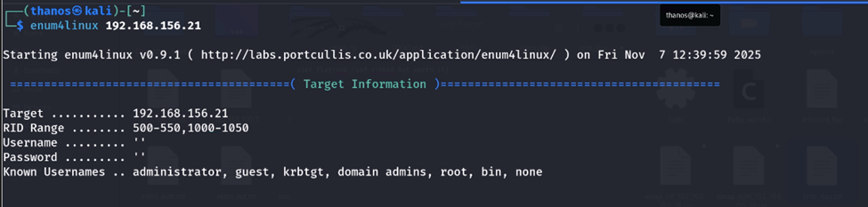
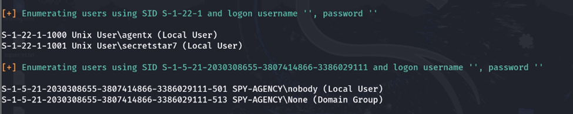

**Result:** The Nessus scan identified that the target's SMB service was misconfigured to allow unauthenticated (NULL) access (plugin 42411). Leveraging this, enum4linux successfully enumerated local Unix account names and Security Identifiers without any credentials.

Accounts discovered:
- `agentx` (SID: S-1-22-1-1000)
- `secretstar7` (SID: S-1-22-1-1001)

These usernames were then used to build a wordlist for Hydra brute-force testing.

---

### Method 2 - Post-Authentication Local Enumeration

After gaining SSH access (covered in Flag 2), post-authentication enumeration of the `/home` directory revealed additional accounts and files on the system.

**Commands used:**

```bash
ssh secretstar7@192.168.156.21
secretstar7@spy-agency:~$ cd /home
secretstar7@spy-agency:/home$ ls
secretstar7@spy-agency:/home$ cat root_flag.txt
```

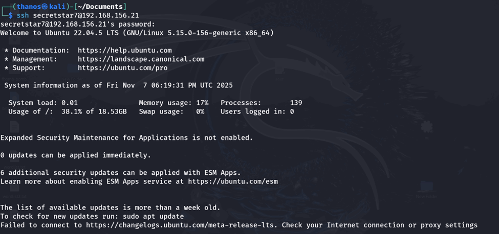
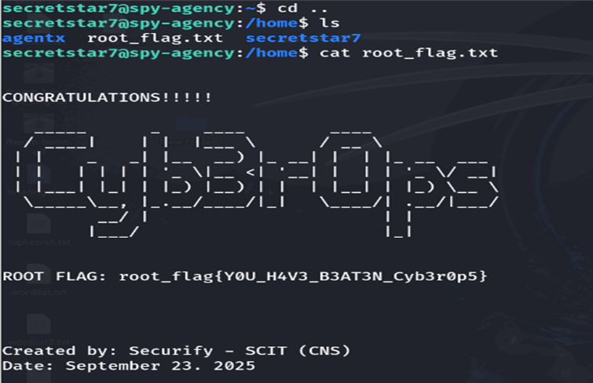

**Result:** Listing `/home` revealed the `agentx` account and the presence of `root_flag.txt`. This technique is a stealthy approach to uncovering other login accounts, personal files, and potential privilege escalation targets without triggering noisy automated tools.

---

## 2. Exploitation and Flag Discovery

### Flag 1 - SMB Flag

**Objective:** Locate and retrieve the SMB flag from the target's file sharing service.

**Step 1 - Full port scan to identify services:**

```bash
nmap -sV -p1-65535 -O 192.168.156.21
```

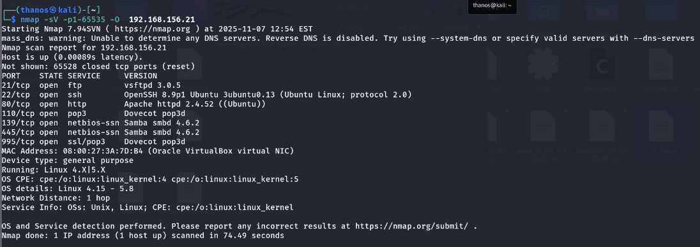

The scan revealed the target was running multiple services including FTP, SSH, HTTP, and POP3. Critically, ports 139 and 445 were open and associated with Samba smbd 4.6.2, indicating network file sharing was active and warranted further investigation.

**Step 2 - Nessus vulnerability scan to assess SMB posture:**

```bash
# Nessus Scan on 192.168.156.21
```

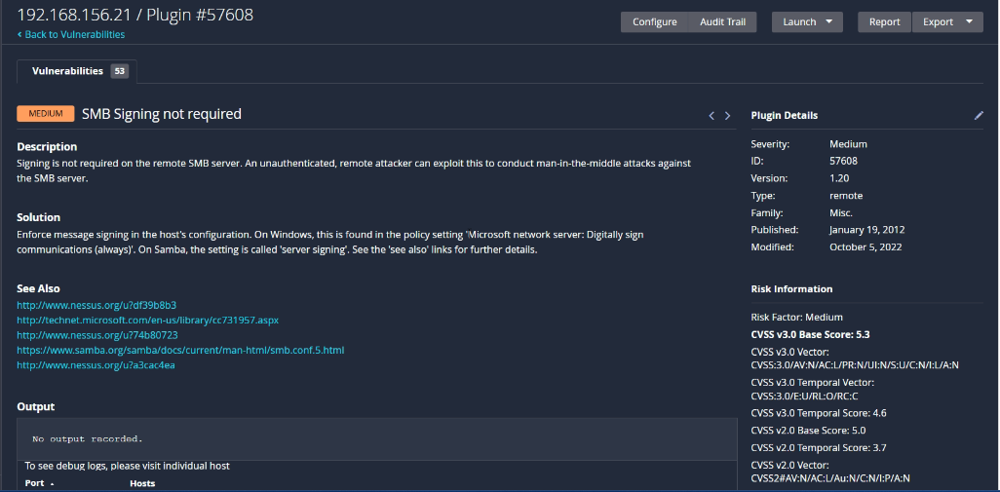
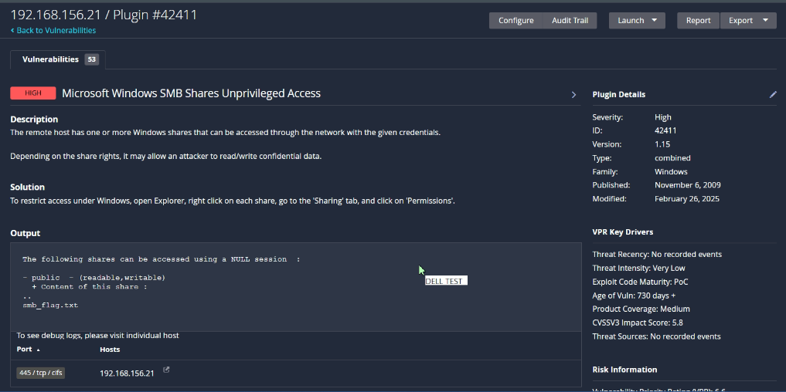

The Nessus scan returned two key findings for the SMB service:
- Plugin 57608: SMB signing not required (protocol tamper-vulnerable)
- Plugin 42411: Windows SMB shares allow unprivileged (NULL) access

The plugin 42411 report also listed a publicly accessible, writable share containing a file named `smb_flag.txt`.

**Step 3 - Enumerate shares with enum4linux:**

```bash
enum4linux 192.168.156.21
```

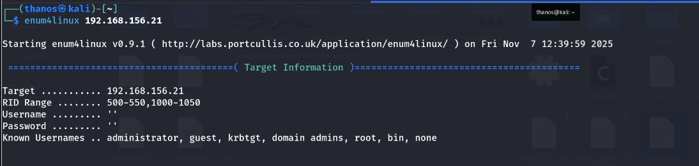
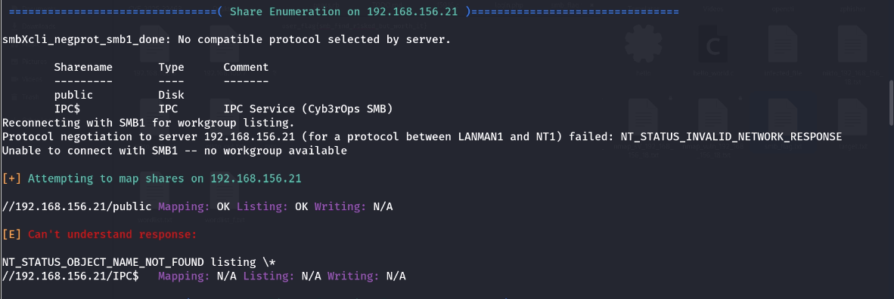

Enum4linux confirmed a share named `public` was accessible and successfully mapped without credentials.

**Step 4 - Connect and retrieve the flag:**

```bash
smbclient //192.168.156.21/public
smb: \> get smb_flag.txt
```

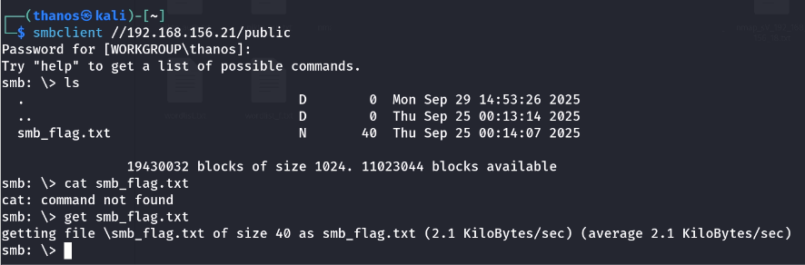

The smbclient session connected to `//192.168.156.21/public` and listed `smb_flag.txt`. The file was downloaded using `get smb_flag.txt`.

**Step 5 - Read the flag:**

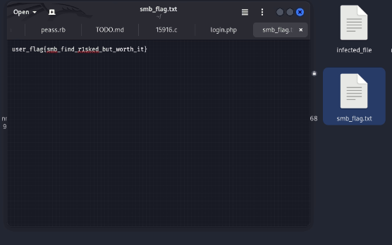

```
user_flag{smb_find_r1sked_but_worth_it}
```

**Root cause:** The SMB service allowed unauthenticated NULL access and did not enforce message signing, enabling any attacker on the network to connect to the share and retrieve files without credentials.

---

### Flag 2 - Decoy Flag

**Objective:** Enumerate user accounts and gain authenticated access to the target via SSH.

**Step 1 - Enumerate user accounts:**

```bash
enum4linux 192.168.156.21
```


Enum4linux returned local Unix accounts `agentx` and `secretstar7` (SIDs S-1-22-1-1000/1001). These were used to build a targeted username list for credential testing.

**Step 2 - Build a wordlist from the discovered usernames:**

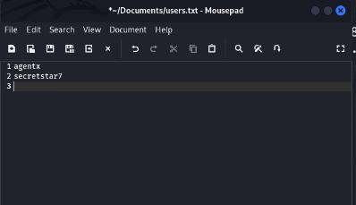

A custom wordlist was constructed using the identified usernames combined with common password patterns for use with Hydra.

**Step 3 - Brute-force SSH credentials with Hydra:**

```bash
hydra -L users.txt -P /home/thanos/wordlist.txt ssh://192.168.156.21
```

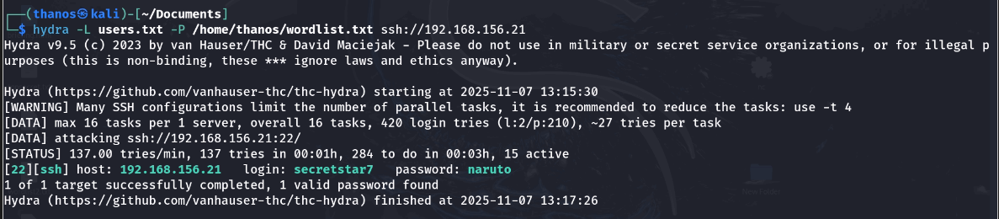

Hydra discovered valid credentials: `secretstar7:naruto`. This provided authenticated SSH access to the target host.

**Step 4 - Log in via SSH:**

```bash
ssh secretstar7@192.168.156.21
```

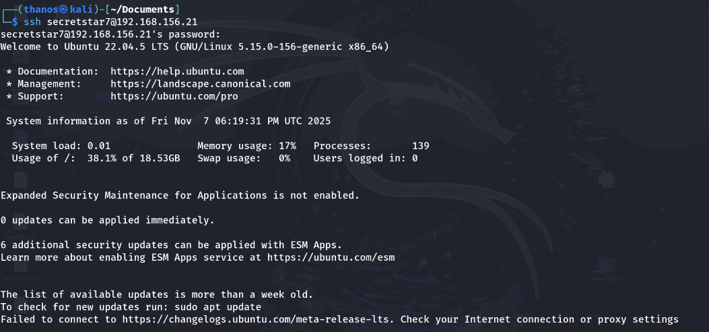

The SSH login succeeded, yielding an interactive shell on the Cyb3rOps VM running Ubuntu 22.04.

**Step 5 - Enumerate the home directory:**

```bash
secretstar7@spy-agency:~$ ls
secretstar7@spy-agency:~$ cat confidentialdata.txt
```

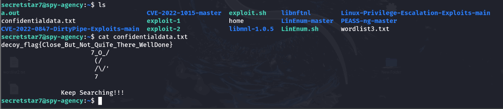

The directory listing included `confidentialdata.txt`. Reading it revealed:

```
decoy_flag{Close_But_Not_Quite_There_WellDone}
Keep Searching!!!
```

**Result:** This was identified as a planted decoy flag. However, the listing also exposed several local privilege escalation resources on the system (LinEnum, PEASS, DirtyPipe exploit folders), indicating viable next avenues for escalation.

---

### Flag 3 - Root Flag

**Objective:** Locate root_flag.txt discovered during post-authentication enumeration.

**Commands used:**

```bash
secretstar7@spy-agency:~$ cd /home
secretstar7@spy-agency:/home$ ls
secretstar7@spy-agency:/home$ cat root_flag.txt
```


**Result:**

```
root_flag{YOU_H4V3_B3AT3N_Cyb3r0p5}
```

The `/home` directory listing revealed `root_flag.txt` was stored at a world-readable path, accessible to the `secretstar7` account without requiring privilege escalation.

---

### Flag 4 - User Flag

**Objective:** Locate the user flag stored in a restricted directory requiring root access.

**Step 1 - Discover the web application login:**

```bash
secretstar7@spy-agency:/var/www/html$ cat login.php
```

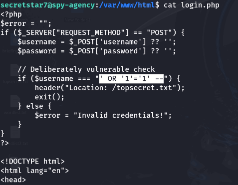

Inspection of `login.php` revealed the authentication logic accepted raw, unsanitized user input concatenated directly into a comparison, making it vulnerable to SQL injection.

**Step 2 - Exploit the SQL injection:**

```
Payload: 'OR '1'='1'--
```

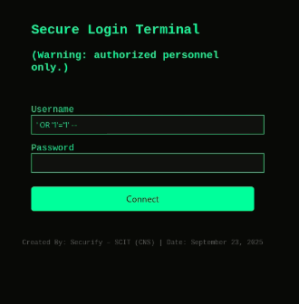

The payload closed the application's username string, injected a tautology (`OR '1'='1'`), and commented out the remainder of the original statement using `--`. This caused the WHERE clause to evaluate as always-true, bypassing authentication and redirecting to `/topsecret.txt`.

**Step 3 - Follow the hint (metadata rabbit hole):**

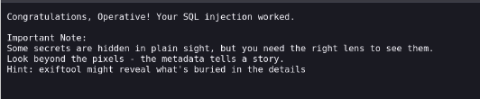

The bypass succeeded and provided a hint to investigate file metadata using `exiftool`.

```bash
secretstar7@spy-agency:/var/www/html$ cd images/
secretstar7@spy-agency:/var/www/html/images$ exiftool fbomb-bomb.gif
```

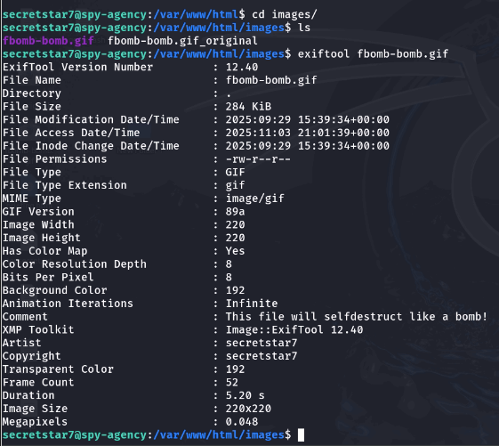

ExifTool output showed embedded metadata including `Artist: secretstar7` and a comment reading "This file will self-destruct like a bomb!" No flag was present -- this path was a rabbit hole.

**Step 4 - Confirm OS and kernel version for privilege escalation research:**

```bash
uname -a
```


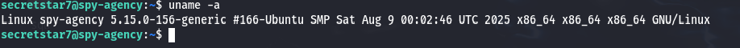

OS confirmed as Ubuntu 22.04.5 LTS, kernel 5.15.0-156-generic (x86_64).

**Step 5 - Research applicable kernel CVEs:**

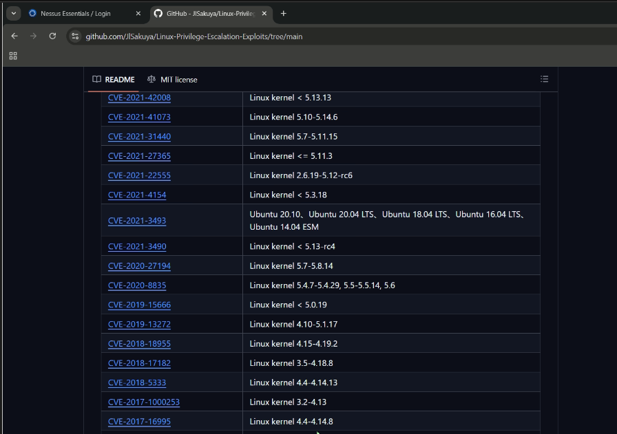

A GitHub repository cataloguing Linux kernel CVEs was used to cross-reference public exploits against the target's kernel version and identify compatible proof-of-concept code.

**Step 6 - Download and stage the exploit:**

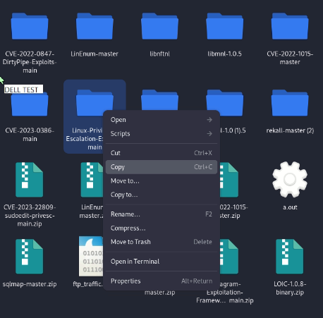
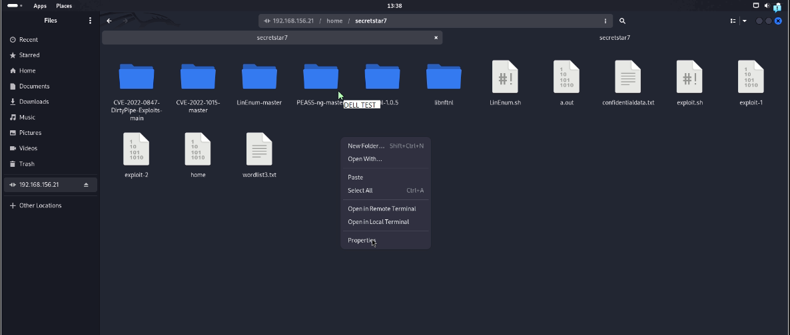

A Linux privilege escalation exploits repository was downloaded locally and copied to the target VM's working directory for on-host testing.

**Step 7 - Compile and execute CVE-2021-3493:**

```bash
uname -a
cd Linux-Privilege-Escalation-Exploits-main/
cd 2021/CVE-2021-3493
gcc exploit.c
./a.out
```

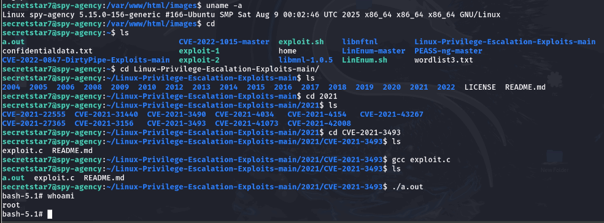

CVE-2021-3493 is an OverlayFS privilege escalation vulnerability in affected Ubuntu kernels. It allows an unprivileged local user to gain root by abusing how the kernel handles unprivileged user namespaces with OverlayFS mounts. After compiling and running the exploit, `whoami` returned `root`, confirming successful local privilege escalation.

**Step 8 - Persist root access and retrieve the flag:**

```bash
# From the root shell
bash-5.1# sudo usermod -aG sudo secretstar7
bash-5.1# exit

# Back as secretstar7
secretstar7@spy-agency:~$ sudo -l
secretstar7@spy-agency:~$ sudo su

# Persistent root shell
root@spy-agency:/# cd /home/agentx
root@spy-agency:/home/agentx# la
root@spy-agency:/home/agentx# cd .mission_Cyb3rOps
```

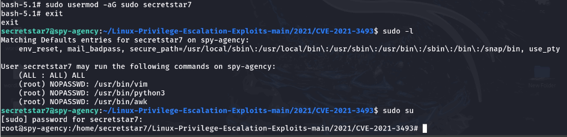
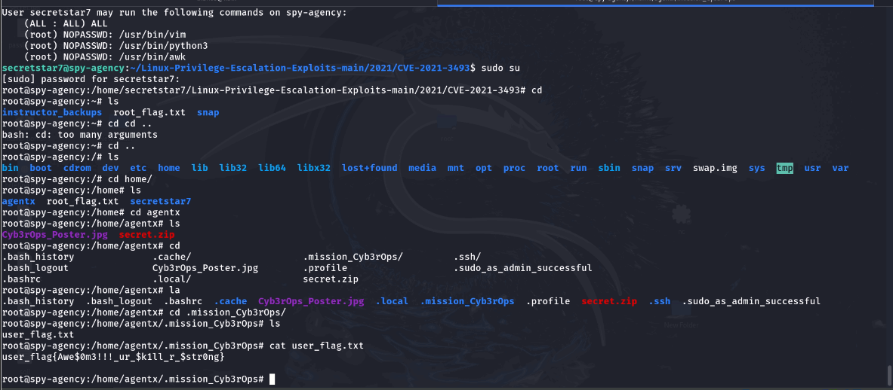

After obtaining the root shell, `secretstar7` was added to the sudo group. `sudo -l` confirmed unrestricted `(ALL:ALL) ALL` access and NOPASSWD entries for `vim`, `python3`, and `awk`, meaning the user could invoke `sudo su` at any time without a password to return to root.

Navigating to `/home/agentx/.mission_Cyb3r0ps/` and reading `user_flag.txt` revealed:

```
user_flag{Awe$0m3!!!_ur_$kill_r_$trong}
```

**Root cause:** CVE-2021-3493 was present due to the kernel being unpatched. The NOPASSWD sudo misconfiguration then converted a temporary exploit shell into permanent unrestricted root access.

---

## 3. Privilege Escalation

**Objective:** Document the full privilege escalation path from unprivileged user to persistent root.

**Step 1 - Confirm OS and kernel version:**

```bash
uname -a
```


OS confirmed: Ubuntu 22.04.5 LTS, kernel 5.15.0-156-generic (x86_64).

**Step 2 - Identify applicable exploit:**

CVE-2021-3493 (OverlayFS Privilege Escalation) was identified as applicable to this kernel version. This vulnerability allows an unprivileged local user to gain root by exploiting how the Linux kernel handles unprivileged user namespaces with OverlayFS mounts.

```bash
cd Linux-Privilege-Escalation-Exploits-main/2021/CVE-2021-3493
```

**Step 3 - Compile, execute, and verify:**

```bash
gcc exploit.c      # compile the PoC source
./a.out            # run the exploit
whoami             # verify -- output: root
sudo usermod -aG sudo secretstar7   # add user to sudo group for persistence
```


**Step 4 - Establish persistent root and confirm:**

```bash
exit               # exit the exploit shell
sudo -l            # confirm sudo privileges
sudo su            # obtain a persistent root shell
cd /home
ls
cat root_flag.txt
```


`sudo -l` confirmed `(ALL:ALL) ALL` with NOPASSWD entries for `vim`, `python3`, and `awk`. The user could invoke `sudo su` at any time without a password to regain root on demand.

---

## 4. Post-Exploitation: Website Defacement

**Objective:** Demonstrate system compromise through controlled web defacement.

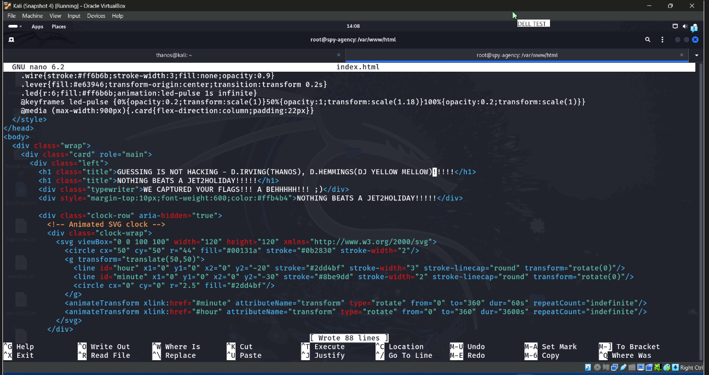
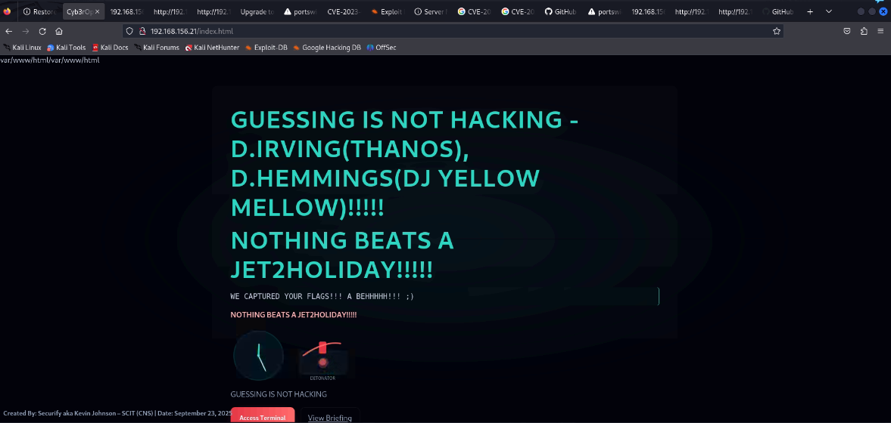

After the SQL injection attack bypassed the application's authentication mechanism, access was gained to protected web content and the files in `/var/www/html`. With the compromised account having write access to the web root, the HTML source files were manually edited using `nano`. Custom HTML, CSS, and SVG elements were inserted directly into the document root.

Because the web root was fully writable and lacked file integrity controls, all modifications were immediately reflected on the live site. The inserted content produced the following visible messages:

```
GUESSING IS NOT HACKING -- D.IRVING (THANOS), D.HEMMINGS (DJ YELLOW MELLOW)!!!!!
NOTHING BEATS A JET2HOLIDAY!!!!!
```

The rendered webpage displayed these changes without restriction, confirming full control over the presentation layer. No file integrity monitoring was in place to detect or alert on the modification.

---

## 5. Remediation Plan

The engagement revealed severe weaknesses across authentication, access control, configuration management, patching, and web application security, all of which contributed to full system compromise.

---

**1. Unsecured SMB Share (NULL access permitted)**

Risk: Anonymous access enabled enumeration and retrieval of SMB data.

- Remove all publicly writable SMB shares and require strong authentication for any remaining SMB resources (Amsar, 2020; Ruambo et al., 2025)
- Enable SMB signing to ensure the integrity of SMB messages
- Restrict ports 139 and 445 via firewall rules to internal hosts only
- If SMB is not operationally necessary, disable the service entirely

---

**2. Weak SSH Credentials (brute-force succeeded: secretstar7:naruto)**

Risk: Weak credentials allowed unauthorized shell access.

- Enforce strong password policies of at least 14 characters with mixed character classes (Joshi, 2024; Siponen et al., 2019)
- Require SSH key-based authentication for administrative users and disable password-based authentication for privileged accounts
- Rotate all account passwords immediately to prevent reuse of compromised credentials

---

**3. No Brute-Force Protection on SSH**

Risk: Hydra succeeded due to unlimited authentication attempts with no lockout.

- Install and configure Fail2Ban to automatically block repeated failed login attempts (Bezas and Filippidou, 2023)
- Configure the firewall to limit connection attempts on port 22
- Generate security alerts for repeated authentication failures

---

**4. Misconfigured sudo (NOPASSWD for multiple binaries)**

Risk: Attackers escalated privileges without authentication.

- Remove all NOPASSWD entries from the sudoers file (Ahmad et al., 2022; Joshi, 2024)
- Restrict sudo privileges to the minimum required for each user following least-privilege principles
- Enforce reauthentication for elevated commands
- Restrict access to the sudoers file to root-only permissions

---

**5. Outdated Ubuntu Kernel Vulnerable to CVE-2021-3493**

Risk: Local privilege escalation enabled a root shell.

- Update to the latest stable Ubuntu kernel release to eliminate the CVE-2021-3493 OverlayFS vulnerability (Wu et al., 2020; Zhou et al., 2021)
- Enable automated patch management to ensure timely application of security updates
- Conduct weekly vulnerability scans to detect outdated components

---

**6. SQL Injection in login.php**

Risk: Authentication bypass and unauthorized file access.

- Rewrite the login functionality to use parameterized queries and prepared statements (Courant, 2021)
- Enforce input validation to ensure only sanitized and expected data is processed
- Configure database accounts with least-privilege permissions
- Suppress error messages to avoid revealing backend logic to attackers

---

**7. Weak Permissions on /var/www/html (world-writable webroot)**

Risk: Allowed direct defacement of the live site.

- Assign root ownership to `/var/www/html` and apply restrictive permissions to prevent unauthorized write access
- Update Apache to the latest version and disable unnecessary modules (Wu et al., 2020; Zahrani et al., 2025)
- Deploy a file integrity monitoring solution such as AIDE or Tripwire (Bezas and Filippidou, 2023)

---

**8. Sensitive Data Stored in World-Readable Locations**

Risk: Attackers accessed confidential files and flags without elevated privileges.

- Secure sensitive files using least-privilege filesystem permissions (Ahmad et al., 2022; Joshi, 2024)
- Relocate sensitive files to directories accessible only to root or authorized service accounts
- Implement regular permissions audits to maintain secure access control practices

---

**9. Outdated / Misconfigured Apache Web Server**

Risk: Risk of information exposure and exploitation.

- Upgrade Apache to its latest stable release and disable unused modules to reduce the attack surface (Wu et al., 2020)
- Disable directory browsing and apply `.htaccess` controls to restrict access to sensitive directories (Zahrani et al., 2025)

---

**10. No Centralized Logging / SIEM Monitoring**

Risk: Privilege escalation and file tampering went undetected throughout the engagement.

- Deploy a centralized SIEM solution such as Wazuh, ELK Stack, or Splunk Free to collect and correlate logs from SSH, sudo, Apache, and system processes (Bezas and Filippidou, 2023)
- Enable auditd to capture detailed system-level events
- Configure alerting rules to detect suspicious behaviors such as new sudo group members, failed SSH attempts, and webroot file changes

---

**11. Weak Security Awareness (password reuse, unsafe behavior)**

Risk: Human error contributed to unauthorized access through a trivially guessable password.

- Implement mandatory recurring user training addressing password hygiene, data sensitivity, and threat recognition (Siponen et al., 2019)
- Run monthly micro-awareness sessions and periodic phishing simulations to reinforce long-term secure behavior

---

**12. Lack of Vulnerability Management and Periodic Testing**

Risk: Critical vulnerabilities such as CVE-2021-3493 remained unpatched and undetected.

- Conduct weekly vulnerability scans using Nessus or OpenVAS
- Commission annual third-party penetration tests to identify emerging risks (Softic and Vejzovic, 2023)
- Formalize a vulnerability management policy aligned with NIST best practices

---

## 6. References

Ahmad, S., Mehfuz, S., Mebarek-Oudina, F., and Beg, J. (2022). RSM analysis based cloud access security broker: a systematic literature review. Cluster Computing, 25(5), 3733-3763. https://doi.org/10.1007/s10586-022-03598-z

Amsar. (2020). Optimization of server computer security using the port knocking method on Ubuntu Server 12.04 LTS. Jurnal Inotera, 5(1), 26-34. https://doi.org/10.31572/inotera.vol5.iss1.2020.id96

Bezas, K., and Filippidou, F. (2023). Comparative analysis of open source Security Information and Event Management systems (SIEMs). Indonesian Journal of Computer Science, 12(2), 443-468. https://doi.org/10.33022/ijcs.v12i2.3182

Courant, J. (2021). Developer-proof prevention of SQL injections. In Lecture notes in computer science (pp. 82-99). https://doi.org/10.1007/978-3-030-70881-8_6

Joshi, A. (2024). Enhancing security protocols: an analysis of Linux root password vulnerabilities and defenses. International Journal of Scientific Research in Engineering and Management, 08(04), 1-5. https://doi.org/10.55041/ijsrem31085

Ruambo, F. A., Masanga, E. E., Lufyagila, B., Ateya, A. A., El-Latif, A. A., Almousa, M., and Abd-El-Atty, B. (2025). Brute-force attack mitigation on remote access services via software-defined perimeter. Scientific Reports, 15(1), 18599. https://doi.org/10.1038/s41598-025-01080-5

Siponen, M., Puhakainen, P., and Vance, A. (2019). Can individuals' neutralization techniques be overcome? A field experiment on password policy. Computers and Security, 88, 101617. https://doi.org/10.1016/j.cose.2019.101617

Softic, J., and Vejzovic, Z. (2023). Impact of vulnerability assessment and penetration testing (VAPT) on operating system security. 2023 22nd International Symposium INFOTEH-JAHORINA (INFOTEH), 1-6. https://doi.org/10.1109/infoteh57020.2023.10094095

Wu, Q., He, Y., McCamant, S., and Lu, K. (2020). Precisely characterizing security impact in a flood of patches via symbolic rule comparison. Network and Distributed Systems Security (NDSS) Symposium 2020. https://doi.org/10.14722/ndss.2020.24419

Zahrani, Z. D., Hardiansyah, N. A., and Rilvani, E. (2025). Linux kernel security: hardening approaches and protection against exploit attacks. Mercury Journal of Information Systems and Informatics Engineering Research, 3(1), 169-177. https://doi.org/10.61132/merkurius.v3i1.620

Zhou, Y., Siow, J. K., Wang, C., Liu, S., and Liu, Y. (2021). SPI: automated identification of security patches via commits. ACM Transactions on Software Engineering and Methodology, 31(1), 1-27. https://doi.org/10.1145/3468854

---

## Disclaimer

This project was performed in a controlled lab environment using an intentionally vulnerable virtual machine. All techniques demonstrated here were carried out legally and ethically as part of a university academic assignment. The tools and methods documented in this repository must not be used against any system without explicit written authorization. Unauthorized use of these techniques may violate local, national, and international law.

---

*University of Technology, Jamaica -- Faculty of Computing and Engineering*
*School of Computing and Information Technology*
