# Enterprise Multi-Site Network Architecture: VLAN Segmentation, Inter-VLAN Routing, DHCP Relay, OSPF, and BGP Peering in Cisco Packet Tracer

---

## Project Overview

This project demonstrates the end-to-end design, configuration, and validation of a secure, scalable enterprise network spanning two geographically separated sites (Site A and Site B). The lab simulates a real-world network segmentation scenario in which four departments — IT, Sales, Accounts, and Finance — are isolated into dedicated VLANs across multiple access-layer switches, with inter-VLAN routing enforced at the distribution layer via Layer 3 multilayer switches. Routing between sites is achieved through a combination of OSPF (intra-AS) and BGP (inter-AS), with centralized DHCP and DNS services providing dynamic addressing to all hosts across both sites — a configuration pattern directly analogous to enterprise and service-provider environments where traffic isolation, controlled routing, and centralized management are non-negotiable security requirements.

---

## Skills & Tools Demonstrated

**Tools & Platforms**
- Cisco Packet Tracer (network simulation)
- Cisco IOS CLI (2960 Series Layer 2 Switches, 3650 Series Multilayer Switches, 2911 Series Routers)
- DHCP Server (Packet Tracer generic server)
- DNS Server (Packet Tracer generic server)

**Core Technical Competencies**
- VLAN creation, naming, and access/trunk port assignment
- 802.1Q trunk encapsulation and trunk VLAN pruning
- Inter-VLAN routing via Switched Virtual Interfaces (SVIs)
- DHCP relay agent configuration (`ip helper-address`)
- Centralized DHCP pool design with per-VLAN scope mapping
- OSPF (Open Shortest Path First) — single-area intra-site routing
- BGP (Border Gateway Protocol) — inter-AS peering between sites (AS 65000, AS 65001, AS 65002)
- Static and dynamic IP address assignment verification
- Multilayer switch SVI IP addressing and `ip routing` enablement
- Interface range bulk configuration
- Network topology documentation and validation (`show interfaces trunk`, `show ip route`, `show running-config`)

---

## Lab Environment

| Component | Detail |
|---|---|
| Simulation Platform | Cisco Packet Tracer |
| Layer 2 Switches | Cisco 2960-24TT-L (IOS 15.0(2)SE4) — SW1 through SW8 |
| Layer 3 Switches | Cisco 3650-24PS Multilayer Switch (Multilayer Switch1, Multilayer Switch3) |
| Routers | Cisco 2911 (Router3 / Router5 / Router6) |
| Servers | Generic Packet Tracer Server (DHCP Server, DNS Server) |
| Addressing Scheme | `192.168.1.0/24` variably subnetted — /28 for VLAN subnets, /29 for server pool, /30 for point-to-point links, /32 for loopbacks |
| Sites | Site A (Left) and Site B (Right) — connected via BGP peering through a core routing layer |

---

## Step-by-Step Lab Walkthrough

---

### Step 1: Topology Overview — Dual-Site Enterprise Network Design

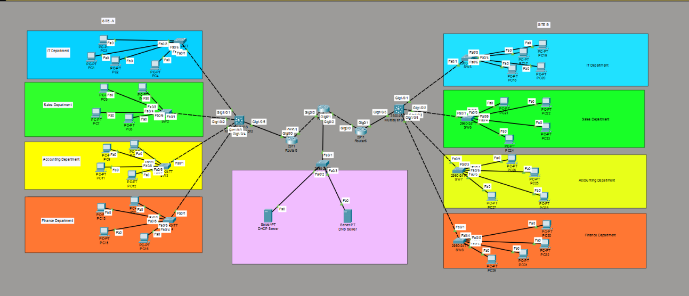

The complete Packet Tracer topology illustrates the logical layout of the two-site enterprise network. Site A (left) contains four department zones — IT (VLAN 10), Sales (VLAN 20), Accounts/Accounting (VLAN 30), and Finance (VLAN 40) — each served by a dedicated access-layer switch (SW1–SW4) feeding into a distribution multilayer switch. Site B (right) mirrors this structure with SW5–SW8 and its own multilayer switch, with both sites interconnected through a core BGP routing layer comprising Router3, Router5, and Router6. A centralized DHCP Server and DNS Server sit in a DMZ-like pink subnet reachable from all VLANs via DHCP relay.

---

### Step 2: Site A — SW1 VLAN Database Configuration (IT Department, VLAN 10)

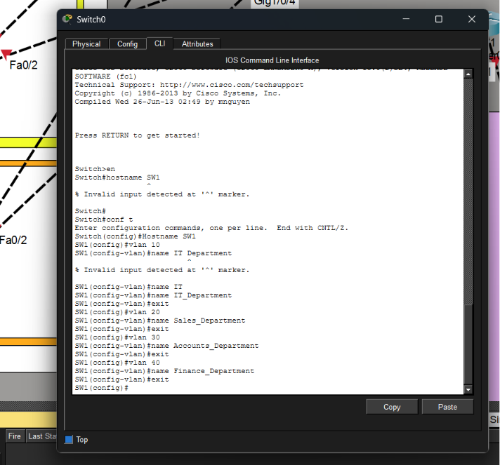

SW1 (renamed from the default `Switch` hostname to `SW1`) is configured as the access-layer switch for the IT Department. The IOS commands `vlan 10` through `vlan 40` are entered in global configuration mode, with each VLAN assigned a descriptive name (`IT_Department`, `Sales_Department`, `Accounts_Department`, `Finance_Department`). The failed attempt `name IT Department` (with a space) triggers `% Invalid input detected` — a common IOS gotcha that underscores why underscore-delimited naming conventions are required in the Cisco VLAN database. SW1 ultimately hosts VLAN 10 as its primary access VLAN.

---

### Step 3: Site A — SW1 Trunk and Access Port Assignment (VLAN 10)

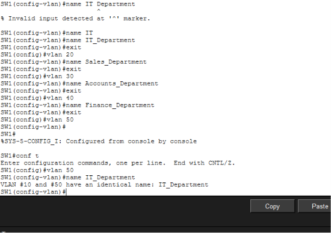

With the VLAN database established, SW1's uplink ports (`FastEthernet 0/1–2`) are configured as 802.1Q trunks with VLAN 10 explicitly allowed — preventing unintended VLAN leakage from other VLANs transiting the trunk. Access-layer ports `FastEthernet 0/3–6` are placed in access mode and assigned to VLAN 10, connecting end-user PCs in the IT Department. The `no shutdown` command activates the interfaces. This trunk pruning practice is a security-relevant configuration: it enforces the principle of least privilege at the data-link layer by ensuring only authorized VLANs traverse inter-switch links.

---

### Step 4: Site A — SW2 Configuration (Sales Department, VLAN 20)

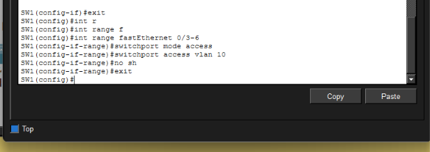

SW2 is configured identically in structure to SW1 but for the Sales Department on VLAN 20. Uplinks (`fa0/1–2`) are trunked with `switchport trunk allowed vlan 20`, and access ports `fa0/3–6` are placed in access mode assigned to VLAN 20 (`switchport access vlan 20`). The consistent per-switch, per-VLAN design pattern across all access switches ensures a deterministic and auditable network configuration — a critical requirement in environments subject to compliance frameworks such as PCI-DSS or ISO 27001, where VLAN-based network segmentation is a mandated control.

---

### Step 5: Site A — SW3 Configuration (Accounts Department, VLAN 30)

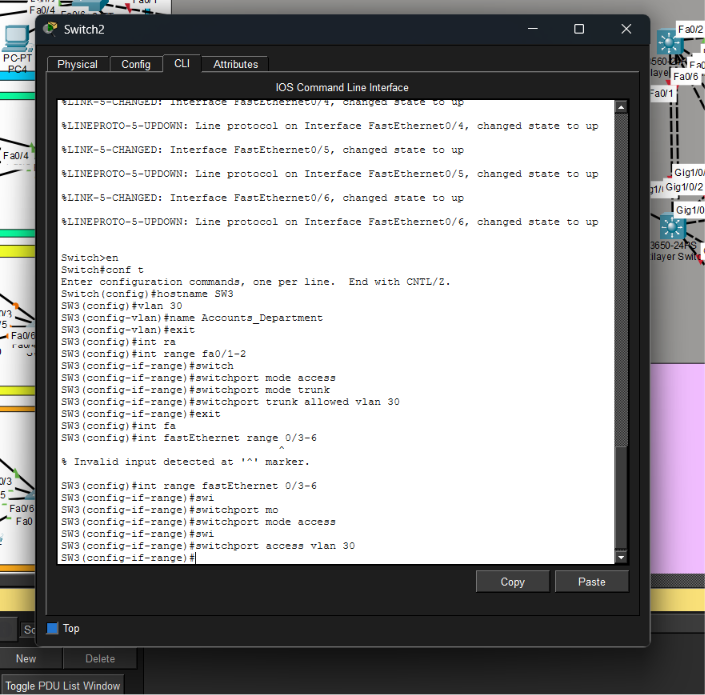

SW3 mirrors the same configuration pattern for the Accounts Department on VLAN 30. The trunk interfaces (`fa0/1–2`) carry only VLAN 30, and access ports `fa0/3–6` are assigned to VLAN 30. Notably, the IOS abbreviation `#swi` for `switchport` and `#sw` for `switchport` are used throughout, demonstrating practical CLI efficiency in a live configuration session. The successful application of `switchport access vlan 30` and `switchport mode access` confirms proper host isolation within the Accounts segment.

---

### Step 6: Site A — SW4 Configuration (Finance Department, VLAN 40)

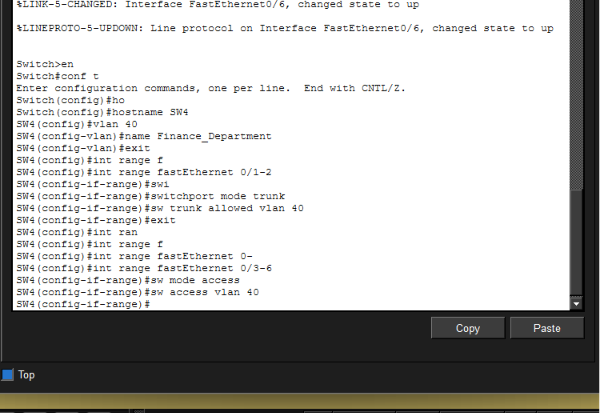

SW4 completes the Site A access layer by configuring the Finance Department on VLAN 40. The trunk uplinks restrict allowed VLANs to VLAN 40 only, and host-facing ports are placed in access mode. The Finance Department's traffic is now fully isolated at Layer 2 from IT, Sales, and Accounts — meaning a compromised host in the Finance VLAN cannot initiate lateral movement via Layer 2 broadcast flooding to adjacent VLANs, a direct mitigation against VLAN-hopping and ARP spoofing-based lateral movement attacks.

---

### Step 7: Site B — SW5 Configuration (IT Department, VLAN 50)

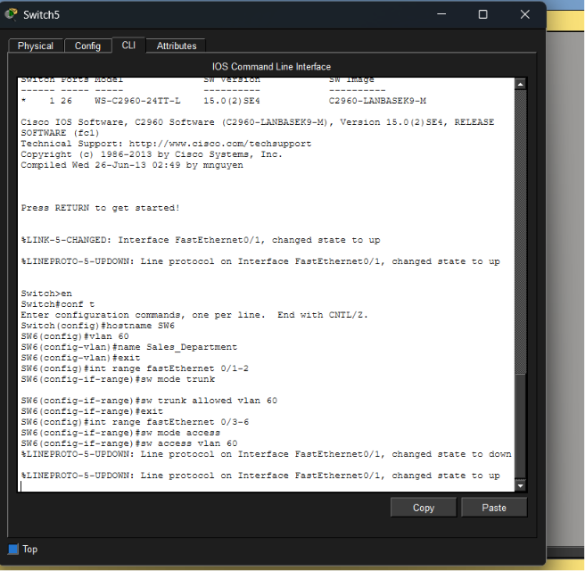

Site B's access-layer switch SW5 is configured for the IT Department using VLAN 50 — a distinct VLAN ID from Site A's VLAN 10, despite representing the same logical department. This design decision is intentional: separate VLAN IDs per site prevent cross-site VLAN ID collisions when the Layer 3 routing infrastructure bridges the two sites. VLAN 50 is assigned the name `IT_Department`, the uplinks are trunked allowing VLAN 50, and host ports `fa0/3–6` are set to access mode on VLAN 50.

---

### Step 8: Site B — SW6 Configuration (Sales Department, VLAN 60)

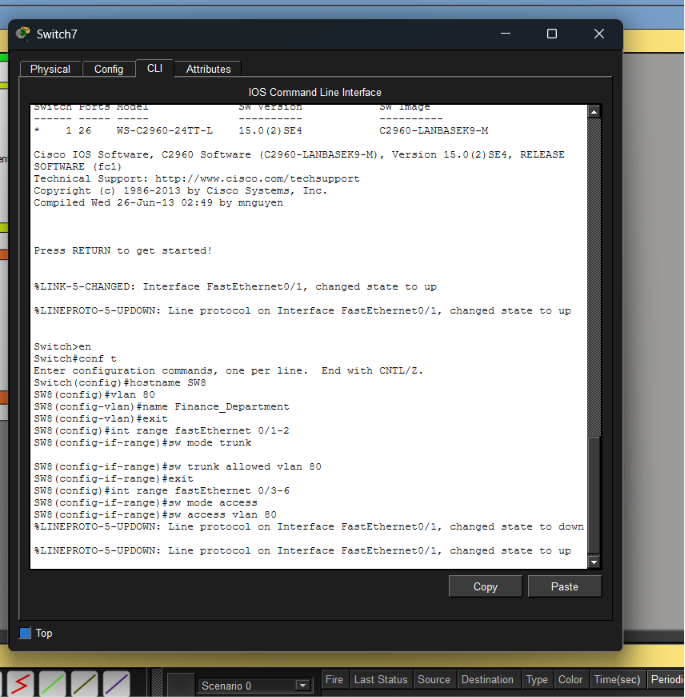

SW6 is configured for Site B's Sales Department on VLAN 60. The configuration follows the established template: hostname set to `SW6`, VLAN 60 created and named `Sales_Department`, uplinks (`fa0/1–2`) trunked with VLAN 60 allowed, and host ports (`fa0/3–6`) placed in access mode on VLAN 60. The symmetry of configuration across all eight access switches demonstrates a scalable, policy-driven approach to switch deployment — consistent with enterprise change management and configuration baselines maintained in tools such as Cisco DNA Center or Ansible.

---

### Step 9: Site B — SW8 Configuration (Finance Department, VLAN 80)

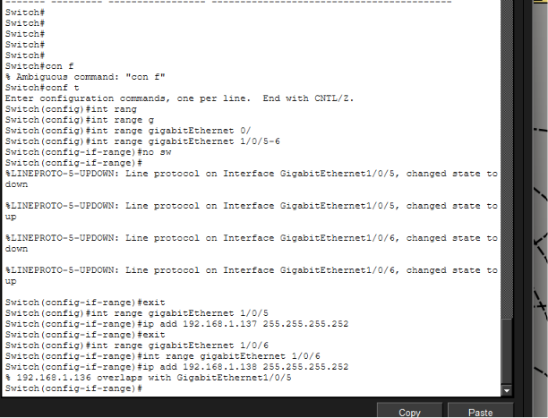

SW8 completes Site B's access layer by configuring the Finance Department on VLAN 80. Following the established pattern, uplinks are trunked (allowing VLAN 80 only) and host-facing ports are placed in VLAN 80 access mode. At this point, both sites have fully isolated Layer 2 domains for all four departments, and inter-department communication is now exclusively dependent on Layer 3 routing decisions made at the multilayer switches — enforcing a controlled, routable security boundary between all VLANs.

---

### Step 10: Core Distribution Switch (Multilayer Switch3 / Site A) — Trunk Uplinks to Access Switches

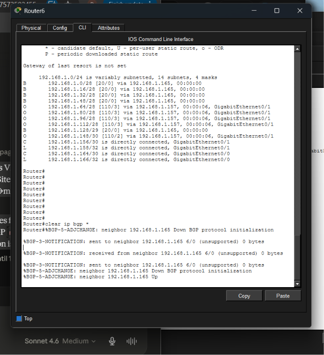

The Site A multilayer switch (Multilayer Switch3) is configured as the distribution-layer device aggregating all four access switches. Trunk ports `GigabitEthernet 1/0/1` through `1/0/4` are individually configured to allow only their respective VLANs (`vlan 10`, `vlan 20`, `vlan 30`, `vlan 40`), enforcing strict VLAN pruning at the distribution layer. VLANs 10–40 are created in the local database and named. This configuration proves that trunk pruning is applied at *both* access and distribution layers — a defense-in-depth approach to VLAN containment.

---

### Step 11: Multilayer Switch3 — SVI Configuration, DHCP Relay, OSPF, and Uplink IP Assignment

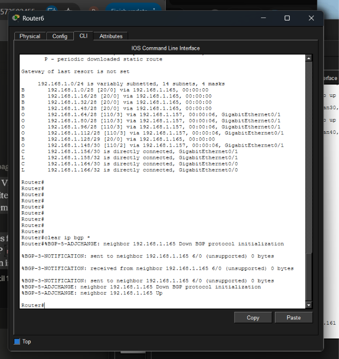

This is the most technically dense configuration step in the lab. Four SVIs are created — `interface vlan 10` through `vlan 40` — and assigned gateway IPs (`192.168.1.1/28`, `192.168.1.17/28`, `192.168.1.33/28`, `192.168.1.49/28`). Each SVI is configured with `ip helper-address 192.168.1.130`, which instructs the switch to forward DHCP broadcast requests from hosts to the centralized DHCP Server at `192.168.1.130` as unicast UDP packets — enabling cross-VLAN DHCP without a local DHCP server per segment. `ip routing` is enabled to activate Layer 3 switching. OSPF process 1 is then configured with network statements covering all four VLAN subnets and the uplink to Router5 (`192.168.1.140/30`), enabling dynamic route advertisement within the AS.

---

### Step 12: Multilayer Switch3 — OSPF Refinement and Uplink to Router5

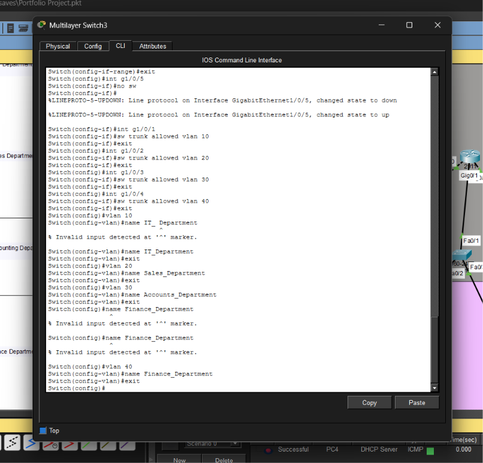

The uplink interface `GigabitEthernet 1/0/5` is assigned the IP `192.168.1.141/30`, establishing the point-to-point link between the Site A multilayer switch and Router5. The OSPF configuration is refined: the incorrect network statement `192.168.1.141 0.0.0.3` is removed and replaced with `192.168.1.140 0.0.0.3 area 0`, correctly covering the /30 link subnet. The `show ip route` output (visible in screenshot 13) subsequently confirms that OSPF-derived routes appear in the routing table, validating bidirectional OSPF adjacency.

---

### Step 13: Multilayer Switch3 — Route Table and Trunk Verification

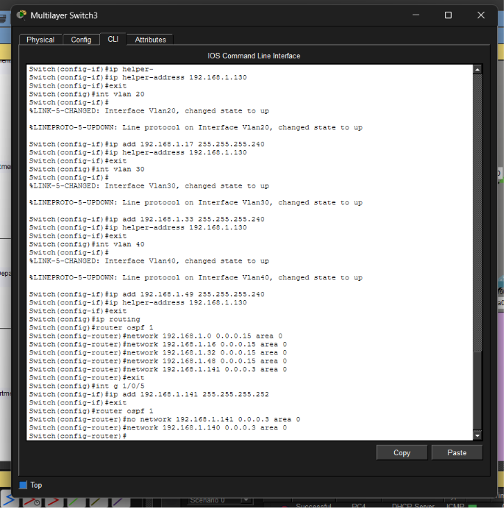

The `show ip route` output confirms the multilayer switch has full visibility of all directly connected VLAN subnets (`192.168.1.0/28`, `192.168.1.16/28`, `192.168.1.32/28`, `192.168.1.48/28`) as Connected (`C`) routes and their respective SVI loopback addresses as Local (`L`) routes. An OSPF External Type 2 (`O E2`) route is also present: `192.168.1.128/29` via `192.168.1.142` — the DHCP/DNS server subnet — confirming OSPF route redistribution is functioning. The `show interfaces trunk` output validates that all four GigabitEthernet uplinks are in 802.1Q trunking mode with the correct per-port VLAN allowed lists active in the spanning tree forwarding state.

---

### Step 14: Multilayer Switch1 (Site B) — Trunk, VLAN, SVI, and DHCP Relay Configuration

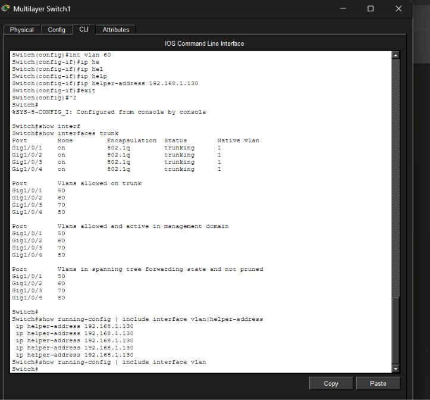

Multilayer Switch1 replicates the Site A distribution architecture for Site B. Trunk ports `g1/0/1–4` are configured to carry VLANs 50, 60, 70, and 80 respectively. SVIs are created for each: VLAN 50 (`192.168.1.65/28`), VLAN 60 (`192.168.1.81/28`), VLAN 70 (`192.168.1.97/28`), and VLAN 80 (`192.168.1.113/28`). All SVIs are configured with `ip helper-address 192.168.1.130` for centralized DHCP relay. The `show interfaces trunk` output confirms all four uplinks are active in trunking mode with correct VLAN lists — providing a clean baseline verification before proceeding to inter-site routing configuration.

---

### Step 15: Core Layer — Router5 Interface and OSPF Configuration

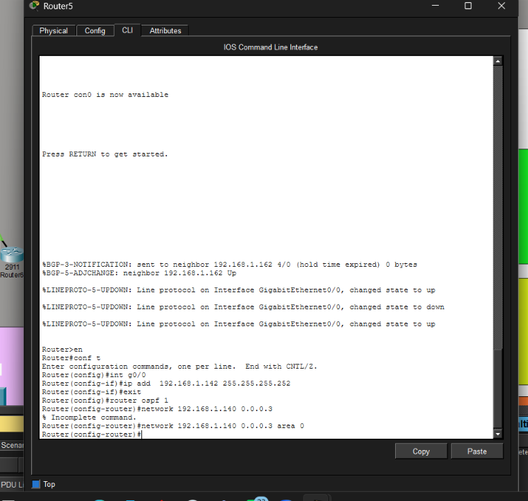

Router5 functions as the OSPF boundary router for Site A, providing the Layer 3 path between the multilayer switch and the BGP core. Interface `g0/0` is assigned `192.168.1.142/30` — the peer address on the `/30` link to Multilayer Switch3. OSPF process 1 is configured with `network` statements covering the four Site A VLAN subnets (`192.168.1.0/28`, `192.168.1.16/28`, `192.168.1.32/28`, `192.168.1.48/28`) and the `/30` uplink (`192.168.1.140/30`), enabling OSPF adjacency and route advertisement into the AS. The subsequent BGP configuration on Router5 (AS 65001) peers with Router3 at `192.168.1.162` to propagate Site A prefixes to the BGP core.

---

### Step 16: Core Layer — Router3 (BGP Route Reflector / Core Router) Configuration

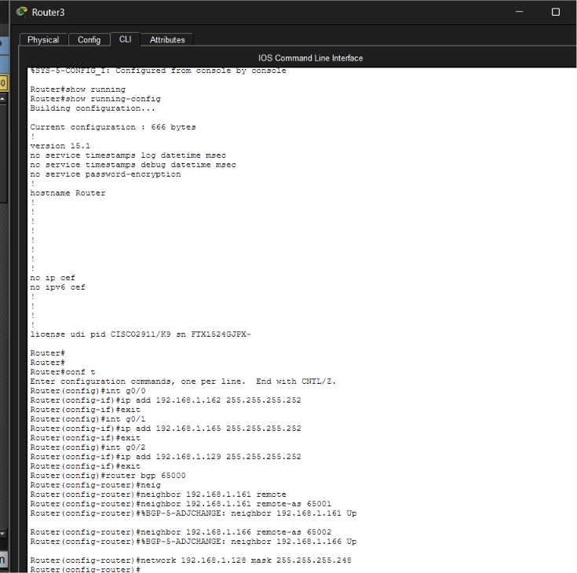

Router3 operates as the BGP core router in AS 65000, peering with both site routers: Router5 (AS 65001, neighbor `192.168.1.161`) and Router6 (AS 65002, neighbor `192.168.1.166`). Interface IPs are assigned: `G0/0` → `192.168.1.162/30`, `G0/1` → `192.168.1.165/30`, `G0/2` → `192.168.1.129/30`. The BGP `network 192.168.1.128 mask 255.255.255.248` statement advertises the centralized server subnet (`192.168.1.128/29`) to both BGP peers — making the DHCP and DNS servers reachable from all sites via BGP-propagated routes. The `%BGP-5-ADJCHANGE: neighbor ... Up` messages confirm successful BGP peering with both neighbors.

---

### Step 17: Core Layer — Router6 (Site B BGP Router) Configuration

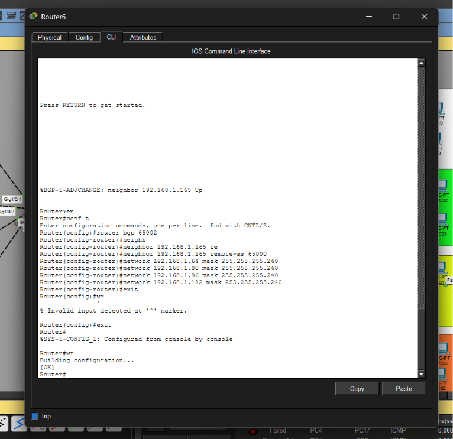

Router6 is the BGP edge router for Site B, operating in AS 65002 and peering with Router3 (`192.168.1.165`, AS 65000). BGP `network` statements are configured for all four Site B VLAN subnets: `192.168.1.64/28` (IT_B), `192.168.1.80/28` (Sales_B), `192.168.1.96/28` (Accounts_B), and `192.168.1.112/28` (Finance_B). The `%BGP-5-ADJCHANGE: neighbor 192.168.1.165 Up` message confirms the eBGP session is established. The `wr` (write memory) command saves the configuration to NVRAM. The BGP table on Router6 will subsequently contain routes to all Site A subnets received via Router3.

---

### Step 18: Router6 — BGP Route Table Verification and OSPF Routes

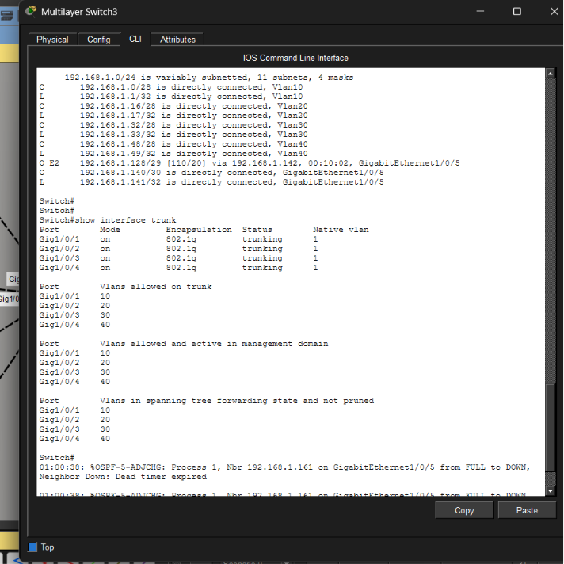

The `show ip route` output on Router6 provides definitive proof of end-to-end routing convergence. BGP-learned routes (`B`) are present for all Site A subnets: `192.168.1.0/28`, `192.168.1.16/28`, `192.168.1.32/28`, `192.168.1.48/28` — all via `192.168.1.165` (Router3), with BGP administrative distance `[20/0]`. OSPF-learned routes (`O`) are present for Site B VLAN subnets via `192.168.1.157` (Multilayer Switch1 uplink). The BGP `clear ip bgp *` followed by re-adjacency confirms the BGP session is stable and routes are being re-advertised correctly after a reset — a standard operational validation procedure.

---

### Step 19: DHCP Server — Pool Configuration for All Eight VLAN Scopes

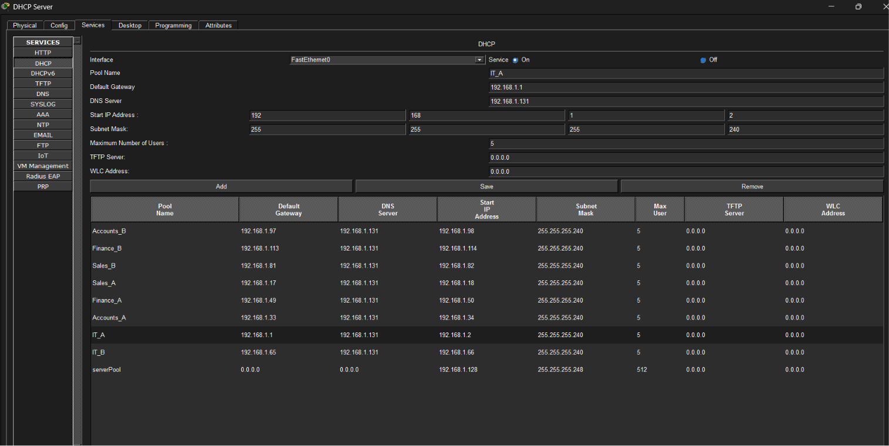

The centralized DHCP Server at `192.168.1.130` (within the `192.168.1.128/29` server subnet) is configured with nine DHCP scopes, one per department per site plus a server pool. Each scope defines the correct default gateway (the SVI IP on the respective multilayer switch), DNS server (`192.168.1.131`), start IP, subnet mask (`255.255.255.240`), and maximum user count (5). This centralized DHCP architecture — combined with `ip helper-address` relay agents on each SVI — eliminates the need for per-VLAN DHCP servers while maintaining scope isolation, reducing attack surface and simplifying IP address management.

| Pool Name | Default Gateway | Start IP | Subnet Mask |
|---|---|---|---|
| IT_A | 192.168.1.1 | 192.168.1.2 | 255.255.255.240 |
| Sales_A | 192.168.1.17 | 192.168.1.18 | 255.255.255.240 |
| Accounts_A | 192.168.1.33 | 192.168.1.34 | 255.255.255.240 |
| Finance_A | 192.168.1.49 | 192.168.1.50 | 255.255.255.240 |
| IT_B | 192.168.1.65 | 192.168.1.66 | 255.255.255.240 |
| Sales_B | 192.168.1.81 | 192.168.1.82 | 255.255.255.240 |
| Accounts_B | 192.168.1.97 | 192.168.1.98 | 255.255.255.240 |
| Finance_B | 192.168.1.113 | 192.168.1.114 | 255.255.255.240 |
| serverPool | 0.0.0.0 | 192.168.1.128 | 255.255.255.248 |

---

### Step 20: End-to-End Validation — PC6 DHCP Lease Verification

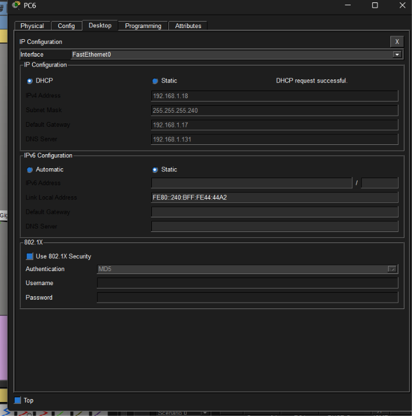

PC6, a host in the Sales Department at Site A, successfully obtains a DHCP lease from the centralized DHCP Server — confirming full end-to-end operation of the entire infrastructure stack. The assigned parameters precisely match the `Sales_A` DHCP pool definition: IP `192.168.1.18`, subnet mask `255.255.255.240`, default gateway `192.168.1.17` (Multilayer Switch3's VLAN 20 SVI), and DNS server `192.168.1.131`. The message `DHCP request successful` validates that: (1) the access port is correctly in VLAN 20, (2) the trunk is carrying VLAN 20 to the multilayer switch, (3) the `ip helper-address` relay is forwarding the DHCP broadcast to `192.168.1.130`, and (4) the DHCP server is responding with the correct pool. This single screen encapsulates the correct operation of the entire multi-layer network design.

---

## Key Findings & Artifacts

**Network Architecture Validated**
- Successfully deployed a dual-site enterprise network with 8 access switches, 2 multilayer distribution switches, and 3 routers
- All 8 VLANs (10, 20, 30, 40 at Site A; 50, 60, 70, 80 at Site B) are fully isolated at Layer 2
- 802.1Q trunks on all inter-switch uplinks with per-port VLAN pruning enforced at both access and distribution layers

**Routing Plane Verified**
- OSPF adjacency confirmed between Multilayer Switch3 ↔ Router5 and Multilayer Switch1 ↔ Router6
- BGP eBGP sessions established: Router5 (AS 65001) ↔ Router3 (AS 65000) ↔ Router6 (AS 65002)
- `show ip route` on Router6 confirms BGP routes (`B [20/0]`) for all four Site A subnets via `192.168.1.165`
- Server subnet `192.168.1.128/29` correctly advertised via BGP from Router3 and confirmed as `O E2` on Multilayer Switch3

**DHCP Infrastructure Validated**
- Centralized DHCP Server at `192.168.1.130` configured with 9 scopes (8 VLAN pools + 1 server pool)
- `ip helper-address 192.168.1.130` applied to all 8 SVIs across both multilayer switches
- PC6 successfully acquired `192.168.1.18/28` from `Sales_A` pool — confirming relay functionality across VLAN boundaries

**Security Controls Implemented**
- All access ports locked to a single VLAN — preventing Layer 2 VLAN hopping between departments
- Trunk ports explicitly pruned — no VLAN is allowed on a trunk unless required by design
- Inter-department traffic forced through Layer 3 routing — enabling future ACL/firewall policy enforcement at the SVI level
- Separate VLAN IDs per site — eliminating cross-site VLAN ID collision risk

---

## Conclusion & Defensive Recommendations

This lab demonstrates a production-equivalent enterprise network design where Layer 2 segmentation, Layer 3 inter-VLAN routing, centralized DHCP, and multi-protocol dynamic routing (OSPF + BGP) work in concert to deliver a secure, scalable, and operationally efficient dual-site network. The architecture enforces the principle of least-privilege at the network layer — no host can reach another department's resources without traversing a controlled Layer 3 boundary — forming the foundation for subsequent security policy enforcement.

**Defensive Recommendations**

1. **Apply VLAN Interface ACLs (VACLs) at the Distribution Layer SVIs.**
   The current design routes inter-VLAN traffic but does not filter it. Implement extended ACLs on each SVI (e.g., `ip access-group VLAN10_IN in` on `interface vlan 10`) to enforce a whitelist of permitted flows between departments. At minimum, the Finance and Accounts VLANs should block unsolicited inbound connections from IT and Sales VLANs, reducing the blast radius of a compromised host.

2. **Enable Dynamic ARP Inspection (DAI) and DHCP Snooping on all Access Switches.**
   All eight access switches (SW1–SW8) are currently operating without DHCP Snooping or DAI. Without these controls, a malicious host on any access port can perform ARP spoofing or rogue DHCP attacks to redirect traffic or achieve MITM positioning within a VLAN. Enable `ip dhcp snooping vlan <id>` and `ip arp inspection vlan <id>` on each switch, designating only uplink trunk ports as trusted interfaces.

3. **Implement BGP Route Filtering with Prefix Lists to Prevent Route Leakage.**
   The current BGP configuration advertises all VLAN subnets between AS 65001 and AS 65002 via AS 65000 without inbound/outbound prefix filtering. Apply BGP `prefix-lists` and `route-maps` on Router3, Router5, and Router6 to explicitly whitelist only the intended prefixes received from each peer AS. This prevents a misconfigured or compromised router from injecting unauthorized routes into the BGP table — a scenario that mirrors real-world BGP hijacking incidents such as the 2010 China Telecom route leak.

---

*This project was designed and documented as part of a professional cybersecurity and networking portfolio, demonstrating hands-on competency in enterprise network architecture, Layer 2/3 security segmentation, and multi-protocol dynamic routing.*
