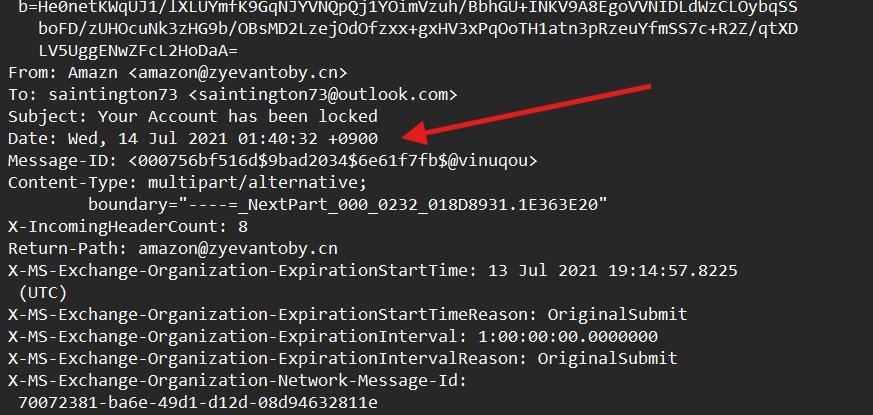
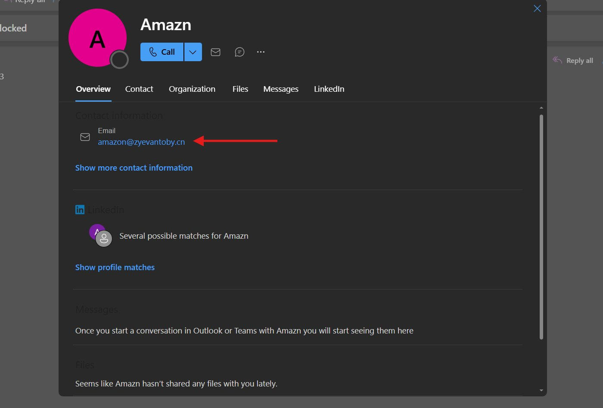
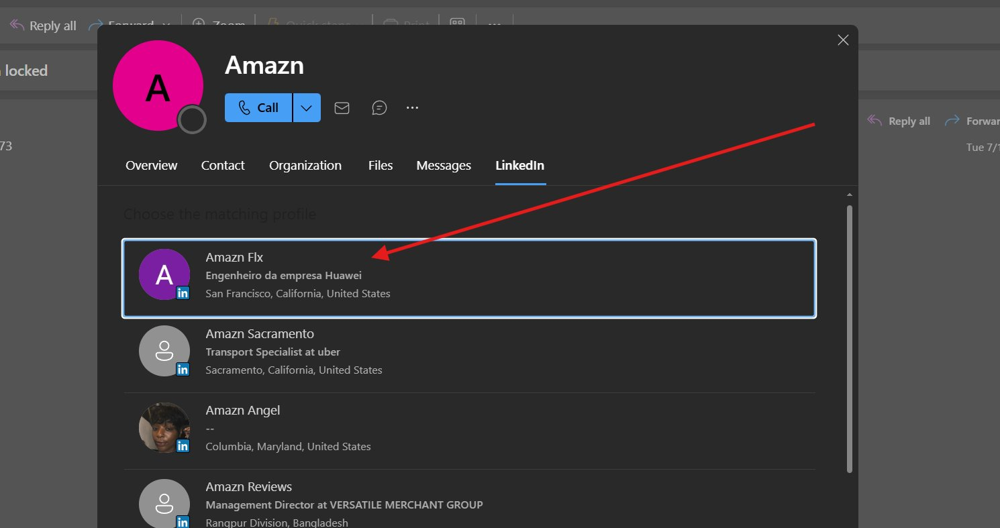
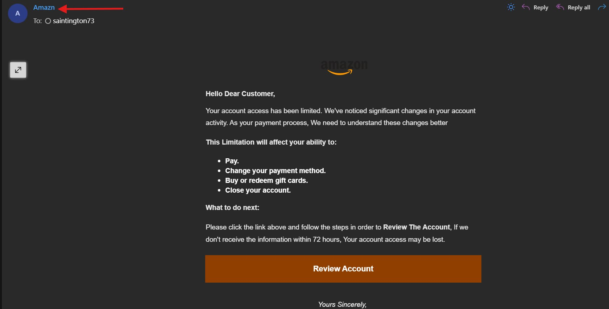
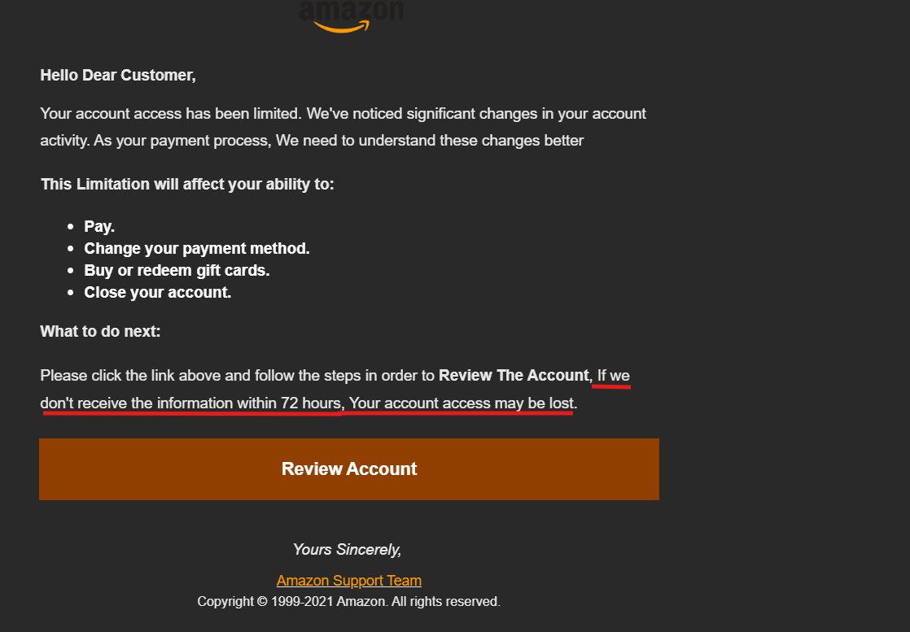
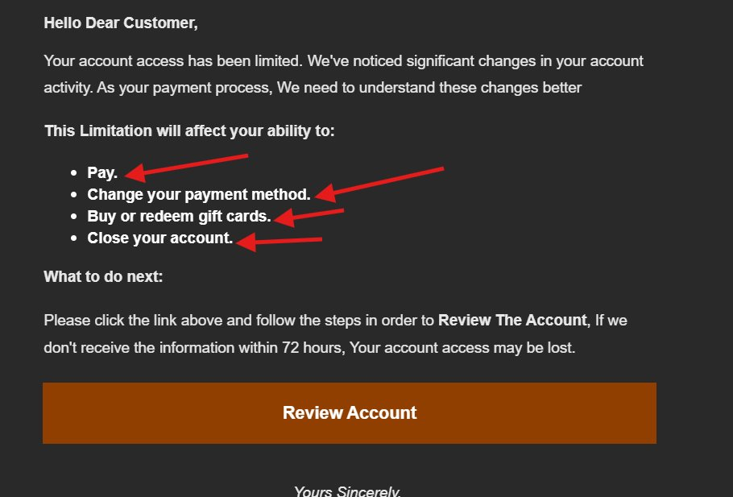
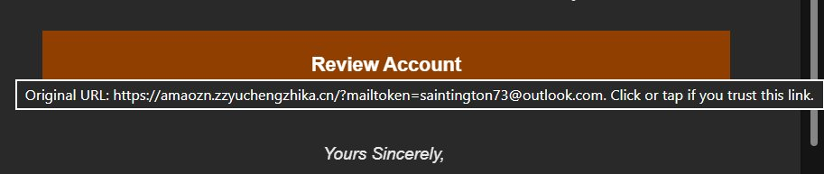
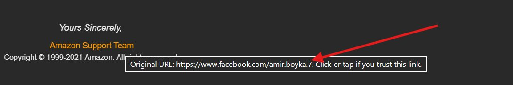
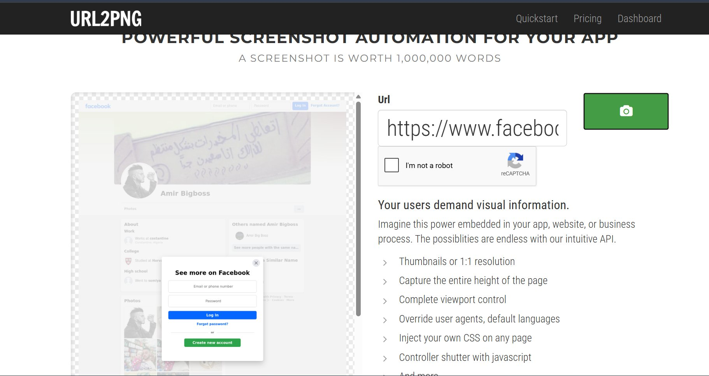
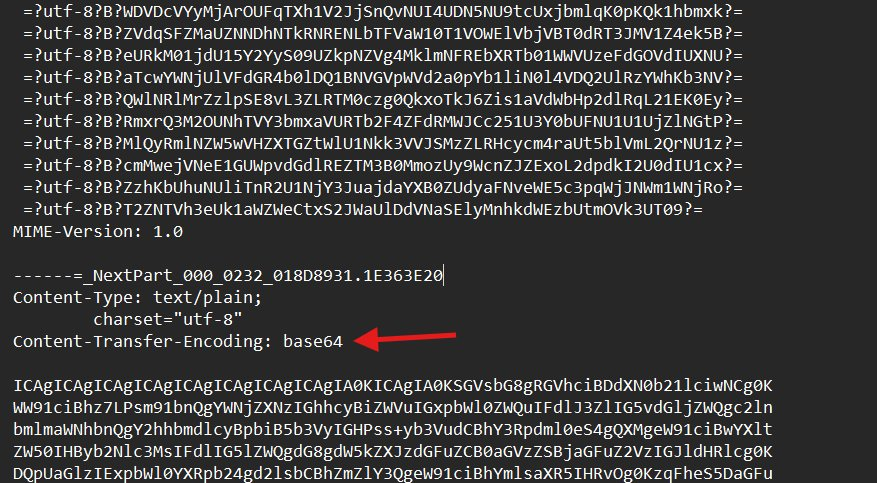

# Phishing Email Analysis — "Amazon: Your Account has been locked"

A forensic breakdown of a credential-harvesting phishing email impersonating Amazon. The
sample was delivered to an Outlook mailbox and analysed from raw headers, MIME structure,
rendered body, and embedded link destinations. All link inspection was done passively
(headers and hover/preview only); the live destination was captured through a third-party
screenshot service rather than visited directly.

> **Classification:** Phishing — brand impersonation / credential harvesting
> **Target brand:** Amazon
> **Severity:** High (credential theft + victim-email tracking token)
> **Status:** Malicious — do not interact

---

## 1. Summary

The message claims the recipient's Amazon account has been "locked" and pressures them to
click a **Review Account** button within 72 hours or lose access. The branding mimics Amazon,
but every authoritative signal — sender domain, return path, link destinations, and sender
reputation — points away from Amazon. The primary call-to-action links to a typosquatted
`.cn` domain that pre-loads the victim's email address as a tracking token, which is the
classic signature of a credential-harvesting page.

The email combines four pressure tactics common to this campaign type: a fear hook (account
locked), a generic greeting, a short deadline, and a list of consequences. None of the
technical evidence supports the claim that the message came from Amazon.

---

## 2. Evidence and Indicators

### 2.1 Sender and headers



The raw headers expose the first and most decisive problem. The display name reads **`Amazn`**
(note the missing "o"), and the actual address is **`amazon@zyevantoby.cn`**. Legitimate Amazon
mail comes from `amazon.com` infrastructure, never from an unrelated `.cn` second-level domain.
The `Return-Path` matches the same forged domain, and the `Message-ID`
(`...$@vinuqou`) references yet another unrelated string that has nothing to do with either
Amazon or the sending domain — a sign the message was generated by a bulk-mail kit rather than
Amazon's mail servers.

| Header | Value | Observation |
|---|---|---|
| `From` (display) | `Amazn` | Misspelt brand name |
| `From` (address) | `amazon@zyevantoby.cn` | Non-Amazon `.cn` domain |
| `To` | `saintington73@outlook.com` | Target recipient |
| `Subject` | `Your Account has been locked` | Fear hook |
| `Date` | `Wed, 14 Jul 2021 01:40:32 +0900` | `+0900` timezone, inconsistent with a US brand |
| `Return-Path` | `amazon@zyevantoby.cn` | Matches forged sender, not Amazon |
| `Message-ID` | `...6e61f7fb$@vinuqou` | Unrelated kit-generated domain string |
| `Content-Type` | `multipart/alternative` | Standard, but see MIME note below |

### 2.2 Sender reputation lookup





Outlook's people card confirms the contact email as `amazon@zyevantoby.cn` and finds **no
verified Amazon corporate identity**. The "matching" LinkedIn profiles it surfaces — e.g.
*"Amazn Flx — Engenheiro da empresa Huawei"* and various unrelated individuals across
different countries — are coincidental name matches, not Amazon. A genuine Amazon
notification would resolve to Amazon's verified organisation, not a scatter of unrelated
personal profiles.

### 2.3 Inbox rendering



At a glance in the inbox the message presents as "Amazn" with Amazon's logo, which is exactly
what the attacker wants — most users read the display name and logo, not the underlying
address. The misspelt display name is the only visible tell at this zoom level.

### 2.4 Body content and social engineering





The body leans entirely on social-engineering pressure:

- **Generic greeting** — "Hello Dear Customer" instead of the real first/last name Amazon
  always uses.
- **Grammar and capitalisation errors** — "As your payment process, We need to understand
  these changes better"; random mid-sentence capitalisation ("We", "Your").
- **Manufactured consequences** — a bulleted list of things you'll supposedly lose the ability
  to do (Pay / Change payment method / Buy or redeem gift cards / Close your account).
- **Hard deadline** — "If we don't receive the information within 72 hours, Your account access
  may be lost." Urgency is used to short-circuit the recipient's judgement.
- **Single funnel action** — one prominent **Review Account** button is the only path forward.

### 2.5 Link destinations (the decisive evidence)



Hovering the **Review Account** button reveals its true target:

```
https://amaozn.zzyuchengzhika.cn/?mailtoken=saintington73@outlook.com
```

Two things stand out. First, **`amaozn`** is a typosquat of "amazon" with the letters
transposed — a deliberate look-alike. Second, the URL appends the recipient's own email
address as a `mailtoken` parameter. That token lets the phishing site pre-fill the login form
and silently confirm which victim clicked, which is a hallmark of a harvesting kit rather than
any legitimate Amazon flow.



The footer "Amazon Support Team" link is even more telling — it points to a personal Facebook
profile:

```
https://www.facebook.com/amir.boyka.7
```

No Amazon communication routes its "support team" to a personal social-media profile. This is
likely a sloppy reuse of the threat actor's own assets and is a useful attribution lead.

### 2.6 Safe destination capture



Rather than open the malicious link in a browser, the destination was captured through
**URL2PNG**, a hosted screenshot service. Letting a third-party sandbox render the page keeps
the analyst's machine and IP out of the interaction while still providing visual evidence. The
capture returned a Facebook-style page tied to the profile name **"Amir Bigboss"**, consistent
with the `amir.boyka.7` profile referenced in the footer link.

### 2.7 MIME structure and encoding



The message is `multipart/alternative` and the `text/plain` part is delivered with
`Content-Transfer-Encoding: base64`. Base64 is legitimate on its own, but encoding the whole
body is also commonly used to push the human-readable text past simple keyword-based spam
filters. The MIME boundary (`----=_NextPart_000_0232_018D8931.1E363E20`) follows the pattern
produced by common bulk-mail generators.

---

## 3. Indicators of Compromise (IOCs)

| Type | Indicator |
|---|---|
| Sender display name | `Amazn` |
| Sender / Return-Path | `amazon@zyevantoby.cn` |
| Sending domain | `zyevantoby.cn` |
| Phishing / harvesting URL | `https://amaozn.zzyuchengzhika.cn/?mailtoken=<victim_email>` |
| Phishing domain | `amaozn.zzyuchengzhika.cn` (root: `zzyuchengzhika.cn`) |
| Secondary link (attribution) | `https://www.facebook.com/amir.boyka.7` |
| Linked profile name | "Amir Bigboss" |
| Subject line | `Your Account has been locked` |
| Message-ID | `<000756bf516d$9bad2034$6e61f7fb$@vinuqou>` |

> The `mailtoken` value is the recipient's own address and will differ per victim. Treat the
> domain and path as the durable indicators.

---

## 4. Why this is phishing — at a glance

1. **Domain mismatch** — sender, return path, and links use `.cn` look-alike domains, not `amazon.com`.
2. **Typosquatting** — `Amazn` in the name and `amaozn` in the link both impersonate the brand.
3. **Victim tracking token** — the URL embeds the recipient's email as a parameter.
4. **Generic greeting** — "Dear Customer" rather than the account holder's real name.
5. **Urgency and threat** — a 72-hour deadline and threatened loss of account access.
6. **Inconsistent support link** — "Support Team" points to a personal Facebook profile.
7. **Language errors** — grammar and capitalisation mistakes a real Amazon notice would not contain.

---

## 5. Recommendations

**For the recipient**
- Do not click the button or any link in the message.
- Do not reply or forward to anyone other than your security/abuse team.
- If credentials were entered on the linked page, change the Amazon password immediately,
  enable two-step verification, and review recent orders and payment methods.
- Report the message (in Outlook: *Report > Report phishing*) and then delete it.

**For mail/security administrators**
- Block the sending domain `zyevantoby.cn` and the phishing domain `zzyuchengzhika.cn` at the
  gateway and DNS layer.
- Add the IOCs above to the mail filter and proxy block lists.
- Search mail logs for other recipients of the same subject line / sender to scope the campaign.
- Verify SPF, DKIM, and DMARC enforcement so spoofed brand mail is rejected rather than delivered.

---

## 6. Verifying a real Amazon message

A genuine Amazon email addresses you by name, originates from an `amazon.com` domain, and never
asks you to confirm credentials through an external link. When in doubt, ignore the email
entirely and sign in by typing `amazon.com` into the browser yourself, then check the Message
Centre. Never trust the link in the message.

---

## Repository contents

```
phishing-analysis-amazon-account-locked/
├── README.md                  # This report
└── images/
    ├── 01_email_headers.png
    ├── 02_url2png_safe_capture.png
    ├── 03_mime_base64_encoding.png
    ├── 04_review_account_phishing_url.png
    ├── 05_support_team_facebook_link.png
    ├── 06_email_body_full.png
    ├── 07_email_body_limitations.png
    ├── 08_sender_linkedin_lookup.png
    ├── 09_sender_contact_card.png
    └── 10_inbox_view_sender_display.png
```

---

*Prepared as a defensive security / forensic computing exercise. All indicators are documented
for detection and awareness purposes only. The sample is malicious — do not interact with the
domains or links listed above.*
